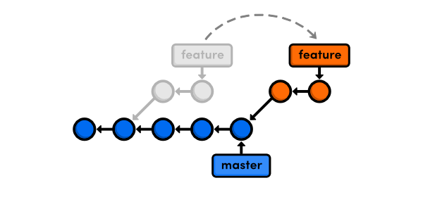
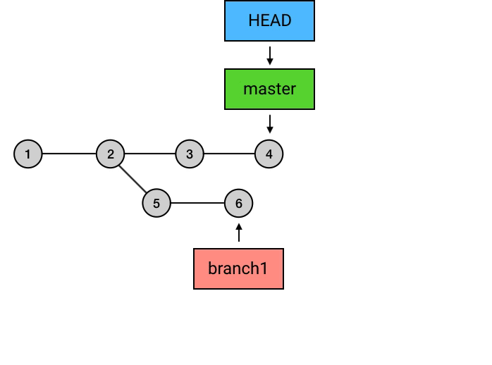
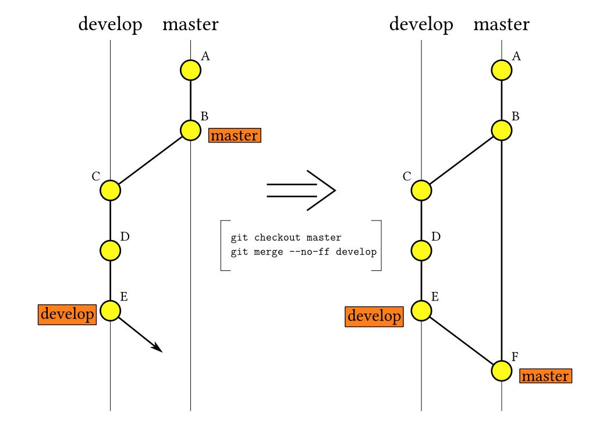
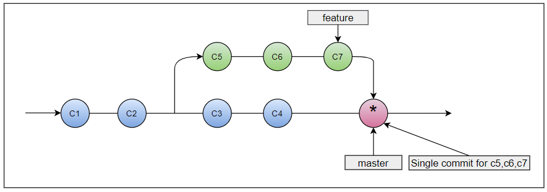

# Git Branch

Git 分支的本质是指向某一系列提交的最后一个提交的指针或引用。

## 创建分支

创建分支是基于某个特定的`commit`，默认为`HEAD`。

## 常用命令

- 查看分支： `git branch`
  - `-a`： 查看全部分支
  - `-r`： 查看远程分支
  - `-vv`： 查看本地分支与远程分支关联关系
- 创建分支： `git branch <分支名>`
- 创建/切换分支：
  - `git switch [-c] <分支名>`：`-c`：创建并切换到新分支
  - `git checkout [-b] <分支名>`：`-b`：创建并切换到新分支
- 删除本地分支： `git br -d <分支名>`
- 删除远程分支： `git push <远程仓库名> --delete <远程分支名>`
- 建立追踪关系： `git branch --set-upstream <本地分支名> <远程分支名>`
- 删除追踪关系： `git branch -dr [remote/branch]`

## 分支集成

分支集成有 Merge、Rebase 和 cherry-pick 三种方式：

Merge 和 Rebase 是将目标分支全部 commit 集成到当前分支。两种方式的执行逻辑不同，合并之后的分支记录会有很大差别

cherry-pick 是提取特定 commit 合并到特定分支

### Rebase

`git rebase <target_branch_name> [--continue][--abort][--skip]`

rebase 和 merge 都可以进行不同分支代码的整合，它们的处理逻辑不同，rebase 首先会将当前分支的 commit 进行暂存，然后将目标分支的 commit 合并到当前分支，最后将当前分支暂存的 commit 重新应用到当前分支。

rebase 有可能会引发问题，虽然 rebase 最终的结果和你提交的结果一致，但是 rebase 后的 commit 的基 commit 是不同的，尽量不要在公用分支上进行 rebase 操作

### Merger

两个不同的分支一定有一个共同的 commit，在这个 commit 之后两个分支产生了各自不同的内容和 commit，分支合并的目的就是把两个分支的最新状态结合到一起。

#### 快进合并 fast-forward

快速合并是最简单的的情况，**当前分支没有新的提交**。这种情况下 Git 只需要将另外一个分支的 commit 添加到当前分支，实际是移动 HEAD 指针到被合并分支的 HEAD。

`git merger target_branch --ff`，`ff`是 fast forward 的简写，快速合并是默认合并方式可以省略`-ff`参数。
和`-ff`参数对应的是`--no-ff`，会强行关闭快速合并，优点是可以保留分支记录。

fast-forward 的优点是简单清晰符合线性提交，缺点是依赖 rebase，无法在大团队使用

#### 整合提交 merge-commit

不满足线性提交的条件时 Git 会创建一个新的 commit 来整合两个分支的修改，这两个 commit 有两个指针，分别执行两个分支的 HEAD.

#### 压缩合并&线性提交

在开发的过程中一个需求我们经常会频繁的提交 commit，将这些 commit 直接合入主分支显然是不优雅的。

**线性提交**是指所有提交都只有一个父 commit.
线性提交的优点是清晰简洁，方便进行代码回退，但是会丢失分支记录，线性提交的好坏暂不讨论。

如果要实现线性提交就必须保证全部 Merge 都是 fast-forward 的。主要以两种具体操作方式：

方式一：首先压缩 commit，然后在对 target 分支进行 rebase， 最后 Merge。压缩合并又有两种方式：

- 在开发的过程中推荐使用`--amend`不断修正提交。
- 交互式 rebase：`git rebase -i`，`-i`是`--interactive`的简写
  - `git rebase -i HEAD~n`：从 HEAD 版本开始往过去数 n 个版本
  - `git rebase -i <commit_id>`：合并指定版本号（不包含此版本）

方式二：压缩合并

`git merge --squash <branch>`

压缩合并会将目标分支上的所有 commit 合并为一个 commit，然后将合并 commit 添加到当前分支。

### cherry-pick

将指定的 commit 的**修改**提取到当前分支并创建一个新的 commit。

- 提取`commit`：`git cherry-pick <commit>`
  - 单个 commit：`commitId`
  - 多个 commit：`commitA commitB ...`
  - 一串 commit：
    - `commitA..commitB`：不包含 A
    - `commitA^..commitB`：包含 A
- 提取`branch`最新 commit：`git cherry-pick <branch_name>`

## 分支集成建议

1. 一切修改(特性添加、bug 修复)都在独立的分支进行
2. 使用 Merge Request 方式合并代码
3. 发起 MR 之前先进行 Rebase 操作
4. 推荐使用压缩合并集成到主分支
