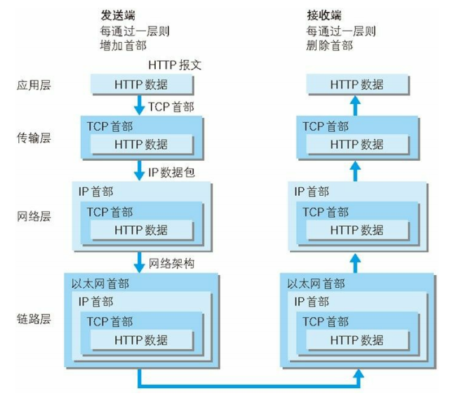

# TODO:互联网协议 Internet Protocol Suite

端到端的交互需要处理寻址、链接、数据传输和数据解析等一系列问题，互联网使用分层的架构实现，每一层完成一种功能，每一层都需要下一层功能的支持。为了数据能够顺利的流转需要各层的实现准时相同的规整，即协议(Protocol)。互联网的每一层都制定了很多协议，这些协议统称互联网协议(Internet Protocol Suite)。

互联网协议的分层法方案有很多种：

- OSI(Open System Interconnection Model)开放式系统互联模型是一种概念模型，由国际标准化组织提出，一个试图使各种计算机在世界范围内互联为网络的标准框架。
- TCP/IP 借鉴了 OSI 的这些概念建立 TCP/IP 模型，是网络互联事实上的标准。

## 经典五层模型

- 物理层：解决硬件设备之间如何链接和数据传输，具体实现为光纤、网线、无线电波等，负责传输`0 1`信号
- 链接层：解决如何发送、接收和对`0 1`信号进行分组，具体实现为网卡，数据的接收和发送基于 ARP 协议采用广播的方式进行，数据的分组基于以太网(Ethernet)协议，
- 应用层：解决数据如何加工和解析，具体实现有 FTP、HTTPD 等
- 传输层：解决同一设备上不同程序的信号接收和发送问题，具体实现为端口，基于 TCP 协议或 UDP 协议
- 网络层：解决局域网之间的通信，具体实现为路由器，基于 IP 协议

## 局域网和互联网

## 以太网(Ethernet)协议

## IP 协议

## 局域网和子网掩码

## TCP 协议

## UDP 协议

## 网关

