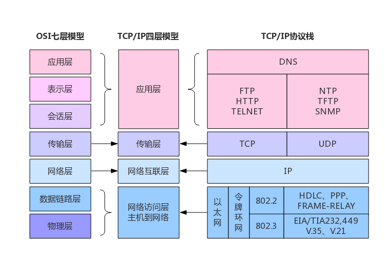
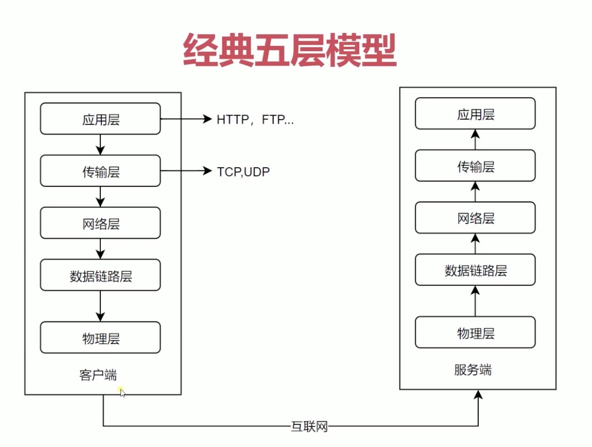
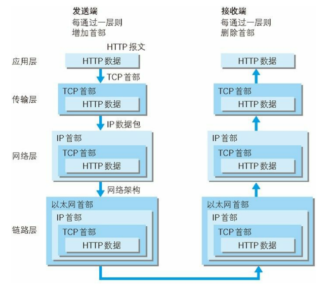

# 互联网协议 Internet Protocol Suite

端到端的交互需要处理寻址、链接、数据传输和数据解析等一系列问题，互联网使用分层的架构实现，每一层完成一种功能，每一层都需要下一层功能的支持。为了数据能够顺利的流转需要各层的实现准时相同的规整，即协议(Protocol)。互联网的每一层都制定了很多协议，这些协议统称互联网协议(Internet Protocol Suite)。

互联网协议的分层法方案有很多种：

- OSI(Open System Interconnection Model)开放式系统互联模型是一种概念模型，由国际标准化组织提出，一个试图使各种计算机在世界范围内互联为网络的标准框架。
- TCP/IP 借鉴了 OSI 的这些概念建立 TCP/IP 模型，是网络互联事实上的标准。

## 经典五层模型

- 物理层：解决硬件设备之间如何链接和数据传输，具体实现为光纤、网线、无线电波等，负责传输`0 1`电信号
- 链接层：解决电信号的发送、接收和对分组，具体实现为网卡和交换机。数据的接收和发送基于 ARP 协议采用广播的方式进行。数据的分组基于以太网(Ethernet)协议，
- 网络层：解决局域网之间的通信，具体实现为路由器，基于 IP 协议
- 传输层：解决同一设备上不同程序的信号接收和发送问题，具体实现为端口，基于 TCP 协议或 UDP 协议
- 应用层：解决数据如何加工和解析，具体实现有 FTP、HTTP 等

## 链接层和以太网(Ethernet)协议

物理层传输的电信号没有任何意义，发送方和接收方必须有同一的方式进行发送和接收，需要对电线信号进行分组。
链接层在物理层之上专门处理电信号的分组，以太网协议是目前占主导地位的电信号分组协议。

### 以太网分组协议

- 一组电信号构成一个数据包，叫做帧(Frame)
- 每一帧分为表头和数据两部分
- 表头(Head)：包含发送者、接受者、数据类型等元数据，长度为 18 字节
- 数据(Data)：长度为 64~1518 字节
- 如果数据很长则拆成多个帧发送

### 以太网传输协议

- 以太网规定接入网络的设备必须要有网卡接口，以太网数据包的接收地址和发送地址就是网卡的地址，即 MAC 地址。
- 每块网卡都一个一个独二无一的 MAC 地址，共 48 个二进制位，通常用 12 个 16 进制数表示，前 8 位位厂商编号，后 8 位为厂商网卡流水号。
- 以太网协议并不能将数据包准确的从一个网卡发送到另外一个网卡，而是采取**广播**的方式向当前网络内的所有设备发送数据，接收设备根据表头的接收方信息决定是否接收信息，这里使用的是 ARP 协议。

## 网络层和 IP 协议

以太网协议这种广播信息的数据传输有两个问题：

1. 发送方和接收方必须处于同一局域网，不可能将世界上所有的设备都组织在一个局域网内。
2. 每一台设备都接收互联网上其它设备发送的全部数据包，那是不可想象的灾难。

网络层在链接层之上解决不同局域网之间的通信问题，网络层会区分两个设备是否在同一局域网内，如果是同一局域网就是有广播的方式，否则就是有**路由**的方式。

### IP 协议

通过 MAC 地址无法判断两个设备是否处于同一个局域网，为了解决这个问题就需要一个网络地址即 IP 地址。
IP 协议解决了两个问题：1. 为每台设备分配一个网路地址；2. 确定两个地址是否处于同一局域网。

目前广泛应用的是 IPV4 协议：

- IP 地址有 32 位二进制位组成，习惯上分层四段 10 进制位表示，例`123.234.345.1`。
- IP 地址分为两部分，前半部分表示网络，后半部分表示主机，只要前半部分相同就表示在同一局域网。
- 但是 IP 地址的前后分段规整不固定，IP 协议规定使用"子网掩码"（subnet mask）来确定 IP 地址的分组。
  - 子网掩码和 IP 地址一样有 32 位二级制位构成，通常使用 10 进制位表示。
  - 子网掩码的二进制位为 1 时表示对应的 IP 地址为网络部分，例`255.255.255.0`表示 IP 地址的前 24 位为网路部分。

### 网络层数据传输和 IP 数据包

网络层在链接层之上，IP 协议在以太网协议之上。
IP 数据包同样由表头和数据两部分组成，标头主要包含 IP 地址、版本、数据长度等信息。
IP 数据包会直接放进以太网包的数据部分，不会修改以太网数据包的结构。

## 传输层

通过 IP 地址我们可以确定唯一的设备，但是一台设备上通常会运行多个程序，传输层可以保证数据被正确的程序接收。

传输层使用端口(port)解决这个问题：

- 端口就是进程使用网卡的编号，是 0~65535 直接的一个整数。
- 每个端口只能为一个进程提供服务，0 到 1023 的端口被系统占用，程序只能选用大于 1023 的端口。
- Unix 系统就把主机+端口，叫做"套接字"（socket）

传输层的实现协议主要有 UDP 和 TCP 两种

### UDP 协议

UDP 协议是最简单的传输层协议：

- UDP 数据包也是有标头和数据两部分组成
- 表达主要包含发送端口和接收端口
- UDP 数据包和 IP 数据包类似，会将标头和数据作为 IP 数据包的数据部分。

### TCP 协议

UDP 协议的比较简单但是也有比较明显的缺点，UDP 数据包发送出去后无法知道接收方是否正常接收。TCP 协议是一个极为复杂的协议，可以理解为有确认机制的 UDP 协议。

## TODO:网关(gateway)
