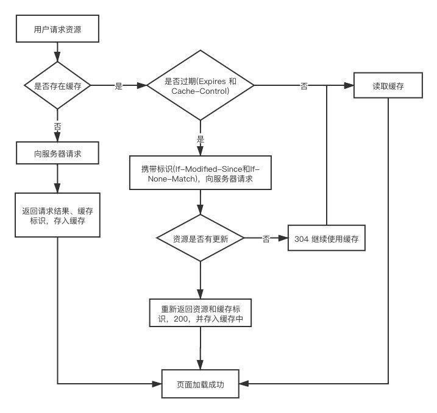

# 浏览器缓存

静态文件（图片、.css、.js）的特点是一般不会发生变化，在客户端缓存这些文件可以达到加速网站加载、降低服务器负载的目的。
HTTP 缓存有很多种规则，根据是否需要向服务器发生请求分为强制缓存和对比缓存两大类，**强制缓存优先级高于对比缓存**。

## 强制缓存

缓存规则：在命中缓存的情况下直接返回缓存内容，未命中缓存则向服务器发起请求并将请求结果缓存到本地。
缓存设置：在 HTTP 响应头中加入`Expires/Cache-Control`声明缓存规则

- `Expires`: HTTP1.0 规范，值为缓存到期时间，例：`expires: Wed, 21 Apr 2021 02:24:25 GMT`。客户端时间和服务端时间可能存在误差，所以在 HTTP1.1 中使用`Cache-Control`替代`Expires`
- `Cache-Control`：**优先级高于`Expires`**，例：`Cache-Control: public, max-age=31536000, immutable`，常见指令：
  - 可缓存性指令：
    - `private`: 客户端可以缓存，默认值
    - `public`: 客户端和代理服务器都可缓存（前端的同学，可以认为 public 和 private 是一样的）
    - `no-cache`: 需要使用对比缓存来验证缓存数据
    - `no-store`: 所有内容都不会缓存，强制缓存，对比缓存都不会触发
  - 缓存时间指令：
    - `max-age=<seconds>`: 缓存的内容将在 xxx 秒后失效

## 对比缓存

缓存规则：本地命中缓存后获取缓存标识，请求服务器验证标识是否失效，服务器验证缓存未失效返回 304 状态码，浏览器则直接使用本地缓存，如服务器验证缓存失效则返回新的缓存数据和缓存规则，客户端使用并缓存服务器返回数据。

缓存设置：

使用`Last-Modified / If-Modified-Since`实现

- `Last-Modified`：服务在响应时告诉浏览器最后修改时间，例：`last-modified: Thu, 11 Mar 2021 07:32:23 GMT`
- `If-Modified-Since`：浏览器在下次请求时使用`If-Modified-Since`告诉服务器客户端缓存的最新响应的时间，服务器会进行对比，若无修改则返回`304`，否则返回`200`

使用`Etag / If-None-Match`优先级高于`Last-Modified / If-Modified-Since`

- 客户端第一次请求服务器时，服务器返回内容时同时返回`etag`header，告诉客户端响应内容的标签，例：`etag: "5e7c3f77-127f"`
- 客户端第二次请求服务器时使用`If-None-Match`带上上次响应的标签，服务器判断响应内容标签是否有变化返回`304`或`200`

## 相关资料

- [Cache-Control](https://developer.mozilla.org/zh-CN/docs/Web/HTTP/Headers/Cache-Control)
