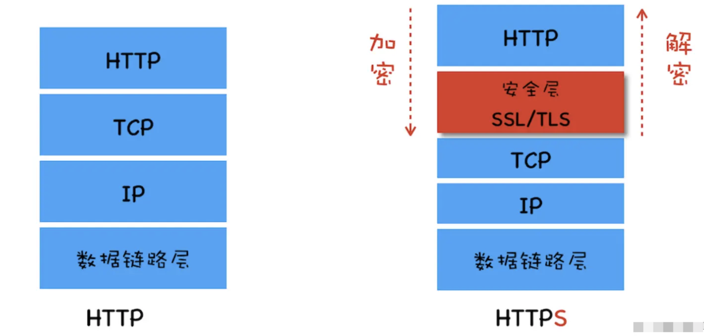
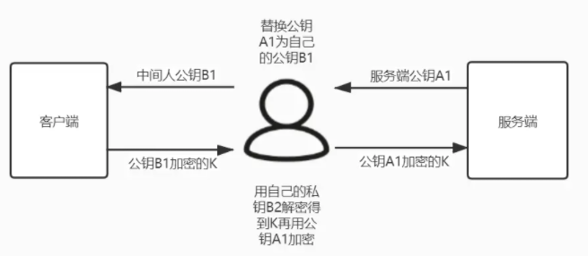

# HTTPS

HTTP 是明文通信，主要有以下几类风险：

- 窃听风险：第三方可以获取通信内容
- 篡改风险：第三方对通信内容进行修改
- 冒充风险：第三方可以冒充它人进行通信

HTTPS(Hypertext Transfer Protocol Secure)就是安全版的 HTTP，HTTP 的默认端口号为`80`，HTTPS 的默认端口号为`443`。
`HTTP`协议承载于`TCP`协议之上，`HTTPS`是在`HTTP`和`TCP`直接加了一层`SSL/TLS`协议负责对传输的内容进行加密；

## HTTPS 加密通信策略

`HTTP`是明文传输，中间人可以很容易的进行拦截，`HTTPS`使用加密通信**防止信息被窃听**。
加密分为对称加密和非对称加密两种，非对称加密性能相对较低，参考[SSH](../../../14-Solutions/加密&身份认证/SSH.md)，`HTTPS`采用混合加密方案，使用对称加密进行通信，使用非对称加密生成对称秘钥。

### HTTPS 链接创建(秘钥协商)

HTTPS 链接创建的过程就是对称秘钥协商创建过程，这个过程是一个**非对称加密**过程。核心过程如下：

- 第一步：客户端向服务端发送一个随机字符串用于生成秘钥，此外还有客户端支持的协议版本和加密套件等信息。
- 第二步：服务端向客户端发送第二个随机字符串和**公钥**，此外还有确认使用的协议版本和加密套件以及**服务器证书**。
- 第三步：客户端生成第三个随机数并使用公钥加密发送给服务端。
- 第四部：服务端使用私钥解密客户端第三步发送的随机数
- 第五步：这时客户端和服务端使用以上步骤获取的三个随机字符串和确认的加密套件生成**对称秘钥**。

基于`SSL/TLS`客户端和服务端的通信都使用`HTTPS`链接创建时生成的秘钥进行加密通信，可以防止信息被窃听。

## 中间人攻击和身份认证

在`HTTPS`链接创建的过程中可能存储在中间人攻击，即在对称秘钥协商阶段进行劫持，参考[SSH](../../../14-Solutions/加密&身份认证/SSH.md)。

`HTTPS`使用**数字证书**认证服务端身份。HTTPS 链接创建第二步中服务端向客户端发送的证书就是数字证书，发送的公钥其实是证书的一部分。
数字证书是由权威结构发布的，客户端获取的证书后会对证书的颁发机构、有效期、域名等进行验证，如果发现问题就会发出安全告警。

数字证书可以保证客户端获取的公钥的可靠性，这样中间人即使进行劫持也无法解密第三步发生的随机数，也就无法获取协商秘钥。

### CA&数字证书

数字证书是由权威的 CA（Certificate Authority）机构给服务端进行颁发，任何人和组织都可以扮演 CA 的角色，但是很难被浏览器信任。

证书申请流程：

1. 本地生成一对秘钥对、用户需要保存好自己的私钥
2. 将公钥以及持有人、域名等信息提供给 CA 机构
3. 证书生成
   1. CA 核验注册信息
   2. 使用摘要算法对申请信息加密生成**摘要签名**
   3. CA 使用自己的私钥对摘要签名和使用的摘要算法进行加密
   4. 证书封装
4. 证书颁发部署

证书由以下几部分构成：

- 公钥：客户端和服务端秘钥协商过程中使用
- 摘要签名和摘要算法：客户端验证证书是否被篡改，即验证服务端身份
- 其它信息：鉴定证书是否可以应用于当前请求
  - CA 机构信息
  - 证书拥有人信息
  - 有效期

客户端会在本地保存信任(权威)CA 的**根证书**，根证书是 CA 自己的证书，所以 HTTPS 的可靠性是建立在 CA 机构的可靠程度上。

客户端验证数字证书主要流程：

1. 客户端获取服务端的数字证书，然后解析得到 CA 信息
2. 客户端获取 CA 的根证书
3. 使用根证书的公钥解密数字证书获得证书签名和摘要算法，运行摘要算法对比证书签名验证

数字证书是 CA 机构使用自己的私钥加密过的，劫持者如果对证书进行修改是无法通过证书认证的

## 信息完整性

信息在传输的过程中很容易被劫持串改，保证信息完整性通常采用的方案是：

- step1: 使用散列算法对传输的数据进行一次 hash，生成信息摘要
- step2：使用服务端的公钥对内容和摘要进行加密，然后一起发送给服务端
- step3：服务端使用私钥对解密获得信息摘要，将解密的内容进行一次 hash 和解密的摘要进行对比，如果一致则证明数据是完整的

## 身份识别

信息接收方需要信息发送方的身份，通常采用的策略是：

- step1：信息发生方将自己的公钥发生给接收方
- step2：信息发送方使用私钥加密信息并发送给接收方
- step3：信息接收方收到信息，使用之前得到的公钥进行解密，这就确保了接收的信息来自可靠的发送方
