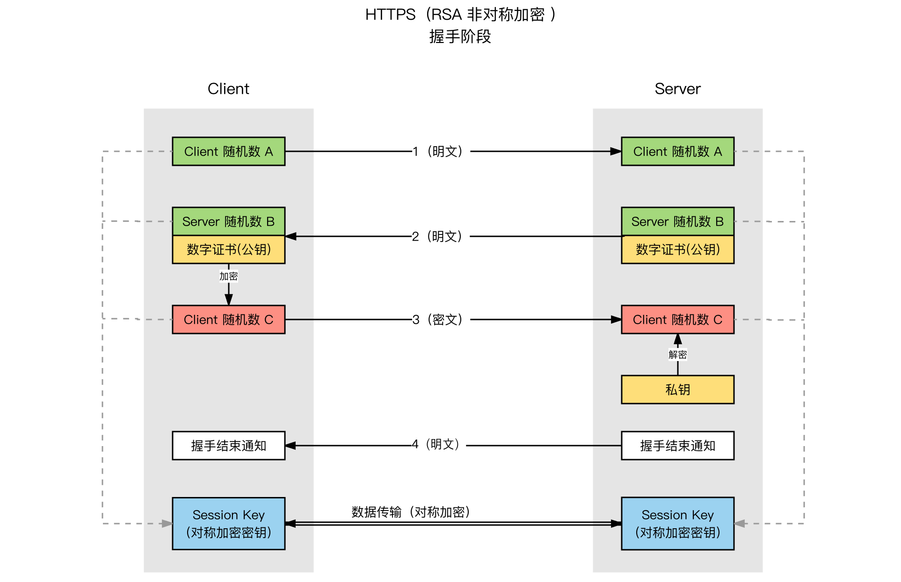

# HTTPS

HTTP 是明文通信，主要有以下几类风险：

- 窃听风险：第三方可以获取通信内容
- 篡改风险：第三方对通信内容进行修改
- 冒充风险：第三方可以冒充它人进行通信

HTTPS(Hypertext Transfer Protocol Secure)就是安全版的 HTTP，HTTP 的默认端口号为`80`，HTTPS 的默认端口号为`443`。
`HTTP`协议通常承载于`TCP`协议之上，`HTTPS`是在`HTTP`和`TCP`直接加了一层`SSL/TLS`协议负责对传输的内容进行加密；

## HTTPS 防窃听策略

HTTP 使用明文传输，中间人可以很容易的进行拦截，`HTTPS`的解决方案是使用加密通信。加密通信分为对称加密和非对称加密两种，非对称加密性能相对较低，参考[SSH](../../../14-Solutions/加密&身份认证/SSH.md)，`HTTPS`采用混合加密方案，使用对称加密进行通信，使用非对称加密生成对称秘钥。

### HTTPS 链接创建

HTTPS 链接创建的过程就是对称秘钥的创建过程，这个过程是一个**非对称加密**过程。核心过程如下：

- 第一步：客户端向服务端发送一个随机字符串用于生成秘钥，此外还有协议版本、加密套件等信息。
- 第二步：服务端向客户端发送第二个随机字符串和**公钥**，此外还有确认的协议版本和加密套件以及**服务器证书**。
- 第三步：客户端生成第三个随机数并使用公钥加密发送给服务端。
- 第四部：服务端使用私钥解密客户端第三步发送的随机数
- 第五步：这时客户端和服务端使用以上步骤获取的三个随机字符串和确认的加密套件生成**对称秘钥**。

基于`SSL/TLS`客户端和服务端的通信都使用`HTTPS`链接创建时生成的秘钥进行加密通信，可以防止信息被窃听。

### 中间人攻击和 CA 证书

在`HTTPS`链接创建的过程中可能存储在中间人攻击，参考[SSH](../../../14-Solutions/加密&身份认证/SSH.md)，即在对称秘钥协商阶段进行劫持。

`HTTPS`使用 CA(Certification Authority)证书防止中间人劫持，HTTPS 链接创建第二步中服务端向客户端发送的证书就是 CA 证书，服务端发生的公钥其实也是证书的一部分。
数字证书是由权威结构发布的，客户端获取的证书后会对证书的颁发机构、有效期、域名等进行验证，如果发现问题就会发出安全告警。

### CA 数字证书

数字证书是由权威的 CA（Certificate Authority）机构给服务端进行颁发，任何人和组织都可以扮演 CA 的角色，但是很难被浏览器信任。

数字证书由：证书内容、散列算法和加密密文三部分组成。

证书内容主要包括持有人相关信息、服务器的公钥和数字签名：

- 服务器公钥：客户端和服务端通信过程中进行加密和解密，保证信息保密性
- 数字签名：数字签名可以保证公钥和正式信息的完整性
- 证书持有人信息：通过验证持有人信息，可以确保证书来自请求的服务器

客户端在和服务端通信之前首先需要获取服务端的数字证书，那么如何保证数字证书的获取过程中不会被劫持伪造呢？

上面说道证书包含证书内容、散列算法和加密密文三部分，CA 机构在生成证书的过程中会将证书内容会通过散列算法计算出一个 hash，然后使用 CA 机构提供的私钥对 hash 进行加密生成加密密文，将这个三部分信息打包生成一个数组证书。
客户端在获取服务端证书之后，客户端会通过 CA 的公钥对证书的密文进行解密获取到 hash，然后使用证书的 hash 算法再次正式内容进行计算，对比两个 hash 值一致就可以确认证书的可靠性。

所以说 HTTPS 的可靠性是建立在 CA 机构的可靠程度上

## 信息完整性

信息在传输的过程中很容易被劫持串改，保证信息完整性通常采用的方案是：

- step1: 使用散列算法对传输的数据进行一次 hash，生成信息摘要
- step2：使用服务端的公钥对内容和摘要进行加密，然后一起发送给服务端
- step3：服务端使用私钥对解密获得信息摘要，将解密的内容进行一次 hash 和解密的摘要进行对比，如果一致则证明数据是完整的

### 身份识别

信息接收方需要信息发送方的身份，通常采用的策略是：

- step1：信息发生方将自己的公钥发生给接收方
- step2：信息发送方使用私钥加密信息并发送给接收方
- step3：信息接收方收到信息，使用之前得到的公钥进行解密，这就确保了接收的信息来自可靠的发送方
