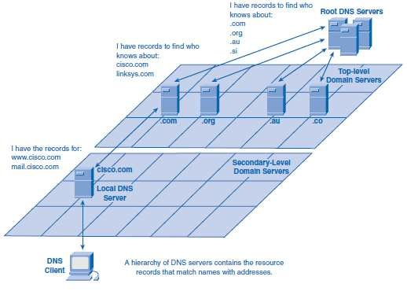

# DNS

DNS(Domain Name System)是一个提供通过域名获取 IP 地址的网络服务。

互联网为了定义连入的电脑，为每一台连入的电脑都分配了一个唯一的地址标识即 IP 地址，像这个样子`45.652.3.2`；
但是这个纯数字的地址没有任何意义，实在是不好记；所以就发明了域名这个东西，例如`http://www.github.com`，也就是给 IP 地址起了一个有意义的别名；

> DNS 是
>
> - 一个由分层的 DNS 服务器实现的**分布式数据库**
> - 一个使得主机能够查询分布式数据库的**应用层协议**

## 域名的结构&分布式数据库

以`www.qq.com.`为例：

- 注意最后的`.`为根域名，浏览器会省略所以平时我们都看不到
  - 按照功能划分，顶级域划分为通用顶级域（com、org、net 等）和国家与地区顶级域（cn、hk、us、tw 等）
- `.com`为顶级域名
- `.qq`为二级域名

DNS 服务器存储域名和 IP 的映射关系，不可能将全部的映射关系保存在单一的服务器。
DNS 服务器按照域名的层级进行组织，每一层的服务器管理和存储下一级服务器的信息。

- 根 DNS 服务器：管理顶级域 DNS 服务器，根 DNS 服务器的数量很少。
- 顶级域(Top-Level Domain, TLD) DNS 服务器：管理权威 DNS 服务器
- 权威 DNS 服务器

## DNS 查询过程&应用层协议

1. 缓存查询
   1. 从浏览器自设的缓存查找，这个缓存的时间比较短(1 分钟左右)，容量也比较小(1000 条左右)，如果没找到继续
   2. 从操作系统缓存中获取，如果没找到继续
   3. 从系统`host`文件中查找(修改`host`文件实现翻墙是一个好办法)，如果没找到继续
2. DNS 查询：向本地 DNS 服务器(一般为运营商)通过以下步骤获取 IP 地址，以`http://www.github.com`为例
   1. 首先查看查找自身缓存，如果找不到继续
   2. 从根域名开始递归查询
      1. 向根域发起访问，根域会告诉`.com`域的 IP 地址，
      2. 然后向`.com`根域发起访问，然后`.com`服务告诉`github.com`的 IP 地址
      3. ...依次列推
   3. 然后获取的 IP 地址返回给浏览器
3. 当然还有一些及特殊情况意思几步都找不到的情况，这里不做讨论；

## A &CNAME

A 记录即 Address 记录，是域名和 IP 的指向关系，例：`www.example.com -> 1.2.3.4`
在 DNS 服务器添加 A 记录之后，当有请求访问这个域名之后，DNS 服务器就会根据 A 记录将匹配的 IP 地址返回给请求方。

CNAME 记录 也称为别名记录，和 A 记录不同，相当于是给 A 记录中的域名起了一个小名。例：`www.demo.com→ www.example.com → 1.2.3.4`
CNAME 可以配置多个，CNAME 除了在服务器 IP 变化可以方便的进行管理外主要应用场景是[CDN](../CDN.md)
