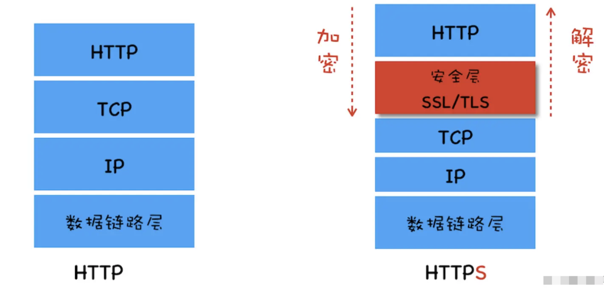
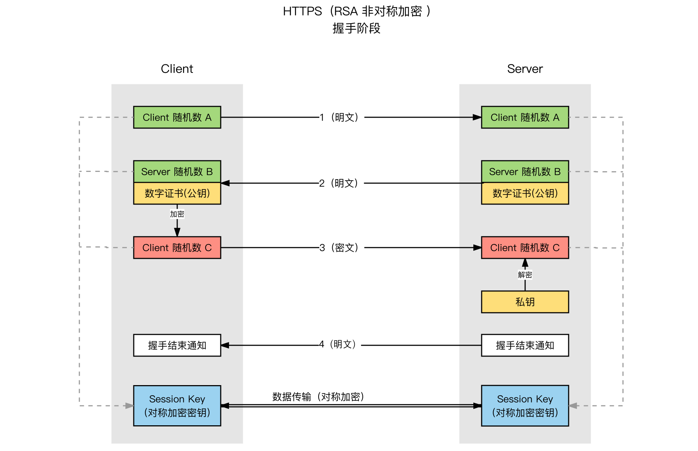
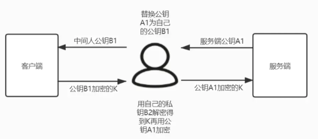
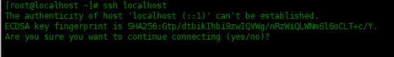
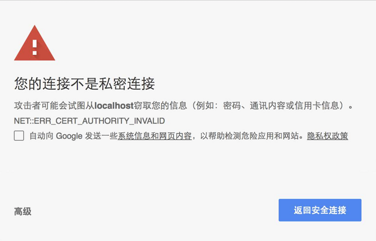

# 前端开发应该了解的 HTTPS 知识

> 超文本传输安全协议（英语：HyperText Transfer Protocol Secure，缩写：HTTPS；常称为 HTTP over TLS、HTTP over SSL 或 HTTP Secure）是一种通过计算机网络进行安全通信的传输协议。HTTPS 经由 HTTP 进行通信，但利用 SSL/TLS 来加密数据包
>
> 传输层安全性协议（英语：Transport Layer Security，缩写：TLS）及其前身安全套接层（英语：Secure Sockets Layer，缩写：SSL）是一种安全协议，目的是为互联网通信提供安全及数据完整性保障。
>
> -- 摘自维基百科

我们都知道 HTTPS 是安全的 HTTP 协议，默认端口为`443`，相对于 HTTP 的明文传输 HTTPS 在通信的过程中会进行数据加密。作为前端开发同学在 HTTPS 站点的部署和日常开发时通常只需要将请求资源的协议由`http://`改成`https://`，对于 HTTPS 如何保证网站的安全以及其背后的原理可能并没有深入的探究。

HTTPS 是基于加密算法的互联网通信安全解决方案，HTTPS 并不要求开发者进行底层的开发和理解，但是 HTTPS 的很多思想是值得学习和借鉴的，现在流行的区块链和无处不在的 SSH 都是基于加密算法的解决方案。作为前端开发同学研究 HTTPS 的底层原理和架构设计可能会为你打开新世界。

## HTTP 存在的安全问题

新技术或方案的出现都是为了解决现有问题，了解一项技术的背景和解决的问题可以帮助我们有更全面和深入的理解。HTTP 是的致命弱点就是明文通信，信息会通过路由器、运营商、机房等多个传输节点，任意一个节点被都可能被攻击，这种攻击称为**中间人攻击**，主要有以下几类风险：

- 窃听风险：明文通信第三方可以窃听通信内容，敏感信息(账号密码等)的泄露可能造成严重的后果。
- 冒充风险：不验证通信身份，第三方可以冒充它人进行通信
- 篡改风险：无法验证报文的完整性，通信内容可以被第三方修改。前些年盛行的运营商劫持就是运营商对网页内容劫持后进行篡改，插入各种广告内容。

## 密码学基础知识

HTTPS 是建立在加密算法基础上的解决方案，研究 HTTPS 的架构设计首先要了解密码学基础知识。

加密算法可以理解为一个如下形式的函数：`f(明文):密文`，`f`为加密算法，会将输入明文转换为**无意义的**密文。加密算法按照是否可逆分为散列算法和加解密算法两大类：

### 散列算法

散列算法又称散列函数或哈希算法，无论多长的信息经过散列函数计算都会生成**固定长度**的密文，被称为**信息摘要**，被称为信息摘要摘要主要因为散列算法有以下特点：

1. 散列算法是不可逆的单向函数(计算很容易，但是逆向计算却非常困难的函数)
2. 输出长度固定，任意长度的输入经过计算后的输出长度都是相同的
3. 不同的输入有不同的输出，输入的细微差别也会导致输出的巨大差异，无法通过输出反推输入

基于以上特性散列算法适合用来对数据生成”指纹“即“数据摘要”，常用于验证消息是否被篡改。常见的散列算法有 MD5、SHA-1、SHA256 等，好的散列算法冲突率更低。

散列冲突：因为散列算法的输出长度固定，但是算法的输入长度是无限制的，所以理论上会存在输入不同但是输出相同的情况，这种情况称为散列冲突或散列碰撞。

### 加解密算法

数据加密是为了保护数据安全，防止数据被窃取和篡改。数据加解密技术是**使用秘钥实现信息和无意义密文相互转换的方法**。加解密算法是可逆的，加解密算法可以使用秘钥进行加密和解密，可以理解为`f(key, content)`，`f`为加密算法，`key`为秘钥，`content`为被加密或解密的内容。按照加密和解密是否使用相同的秘钥，分为对称加密和非对称加密两种。

- 对称加密：加密和解密使用同一个秘钥
  - 优点：算法公开、计算量小、速度快、效率高，适合加密较大的数据
  - 缺点：秘钥管理困难
    - 秘钥传输的过程容易被截取，中间人可以伪造秘钥进行攻击
    - 需要为每个用户生成唯一秘钥，秘钥数量会过大
- 非对称加密：加密和解密使用不同的秘钥，加解密的秘钥必须是匹配。自己进行保管的秘钥称为私钥(private key)，对外公开的称为公钥(public key)。使用公钥加密的密文只能使用匹配的私钥解密，反之亦然。
  - 优点：安全
  - 缺点：相对于对称加密较慢、效率低

### 签名算法

签名算法不属于加密算法，是加密算法的一种应用方案，用来保证信息的可靠性，信息的可靠性由以下三主要因素：

1. 信息接收方可以确认信息发送放的身份
2. 除信息发送方外任何人不能改造或伪造信息
3. 发送方不能否认信息的发送

具体实现方案入下：

- 信息发送方使用散列算生成信息摘要，然后使用私钥对信息摘要进行加密，然后将消息原文和加密后的消息摘要一起发送
- 接收方接收到消息后使用同样的哈希算法生成消息摘要，然后使用发送方的公钥解密获得发送方生成的消息摘要进行对比，以此验证消息的完整性。
- 只有匹配的秘钥对和完整的消息才能生成相同的消息摘要，这样就保证了以上三个可靠性要素。

## HTTPS 加密通信方案

在了解完散列算法、加解密算法和签名算法后我们可以继续研究`HTTPS`如何应用密码学解决`HTTP`通信安全问题。

`HTTP`是明文传输，中间人可以很容易的进行拦截，要防止信息的泄露就要对信息进行加密。`HTTPS`采用的是混合加密方案，接下来分析为什么要采用混合加密方案。

对称加密方案：技术方案选择时效率和复杂度是重要因素，对称加密从算法效率和复杂度都优于非对称加密，但是之前介绍过对称加密的最大的问题就是秘钥的管理问题，在网络通信的场景下必然要存在一个秘钥传输的过程，这个过程是不安全的，所以不能采用对称加密方案。

非对称加密方案：

1. 信息发送方向接收方法发起请求
2. 接收方将公钥返回给发送方
3. 发送方使用公钥加密信息后发送给接收方
4. 接收方接收信息后使用私钥解密得到信息

这个过程看起来是安全的，但是存在两个问题，一个是仍然存在秘钥传输过程，这个会在下面数字证书部分介绍解决方案，另一个主要问题是对称加密的效率问题，网络通信是双向的，如果采用非对称加密就需要接收双方都维护自己的秘钥对，这样在服务端秘钥管理和加密效率上存在问题。

综合安全性和性能`HTTPS`采用了混合加密方案，**首先使用非对称加密协商生成对称秘钥，然后使用对称加密进行通信**。

### HTTPS 链接创建(秘钥协商)

`HTTPS`链接创建的过程就是对称秘钥协商创建过程，这个过程是一个**非对称加密**过程。简化核心过程如下：

1. Client Hello：客户端向服务端发送一个随机数用于生成秘钥，此外还有客户端支持的协议版本和加密套件等信息。
2. Server Hello：服务端向客户端发送第二个随机数，此外还有确认使用的协议版本和加密套件以及**数字证书**。
3. Client Key Exchange：
   1. 客户端生成第三个随机数，然后使用证书中的公钥和前两步协商确认的加密套件进行加密并发送给服务端。
   2. 服务端使用私钥解密获得客户端第三步发送的随机数
4. Change Cipher Spec Finish：客户端和服务端使用以上步骤获取的三个随机数和确认的加密套件生成**对称秘钥**。

第三步发送的随机数是经过加密的，只有服务端能够解密，中间人无法获取，所以最终生成的对称秘钥是可靠的。

基于`SSL/TLS`客户端和服务端的通信都使用`HTTPS`链接创建时生成的秘钥进行加密通信，可以防止信息被窃听。

## 中间人攻击和身份认证

使用协商秘钥进行加密通信可以保证通信的安全，但是秘钥协商过程是存在漏洞的。在`HTTPS`链接创建的过程中可能存储在中间人攻击，即在对称秘钥协商阶段进行劫持，过程如下图：

中间人攻击的核心原因是客户端无法确认收到的公钥是否真正来自服务端。

在 SSH 验证的场景中，客户端首次登录时会提示确认公钥指纹是否正确，服务器会在自己的官网上公布自己的公钥指纹，用户可以将提示的指纹和官方发布的指纹进行对比以确保获取公钥的正确性。

在网站应用场景下要求用户进行公钥指纹确认显然是不现实的，`HTTPS`采用**CA 数字证书**(后文简称为数字证书)认证方案进行服务端身份认证，以此确保获取公钥的正确性。

HTTPS 链接创建第二步中服务端向客户端发送的证书就是数字证书，数字证书中包含公钥、证书有效期和域名等相关信息。数字证书是由权威结构发布的，客户端获取的证书后会对证书的颁发机构、有效期、域名等进行验证，如果发现问题就会暂停或终止链接并发出安全告警。

数字证书可以保证客户端获取的公钥的可靠性，这样中间人无法进行伪造，即使进行劫持也无法解密第三步发送的随机数，也就无法解密，无法生成协商秘钥。

### 数字证书的验证和 CA

数字证书是由 CA（Certificate Authority）机构给服务端进行颁发，CA 类似现实世界中的公正中心，用自己的信誉来对证书的正确性做验证和担保。任何人和组织都可以扮演 CA 的角色，但是只有权威 CA 机构颁发的数字证书才能被浏览器和操作系统信任，关于数字证书的分类、证书信任链和证书申请部署流程大家可以自行查阅资料，证书申请简易流程如下：

1. 秘钥对生成：本地生成一对秘钥对，用户需要保存好自己的私钥（即使 CA 机构也不能够获得）
2. 证书申请：将公钥以及持有人、证书域名等信息提供给 CA 机构
3. 证书生成
   1. 信息核验：CA 核验注册信息
   2. 摘要生成：使用散列算法对申请信息加密生成**信息摘要**
   3. 数字签名：CA 使用自己的**私钥**对**信息摘要**和使用的摘要算法进行加密，生成数字签名
   4. 证书封装
4. 证书颁发部署

#### 证书核心构成

- 公钥：客户端和服务端秘钥协商过程中使用
- 摘要签名和摘要算法：客户端验证证书是否被篡改，即验证服务端身份
- 其它信息：鉴定证书是否可以应用于当前请求
  - CA 机构信息
  - 证书拥有人信息，用于验证是否可以应用到当前站点
  - 证书有效期

#### 证书认证机制

客户端(浏览器或操作系统)会内置信任(权威)CA 的**根证书**，根证书是 CA 自己的证书，客户端验证数字证书主要流程：

1. 浏览器获取服务端的数字证书，然后解析得到 CA 信息
2. 浏览器从本地获取 CA 的根证书
3. 证书验证：前面讲到过证书的生成过程中 CA 会使用自己的**私钥**对证书的信息摘要进行加密，在验证阶段就可以使用本地证书中的公钥进行解密并验证
   1. 使用根证书的公钥解密证书**数字签名**，
   2. 使用数字签名中的散列算法对证书信息进行哈希计算得到信息摘要
   3. 对比两个信息摘要进行验证

数字证书是由 CA 机构使用私钥加密过的，劫持者如果对证书进行修改是无法通过证书认证的。可以认为 HTTPS 的可安全性是建立在本地安全和 CA 机构的可靠程度上的，由于系统本地安装了攻击者的证书或者 CA 机构私钥丢失导致的安全问题 HTTPS 的机制是无法控制的。

## 总结

- `HTTPS`是基于加密算法的一整套网络通信安全解决方案，为了兼顾性能和安全性采用了对称加密和非对称加密混合应用方案，解决了通信过程中的窃听风险。
- 为了解决秘钥协商过程的中间人攻击问题又引入的`CA`和数字证书方案，解决了身份冒充风险。
- 在证书的验证过程中采用了签名算法解决了证书篡改风险。
- `HTTPS`的安全性建立在加密算法安全性、本地安全和`CA`可靠性的基础上。

`HTTPS`的整体设计方案非常有启发性和参考价值，本文也只是皮毛只介绍了大致的架构设计，架构中的每一个层面的具体实现都可以无限深入，大家加油。
