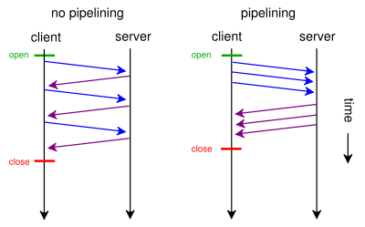
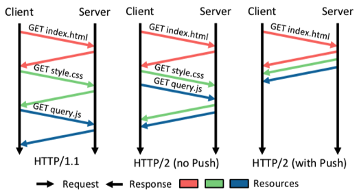
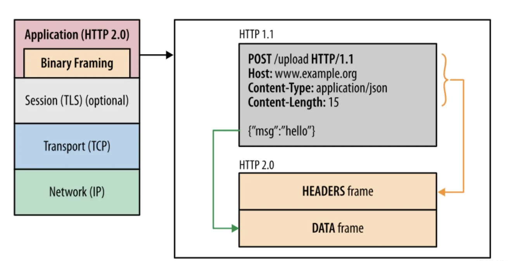

# HTTP 版本对比

## HTTP 发展史

- HTTP0.9(1991)：只有`GET`方法、只有纯文本、没有响应头
- HTTP1.0(1996)：增加了响应头、状态码、权限、缓存、长连接等特性
- HTTP1.1(1997)
  - 默认使用持久链接：`Connection: keep-alive`
  - 增加了`PUT`、`HEAD`、`OPTIONS`等方法
  - 支持虚拟主机：请求头强制增加`HOST`字段，同一台端口可以提过多个服务
  - 缓存增加`etag`和`Cache-Control`方式
  - 支持管线化：允许客户端通过一个**套接字**发送多个请求，不用等待服务器响应
- HTTP2.0(2015)

## HTTP 管线化

通常 HTTP 请求是一个请求->响应的过程，下一个请求只能等待上一个请求响应完成之后再发送。
这样会导致服务器在做下一个响应时中间会有等待，网络条件越不好延迟越大。

管线化是指可以的可以通过一个套接字(IP+PORT)发送多个请求，不需要等待服务器的响应完成之后再发送。
然后服务端会按照请求顺序依次响应。

管线化的限制：

- 要求服务器按照请求发生的顺序响应（FIFO），因为 HTTP 请求和响应式无状态的，如不不按顺序响应则无法将响应和请求进行对应
- 当连接中断后时，客户端需要重新发起未收到响应的请求，所以只有幂等(对于同一个系统，在同样条件下，一次请求和重复多次请求对资源的影响是一致的)的请求才能管线化，否则可能出现意料之外的结果

## HTTP1 存在的问题

- 队头阻塞：管线化可以实现多个请求同时发送，但是因为管线化要求按照请求的顺序进行响应，在响应阶段仍然可能存在阻塞
- 多个 TCP 连接：HTTP1.1 管线化可以并发请求，但是因为管线化的限制很多浏览器都关闭了管线化支持。所以`HTTP1.1`的并发请求是通过多个 TCP 链接实现的，TCP 链接的建立成本较高
- 头部冗余：每次请求都需要带上 cookie、userAgent 等字段，采用纯文本格式
- 只能客户端主动发起请求

## HTTP2.0

HTTP2.0 是一种安全高效的下一代 HTTP 传输协议。安全是因为 HTTP2.0 是建立在 HTTPS 基础上的，高效是因为通过二进制分帧传输实现了在一个 TCP 链接上并发请求，头部压缩方案降低了数据传输量。

### 二进制分帧传输

HTTP1 采用文本传输，HTTP2 采用二进制分帧传输数据，这是 HTTP2 的核心，

HTTP2 基于 Fragment 通信，在 HTTP2 Fragmenting Layer 进行拆分和组装，从而打破必须按照顺序请求响应的限制。

- 流(Stream)：在已建立的 TCP 链接上的双向字节流，一个 TCP 链接上可以有多个流
- 消息(Message)：一个完整的 HTTP 请求或响应，一个流上可以承载多个消息，一个消息由一或多个帧构成。
- 帧(Frame)：数据载体，包含长度、类型、流标识(Stream Identifier)、消息数据等信息

特定的消息在同一个流上，这意味着一个请求响应只能在一个流上传输。

### 多路复用

因为 HTTP2 的二进制分帧传输特性，一个 TCP 链接可以有多个流，也就是一个 TCP 链接可以处理多个 HTTP 请求响应。完美的解决了 HTTP1 线头阻塞和多 TCP 链接问题。

一个 TCP 链接上可以有多个流，消息被分割成多个帧，在传输完成之后进行组装，请求和响应都不会被阻塞。

### 头部压缩

HTTP2 协议在客户端和服务器维护了一份相同的字典，字典维护了常用的头部名称以及常用的头部名称和值的组合信息。这样在传输的过程中只需要传输索引值即可，大大的压缩了空间。

客户端和服务端可以在这份字典里面动态的添加内容，对于`cookie`、`user-agent`等这种只有头部名称没有值的情况，第一次传输的时候需要传输索引及它的值，值会采用静态 Huffman 编码来减小体积。然后在字典里面动态的添加索引和对应的值，后续传输就只需要传递索引。

[索引表](https://httpwg.org/specs/rfc7541.html#static.table.entries)

### 服务端推送

服务端可以预算客户端需要的资源并主动推送给客户端。
服务端推送是 HTTP2 协议里面唯一需要开发中自己配置的功能。

例如客户端请求某个 HTML 页面时，服务端可以分析该客户端依赖的 JS 和 CSS 文件，然后和 HTTP 页面一起推送给客户端，这样客户端在收到 HTTP 页面的同时其依赖的资源也已经得到了。

## 相关阅读

[HTTP 1 & 2](http://blog.yanick.site/2020/10/08/networking/http/http/)

## TODO:HTTP3

HTTP/3 基于 QUIC 协议（Quick UDP Internet Connections），它直接运行在 UDP 之上，而不是传统的 TCP
