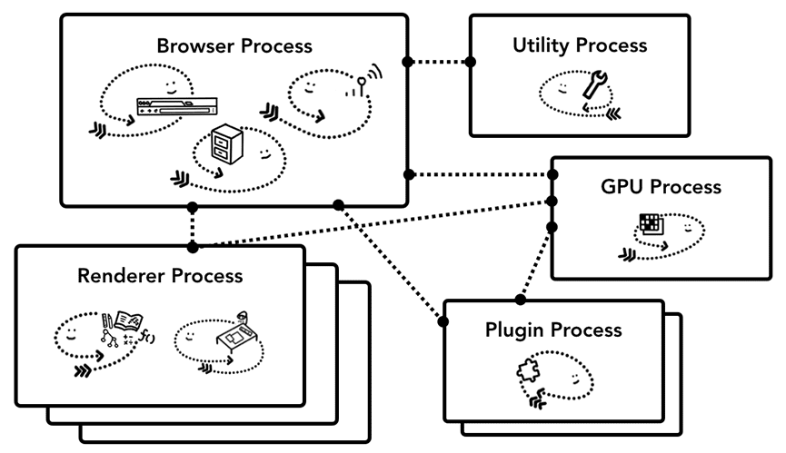
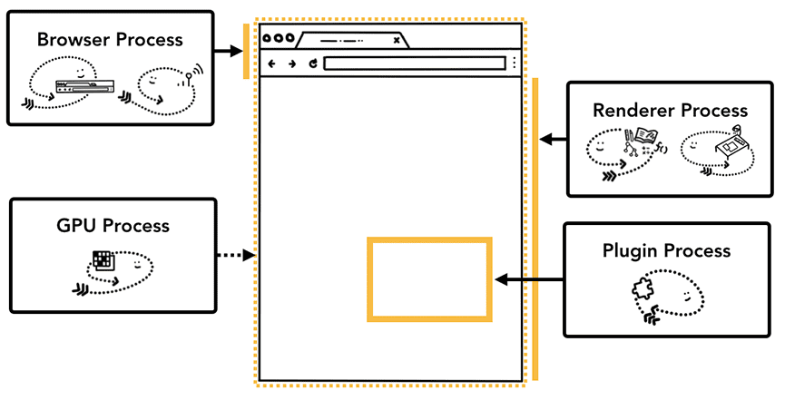
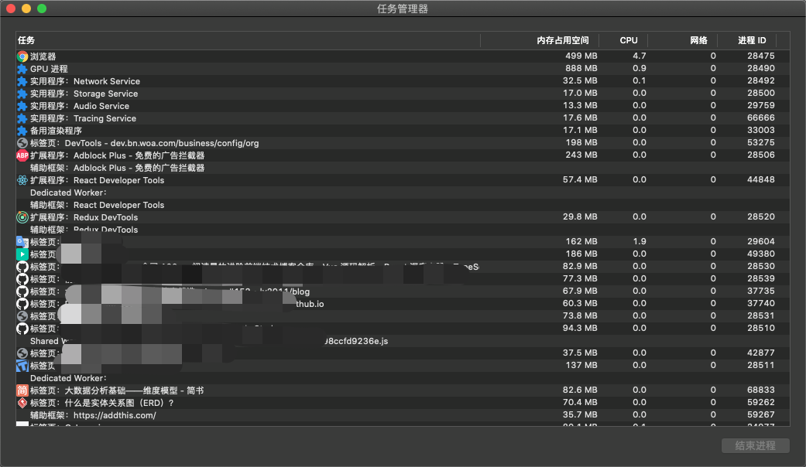
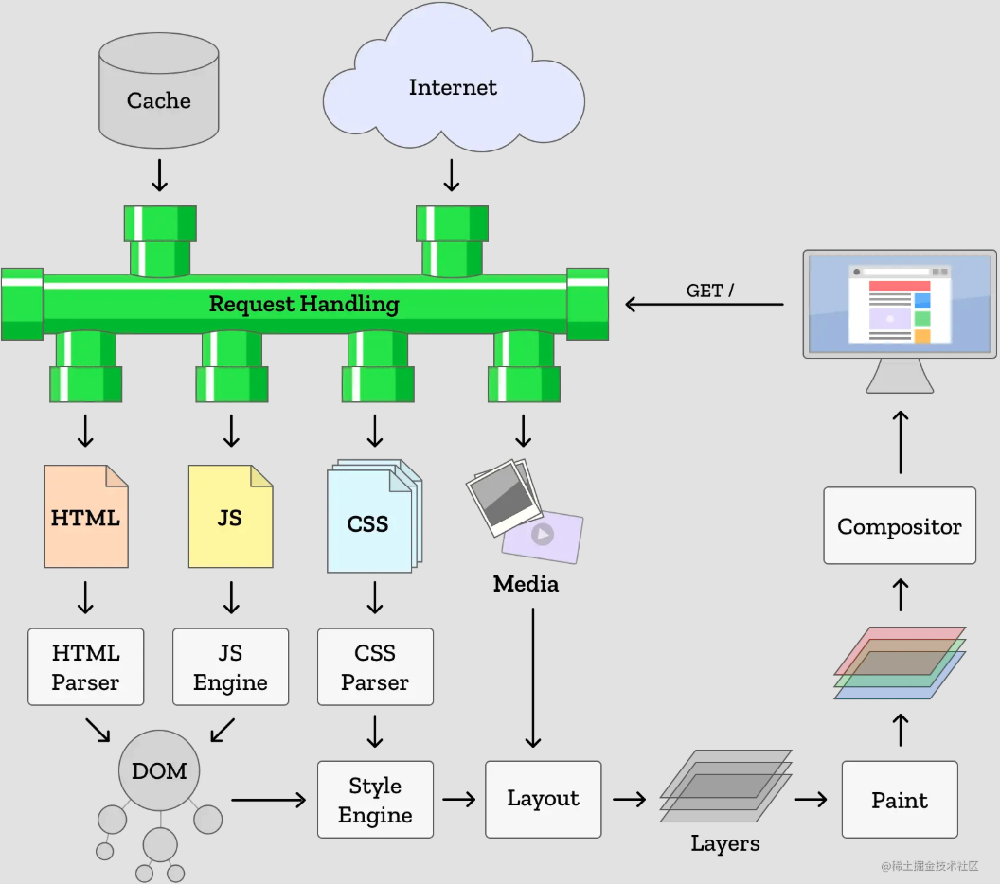

# 浏览器架构

浏览器是**多进程架构**（注意是进程，不要和 JS 单线程混淆），浏览器通常会为每个页面分配一个单独的**渲染进程**，浏览器的主进程负责进程之间的协调。

- 主进程（浏览器进程）：控制页面创建、销毁等，为每个标签页创建一个渲染进程，当用户输入一个 URL 后，主线程会处理请求和响应，然后将获取的数据交给渲染进程处理
  - UI 线程：负责浏览器面显示与用户交互(前进、后退等)
  - 网络线程：处理网络请求堆栈，从互联网获取数据
  - 存储线程：处理文件访问
- 渲染进程：每个标签一个，各进程互不影响，主要负责页面渲染、脚本执行和事件处理等
  - 主线程：会处理**大部分**代码，解析 HTML，构建 DOM 树和 CSSOM 树，执行 JavaScript 脚本，计算样式，进行布局（Layout）和绘制（Paint）等
  - 合成器线程：将不同的渲染层（Layer）合成为最终的页面，处理滚动、动画等不需要完整重绘的操作
  - 光栅线程：将合成线程生成的图层（Layer）转换为位图（Bitmap），即将矢量图形转化为像素，通常在 GPU 中执行，以加速图像的生成和渲染。
  - 工作线程：处理由主线程派发的耗时任务，如脚本执行、数据处理等，以避免阻塞主线程。通过 Web Workers 等机制创建，运行在与主线程隔离的上下文中。
- 插件进程：每个插件一个
- GPU 进程：浏览器公用一个，负责将渲染进程绘制好的位图作为纹理上传到 GPU，并调用 GUP 相关方法将纹理绘制到屏幕
  
  

这种多进程架构的优势在于：

- 稳定性：各个标签页和插件运行在独立的渲染和插件进程中，某个进程崩溃不会影响整个浏览器。
- 安全性：进程间相互隔离，增强了安全性，防止恶意代码跨站点访问数据。
- 性能：多进程利用多核 CPU，提高了浏览器的响应速度和页面渲染效率。

## 渲染进程 Renderer Process

渲染进程即渲染引擎(即我们常说的浏览器内核)工作进程，浏览器的渲染进程是**多线程的**，主要负责页面渲染、脚步执行和事件处理等

- 主线程(Main Thread)：代码的运行线程
  - HTML 解析
  - 样式计算
  - Layout
  - 绘制
  - 合成
  - JS 脚步执行
- TODO:合成线程(Compositor Thread)：接收操作系统绘制信号后将进入合成线程，然后将更新的位图信息发送给 GPU 线程进行绘制
  - 用户交互后操作系统会触发`vsync event`通知合成线程
  - 如果主线程没有绑定事件(滚动事件监听等)，合成线程会避免进入主线程，以达到更优的性能
  - 否则合成线程会触发主线程处理
- TODO:Compositor Tile Worker：由合成线程产生一个或多个 worker 来处理光栅化的工作
  - 光栅化又称栅格化，用于执行绘制指令生成颜色值

### 主线程 Main Thread

- `Frame Start`：Vsync 触发, 一帧开始。
- `Input event handlers` ：合成线程把 input 数据传给主线程，处理事件回调。OS 调度程序将尽最大努力合理调度事件回调(touchmove, scroll, click 等)，以及时响应用户交互。即便如此，在用户交互和主线程处理事件获得响应之间多少会有些延迟。
- `requestAnimationFrame`：
- `Parse HTML`：任何新增的 HTML 都会被处理，构建新的 DOM 元素。 你可以在页面加载或 appendChild 等操作中看到这一过程。
- `Recalc Styles`：对于解析样式文件或 class 或 style 等样式操作都会引发样式计算。可能会重新渲染整棵样式树。 具体取决于哪个元素的样式改变，例如 body 就影响比较大。值得注意的是，浏览器已经很聪明能自动限制波及的范围。
- `Layout`：计算可见元素几何(盒模型)信息(位置、尺寸)。通常会对整个文档操作一遍，生成 Layout Tree。 产生的开销和 DOM 个数成正比例关系。
- `Update Layer Tree`：创建层叠上下文和元素层级顺序，生成 Layer Tree。
- `Paint`：这一步遍历 Layout Tree 记录需要调用绘制的方法 draw calls (fill a rectangle here, write text there)。
- `Composite`：渲染信息合成并提交给合成线程处理，将各个分层进行栅格化
- `Raster Scheduled 和 Rasterize`：光栅调度和光栅化，这里将执行在 Paint 任务中提到的 draw calls。
- `Frame End`：所有 layers 中被光栅化的 tiles 和 input data (可能被事件回调处理了)将被提交给 GPU Thread。
- `requestIdleCallback`：如果还有时间会触发

主线程除了负责页面渲染之外还是 JS 的执行线程，具体的调度由 Event Loop 控制，详见[运行机制 Event Loop](../../02-JavaScript/02.Core/05-运行机制%20Event%20Loop.md)

## 页面加载流程

在浏览器输入一个 URL 到页面加载完成大概分为以下几大步骤：

1. **浏览器进程**处理，负责加载页面
   1. 浏览器进程会判断输入内容是 URL 地址还是搜索查询
   2. 如果是 URL，浏览器进行会调用网络线程请求网络
      1. DNS 寻址及 IP 解析
      2. TCP 链接
      3. 请求、响应、文档下载
   3. 加载完成后网络线程会进行简单的解析，判断响应类型（HTML 文档或 zip 文件），如果加载的是 HTML 文件，那么会将数据传递给**渲染进程**
2. **渲染进程**处理，负责解析并渲染页面，**责在标签页中发生的一切**
   1. 主线程解析
      1. 解析 HTML 生成**DOM 树**，解析过程中会加载解析到的资源，解析 CSS 生成**CSSOM 树**
         1. 将解析到资源加载（图片、CSS、JS）发送到**主进程的网络线程处理**
         2. 当 HTML 解析器找到`<script>`标签时，它会暂停 HTML 文档的解析，并且必须加载、解析和执行`JavaScript`代码
      2. 结合 DOM 树和 CSSOM 树，构建**渲染树**
      3. 布局：遍历 DOM 和计算出的样式，并创建**layout tree**
      4. 绘制：有了 layout tree 之后已经知道 DOM 绘制的尺寸和位置，但是还需要处理浮动、定位等导致的重叠问题，主线程会遍历 layout tree 来创建绘制记录，来生成**绘制顺序**
      5. 合成：将网页的各个部分**分离成图层，分别将它们光栅化**，然后在单独的线程（称为“**合成器线程**”）中合成为网页
         1. 将解析得到的信息转换为屏幕上的像素，这一过程称之为**光栅化**
         2. 主线程会遍历 layout tree 来创建**layer tree**
         3. 将 layer tree 和绘制顺序提交给**合成器线程**，
         4. **合成器线程**会光栅化每一个图层
            1. 首先将图层拆分成多个图块并发送给**光栅线程**
            2. **光栅线程**会光栅化每个图块并将它们存储在 GPU 内存中
            3. 图块光栅化后，合成器线程会收集图块信息生成合成帧。然后，通过 IPC（进程间通信）将合成帧提交到**浏览器进程**，后续提交操作系统完成渲染。

## 参考资料

[深入了解现代网络浏览器](https://developer.chrome.com/blog/inside-browser-part1?hl=zh-cn)
[浏览器简史及其核心原理详解：47 张图带你走进浏览器的世界](https://juejin.cn/post/6983896089703235592)
[性能优化到底应该如何做](https://juejin.cn/post/6962039912392556575)
[[译] 一帧剖析](https://juejin.cn/post/6844904054863183879)
