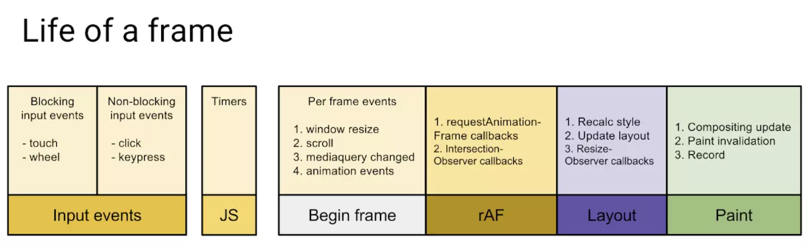

# 浏览器架构

浏览器是**多进程架构**（注意是进程，不要和 JS 单线程混淆），浏览器的主进程负责进程直接的协调，浏览器通常会为每个页面分配一个单独的**渲染进程**

- 主进程（浏览器进程）：控制页面创建、销毁等，为每个标签页创建一个渲染进程，当用户输入一个 URL 后，主线程会处理请求和响应，然后将获取的数据交给渲染进程处理
  - UI 线程：负责浏览器面显示与用户交互(前进、后退等)
  - 网络线程：处理网络请求堆栈，从互联网获取数据
  - 存储线程：处理文件访问
- 渲染进程：每个标签一个，各进程互不影响，主要负责页面渲染、脚本执行和事件处理等
- 第三方进程：插件进程，每个插件一个
- GPU 进程：浏览器公用一个，负责将渲染进程绘制好的位图作为纹理上传到 GPU，并调用 GUP 相关方法将纹理绘制到屏幕

## 渲染进程 Renderer Process

渲染进程即渲染引擎(即我们常说的浏览器内核)工作进程，浏览器的渲染进程是**多线程的**，主要负责页面渲染、脚步执行和事件处理等

- 合成线程(Compositor Thread)：接收操作系统绘制信号后将进入合成线程，然后将更新的位图信息发送给 GPU 线程进行绘制
  - 用户交互后操作系统会触发`vsync event`通知合成线程
  - 如果主线程没有绑定事件(滚动事件监听等)，合成线程会避免进入主线程，以达到更优的性能
  - 否则合成线程会触发主线程处理
- 主线程(Main Thread)：代码的运行线程
  - JS 脚步执行
  - HTML 解析
  - 样式计算
  - Layout
  - 绘制
  - 合成
- Compositor Tile Worker：由合成线程产生一个或多个 worker 来处理光栅化的工作
  - 光栅化又称栅格化，用于执行绘制指令生成颜色值

### 主线程 Main Thread

- `Frame Start`：Vsync 触发, 一帧开始。
- `Input event handlers` ：合成线程把 input 数据传给主线程，处理事件回调。OS 调度程序将尽最大努力合理调度事件回调(touchmove, scroll, click 等)，以及时响应用户交互。即便如此，在用户交互和主线程处理事件获得响应之间多少会有些延迟。
- `requestAnimationFrame`：
- `Parse HTML`：任何新增的 HTML 都会被处理，构建新的 DOM 元素。 你可以在页面加载或 appendChild 等操作中看到这一过程。
- `Recalc Styles`：对于解析样式文件或 class 或 style 等样式操作都会引发样式计算。可能会重新渲染整棵样式树。 具体取决于哪个元素的样式改变，例如 body 就影响比较大。值得注意的是，浏览器已经很聪明能自动限制波及的范围。
- `Layout`：计算可见元素几何(盒模型)信息(位置、尺寸)。通常会对整个文档操作一遍，生成 Layout Tree。 产生的开销和 DOM 个数成正比例关系。
- `Update Layer Tree`：创建层叠上下文和元素层级顺序，生成 Layer Tree。
- `Paint`：这一步遍历 Layout Tree 记录需要调用绘制的方法 draw calls (fill a rectangle here, write text there)。
- `Composite`：渲染信息合成并提交给合成线程处理，将各个分层进行栅格化
- `Raster Scheduled 和 Rasterize`：光栅调度和光栅化，这里将执行在 Paint 任务中提到的 draw calls。
- `Frame End`：所有 layers 中被光栅化的 tiles 和 input data (可能被事件回调处理了)将被提交给 GPU Thread。
- `requestIdleCallback`：如果还有时间会触发

主线程除了负责页面渲染之外还是 JS 的执行线程，具体的调度由 Event Loop 控制，详见[运行机制 Event Loop](../../02-JavaScript/02.Core/05-运行机制%20Event%20Loop.md)

## TODO:页面加载流程

在浏览器输入一个 URL 到页面加载完成大概分为以下几大步骤：

1. 浏览器输入 url，浏览器主进程接管，开一个下载线程
   1. DNS 寻址及 IP 解析
   2. TCP 链接
   3. 请求、响应、文档下载
2. 将下载内容通过`RendererHost`接口转交给渲染进程
   1. 建立 DOMTree、CSSOMTree 和 RenderTree 并渲染页面

## 参考资料

[浏览器简史及其核心原理详解：47 张图带你走进浏览器的世界](https://juejin.cn/post/6983896089703235592)
[性能优化到底应该如何做](https://juejin.cn/post/6962039912392556575)
[[译] 一帧剖析](https://juejin.cn/post/6844904054863183879)
