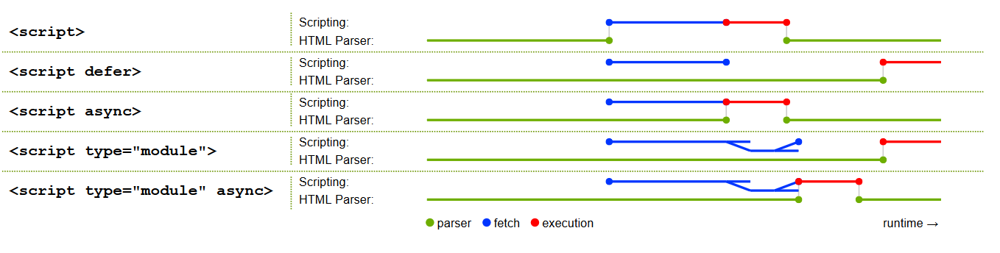
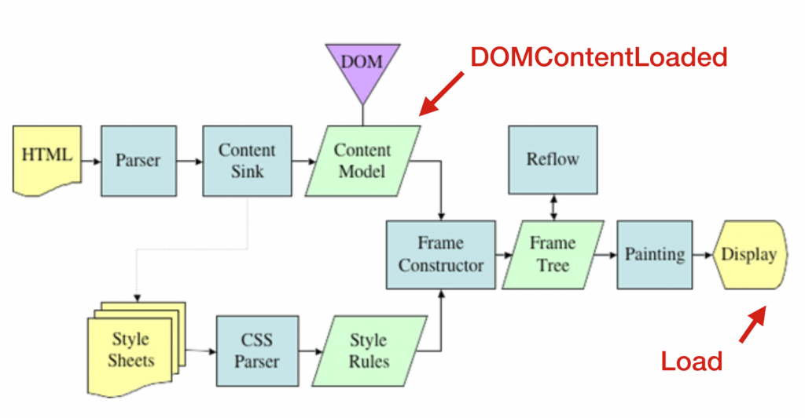

# HTML 页面中的资源加载策略

HTML 页面及页面内包含的资源一般基于 HTTP 协议进行资源的请求和获取。

浏览器根据照资源对页面的影响计算加载的优先级，并按照优先级下载资源。

我们可以使用异步脚本、preload 和 prefetch 等方法更细粒度的对优先级进行微调。

页面在资源加载之前会进行安全检查，阻止不满足条件的资源加载并报错，详见[CSP](../06-安全/XSS.md)。

## 资源加载优先级

浏览器默认加载优先级：

- 第一级：会影响页面布局的资源，包括：html、css、front
- 第二级：preload 资源、script、xhr
- 第三级：图片、音频、视频
- 第四级：prefetch 资源

在默认优先级基础上浏览器会根据一些规整对优先级进行调整，例如：

- 将同步 XHR 请求优先级调为最高
- 现代浏览器为了提升用户体验会将首屏图片优先级调高
- 脚本规则
  - 异步脚本的优先级会降低
  - 在页面第一张图片之前的标记为`early**`，提升优先级
  - 在页面第一张图片之后的标记为`late**`


## 异步脚本

HTML 页面通过`script`标签可以加载外部 JS 脚本，总共有三种方式：

1. 普通模式：`<script src="path.js" />`
2. 延迟模式：`<script src="path.js" defer />`
3. 异步模式：`<script src="path.js" async />`

异步模式优先级高于延迟模块，如果在`script`标签上同时设置`async`和`defer`属性，生效的是`async`属性。



如上图不同的模式会对页面的解析和渲染产生不同的影响。

- 普通模式：在 DOM 解析过程中遇到`script`标签会停止解析，等待脚本加载运行完成后再继续进行解析。
- 延迟模式：不会中断 DOM 解析，会在后台进行脚本下载，在 DOM 解析完成后(DOMContentLoaded 之前)执行。
- 异步模式：和 Defer 模式相同的是也会在后台进行进行脚本下载，不同的是在脚本加载完成后会中断 DOM 解析立即执行脚本。

另外如果存在多个非普通模式脚本

- Defer 模式会按照声明顺序依次执行
- Async 模式则会根据加载完成顺序执行，即先加载完成的先执行

## PreFetching&Preloading

`prefetch`和`preload`为我们提供了更细粒度的控制浏览器加载资源的方法，在`<head>`中使用`<link>`标签声明，告诉浏览器提前进行加载，后执行，加载和执行解耦。

### 预提取(preload)

用来定义当前页面需要的资源，`preload`加载的样式和脚本在加载完成后不会执行，加载过程也不会阻塞页面渲染。

- 场景一：为了避免 JS 脚本阻塞页面渲染，我们通常会将脚本放`<body>`底部加载，使用`preload`实现在不阻塞页面渲染的前提下尽早的开始资源加载。
- 场景二：在使用自定义字体时常常会发生字体样式闪动（FOUT，Flash of Unstyled Text），原因是字体时通过 CSS 引入的，在 css 解析后才会加载，可以使用 preload 告诉浏览器提前进行字体加载。

```HTML
<head>
  <meta charset="utf-8">
  <title>JS and CSS preload example</title>

  <link rel="preload" href="style.css" as="style">
  <link rel="preload" href="main.js" as="script">
  <link rel="preload" href="fonts/xxx.woff2" as="font" type="font/woff2" crossorigin>

  <link rel="stylesheet" href="style.css">
</head>

<body>
  <h1>bouncing balls</h1>
  <canvas></canvas>

  <script src="main.js" defer></script>
</body>
```

**注意**：

1. `type`属性可以优化`preload`，浏览器之后对执行的类型进行预加载
2. 当预加载资源使用 CORS(例如 font、xhr、fetch) 加载时，必须加上`crossorigin`属性，否则会进行多次加载，即使这个资源不是跨域请求也需要。
   1. 原因是不添加`crossorigin`属性，浏览器会以匿名的方式请求，preload 相对于正常请求，请求头中没有`origin`字段

### 预加载(prefetch)

用来定义页面**将来可能**会用到的资源，告诉浏览器在主要内容加载完成之后加载，利用浏览器空闲时间下载，以提升之后的用户体验。

```HTML
<!-- 资源预加载 -->
<link rel="prefetch" href="test.css">
<!-- DNS预解析： -->
<link rel="dns-prefetch" href="//xxx.com">
<!-- http预连接：将建立对该域名的TCP链接 -->
<link rel="preconnect" href="https://xxx.com">
<!-- 页面预渲染：将会预先加载链接文档的所有资源 -->
<link rel="prerender" href="//xxx.com">
```

## 页面加载事件

页面加载主要节点和事件：

- 页面加载完成
- 资源加载完成
- 页面关闭



### 页面加载完成`DOMContentLoaded`

HTML 文档加载和解析完成之后触发，**DOM 已经就绪（DOMTree Ready）**，但像 `` 和样式表之类的外部资源可能尚未加载完成。

浏览器在 HTML 页面下载完成后会自上而下进行解析并开启下载进程，对页面引用的资源进行优先级排序并下载
JS 脚本和 CSS 样式会阻塞页面的解析和渲染，影响`DOMContentLoaded`事件触发，详见[关键渲染路径&渲染优化](./2.关键渲染路径&渲染优化.md)

```JavaScript
document.addEventListener("DOMContentLoaded", ready);
```

### 资源加载完成`onload`

外部资源已加载完成。浏览器不仅加载完成了 HTML，还加载完成了所有外部资源：图片，样式等。

```JavaScript
// 方式一
window.addEventListener('load', (event) => {
// 方式二
window.onload = function() {};
```

### 页面关闭

用户准备离开`beforeunload`，如果访问者触发了离开页面的导航（navigation）或试图关闭窗口。可以检查用户是否保存了更改，并询问他是否真的要离开

```JavaScript
window.onbeforeunload = function() {
  return "There are unsaved changes. Leave now?";
};
```

用户马上离开`unload`，当用户关闭页面时触发，但是我们仍然可以启动一些操作，例如发送统计数据。

```JavaScript
window.addEventListener("unload", function() {});
```

### 获取页面状态

使用`document.readyState`属性可以获取当前加载状态的信息，有以下属性：

`loading`： 文档正在被加载。
`interactive`： 文档被全部读取。与`DOMContentLoaded`几乎同时发生，但是在`DOMContentLoaded`之前发生。
`complete`： 文档被全部读取，并且所有资源（例如图片等）都已加载完成，与`window.onload`几乎同时发生，但是在`window.onload`之前发生。

```JavaScript
// 监听状态变化
document.addEventListener('readystatechange', callback);

// DOM加载完成后立刻执行
function doSomething() { /*...*/ }
if (document.readyState == 'loading') {
  // 仍在加载，等待事件
  document.addEventListener('DOMContentLoaded', doSomething);
} else {
  // DOM 已就绪！
  doSomething();
}
```

## 参考

[浏览器里的资源请求](https://blog.windstone.cc/browser-env/browser/browser-requests.html)
