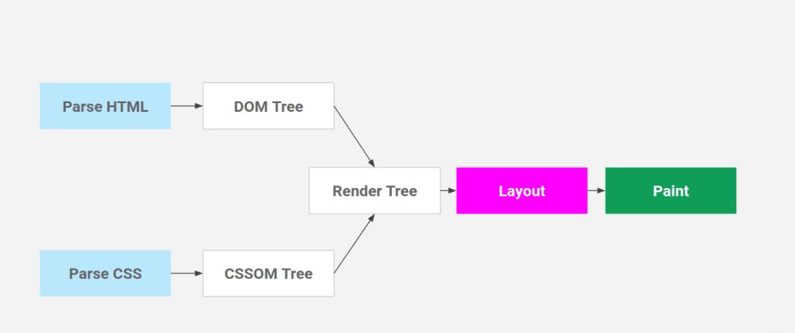

# 页面加载渲染流程

浏览器在下载 HTML 网页的同时胡进行解析，构建 `DOM Tree`，浏览器会从上到下解析 HTML 将 DOM 标签生成`DOM Tree`，将 CSS 样式生成`CSSOM Tree`，然后将`DOM Tree`和`CSSOM Tree`合成`Render Tree`。`Layout`计算每个对象的精确位置和大小在页面上完成布局和渲染。最后将渲染树绘制到屏幕上。

Javascript 脚本，主要是通过`DOM API`和`CSSOM API`来操作 `DOM Tree` 和 `CSSOM Trees`.

## 渲染树构建

渲染树只包含渲染网页所需的节点，生成流程大致为以下步骤：

1. 从 DOMTree 上遍历每一个可见节点
2. 为每一个可见节点找到其适配 CSSOM 规则
3. 组合生成 RenderTree 节点

## 页面阻塞

HTML 的解析过程是可以被中断的，即**页面阻塞**。

**JS 阻塞**：当解析的过程中遇到`<script>`标签便会停止解析去处理脚本，即解析阻塞，如果是内联脚本则会在脚本运行结束之后继续进行解析，如果是外联脚本则会下载脚本运行之后继续继续解析。同时会阻塞`img`和`link`等标签请求外部资源。
异步`<script>`可以优化阻塞，详见[页面资源加载策略及优化](./1.%20页面资源加载策略及优化.md)

**CSS 阻塞**：`link`、`style`标签加载 css 不会阻塞 DOMTree 生成，会阻塞 RenderTree 的生成，并且会**阻塞后面 JS 语句**的执行。不会阻塞`img`和`link`等标签请求外部资源

## 渲染优化

合理的脚本样式加载顺序可以提升页面的用户体验，最佳实践：

1. 将 CSS 引入在 HTML 的 header 中处理
2. 将 JS 脚本放到 HTML body 的最下方

**避免浏览器样式闪烁** FOUC(Flash Of UnStyled Content)浏览器样式闪烁，在页面加载渲染完成后又加载新的的样式，导致页面重新渲染。

为了避免这种情况要将 external style 放到`head`标签中进行加载，在页面渲染之前构建相对完整的 CSSDOM Tree。
另外`img`等标签的尺寸会在资源加载完成之后发生变化，针对这些标签我们可以采用固定尺寸等方式防止 FOUC。

**页面的重绘(repaint)和重流(reflow)** 重绘和重流会消耗很多时间和资源，应该尽量减少重绘和重流

**重绘**：屏幕的一部分需要重新绘制，例如修改页面颜色等会导致页面重绘
**重流**：节点尺寸变化会导致重新计算 Render Tree

- 读取 DOM 或者写入 DOM，尽量写在一起，不要混杂
- 缓存 DOM 信息
- 不要一项一项地改变样式，而是使用 CSS class 一次性改变样式
- 使用 document fragment 操作 DOM
- 动画时使用 absolute 定位或 fixed 定位，这样可以减少对其他元素的影响
- 只在必要时才显示元素
- 使用 window.requestAnimationFrame()，因为它可以把代码推迟到下一次重流时执行，而不是立即要求页面重流
- 使用虚拟 DOM（virtual DOM）库
