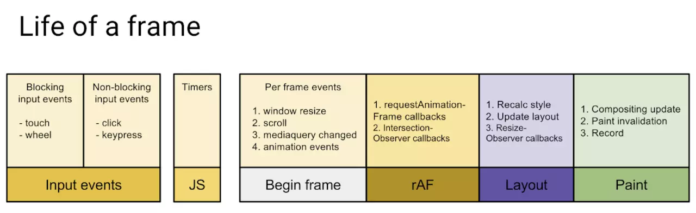
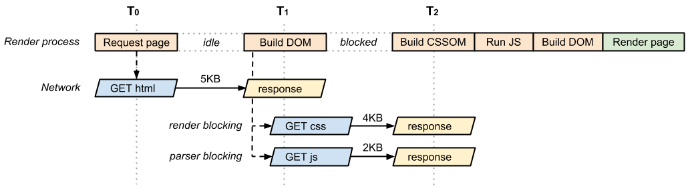

# 关键渲染路径&渲染优化

## CRP(Critical Rendering Path) 关键渲染路径

CRP 指浏览器通过把 HTML、CSS 和 JavaScript 转化成屏幕上的像素的步骤顺序：

1. 下载 HTML
2. 解析 HTML 并构建 DOM
3. 处理 CSS 并构建 CSSOM
4. 将 DOM 与 CSSOM 合并成一个 RenderTree(渲染树)
5. Layout：根据渲染树来布局，以计算每个节点的几何信息
6. Paint：绘制文字、颜色、图像、边框和阴影等，也就是一个 DOM 元素所有的可视效果。一般来说，这个绘制过程是在多个层上完成的。
7. Composite：层合成，根据复杂的 3d 转换，页面滚动，还有`z-index`属性都会形成单独图层，把图层按照正确顺序排列。生成分层树。

Javascript 脚本，主要是通过`DOM API`和`CSSOM API`来操作 `DOM Tree` 和 `CSSOM Trees`，最终影响页面.

## RenderTree

渲染树只包含渲染网页所需的节点，生成流程大致为以下步骤：

1. 从 DOMTree 上遍历每一个可见节点
2. 为每一个可见节点找到其适配 CSSOM 规则
3. 组合生成 RenderTree 节点

## TODO:渲染层 AND 合成层

渲染树中的每一个节点都对应应 LayoutObject，处于同一坐标空间(z 轴)的节点会合成一个 RenderLayer，也就是渲染层，渲染层保证元素最终以正确的顺序合成，合成之后称为合成层(Compositing Layers)，从而正确的处理透明元素和重叠元素显示。

用于特定属性的渲染层浏览器会自动提升为合成层，合成层有单独的图层，和其他图层互不影响。二普通渲染层内的元素共用一个图层，单个元素的变化可能会导致其他元素的变化（重流），基于这个特性我们可以将动画元素设置为合成层，避免重流带来的性能问题。可以出发合成层提升的属性：

- 3D 转换：`transform: translateZ(0);`等
- `video`、`canvas`、`iframe` 等元素
- `position: fixed;`
- `will-change`
- `filter`

## 页面阻塞

那么浏览器每一帧都需要完成哪些工作？

- 处理用户的交互
- JS 解析执行
- 帧开始。窗口尺寸变更，页面滚去等的处理
- requestAnimationFrame(rAF)
- 布局
- 绘制

HTML 的解析过程是可以被中断的，即**页面阻塞**。

### JS 阻塞

JS 可以对 DOM 和 CSSOM 进行修改，所以在首次渲染的时候遇到 JS 会停止 DOM 解析。

- 浏览器解析器遇到`<script/>`标签会停止 DOM 构建，直到 JS 脚本下载并执行完成(内联脚本不需要下载)
- 同步脚本会阻塞 DOM 构建，也就是会影响`DOMContentLoaded`事件
- 异步脚本：
  - 延迟模式：会在 DOM 解析完成后执行，不会阻塞`DOMContentLoaded`。
  - 异步模式：下载过程中不会阻塞解析，因为异步脚本下载完成后会立刻执行，如果下载完成后 DOM 解析还没有完成会停止解析等到 JS 脚本执行完成后继续解析。

### CSS 阻塞

**CSS 加载不会阻塞 DOM 解析**，浏览器在解析 HTML 时，遇到`link` `style`标签会继续解析 DOM 元素，并同时加载和解析 CSS

**CSS 加载会阻塞 DOM 渲染**，尽管 DOM 和 CSSOM 是并行解析的，但在构建 Render Tree 之前。浏览器需求同时拥有完整的 DOM 和 CSSOM，所以在 CSS 加载和解析完成之前，浏览器会组织页面的渲染，避免出现内容闪烁（FOUC）现象

**CSS 会阻塞后续 JS 执行**，如果在`script`标签之前引用了外部的 CSS 文件，浏览器会等等 CSS 加载解析完成之后，在执行 JS 脚本，这是为了避免 CSS 影响到 JS 可能需要的样式信息

将脚本设为异步模式后，异步脚本不会阻塞渲染，CSS 脚本也不会阻塞`domContentLoaded`事件。

优化建议：

- 将关键 CSS 放在 `<head>` 中：确保关键样式尽早加载，减少首次渲染的延迟。
- 非关键 CSS 使用 media 属性：对于非关键的 CSS，可以使用 media 属性（如 media="print"）或在需要时动态加载，以避免阻塞渲染。
- 异步加载 JavaScript：对于不依赖于 CSS 的脚本，使用 async 或 defer 属性，使其异步加载，减少对页面解析和渲染的阻塞。

## TODO:渲染优化

阻塞网页首次渲染的资源称为**关键资源**，主要是 JS 和 CSS，首屏渲染优化的关键就是关键资源的优化。

1. 关键资源数量优化
   1. 适当使用内联样式和脚步
   2. 不要操作 DOM 的脚步使用异步或延迟模式加载
2. 关键资源大小优化
   1. 脚步和文档压缩

合理的脚本样式加载顺序可以提升页面的用户体验，最佳实践：

1. 将 CSS 引入在 HTML 的`header`中处理
2. 将 JS 脚本放到 HTML`body`的最下方

**避免浏览器样式闪烁** FOUC(Flash Of UnStyled Content)浏览器样式闪烁，在页面加载渲染完成后又加载新的的样式，导致页面重新渲染。

为了避免这种情况要将 external style 放到`head`标签中进行加载，在页面渲染之前构建相对完整的 CSSOM Tree。
另外`img`等标签的尺寸会在资源加载完成之后发生变化，针对这些标签我们可以采用固定尺寸等方式防止 FOUC。

**页面的重绘(repaint)和重流(reflow)** 重绘和重流会消耗很多时间和资源，应该尽量减少重绘和重流

**重绘**：屏幕的一部分需要重新绘制，例如修改页面颜色等会导致页面重绘
**重流**：节点尺寸变化会导致重新计算 Render Tree

- 读取 DOM 或者写入 DOM，尽量写在一起，不要混杂
- 缓存 DOM 信息
- 不要一项一项地改变样式，而是使用 CSS class 一次性改变样式
- 使用 document fragment 操作 DOM
- 动画时使用`absolute`定位或`fixed`定位，这样可以减少对其他元素的影响
- 只在必要时才显示元素
- 使用`window.requestAnimationFrame()`，因为它可以把代码推迟到下一次重流时执行，而不是立即要求页面重流
- 使用虚拟 DOM（virtual DOM）库

TODO:[优化关键渲染路](https://developers.google.com/web/fundamentals/performance/critical-rendering-path)
TODO: DevTools 使用
