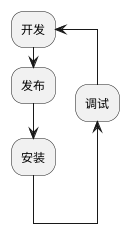

# NPM Package 开发和发布

npm package 是 js 程序共享的主要途径，npm package 主要有两种使用场景，一种是作为命令行工具安装使用，一种是作为一个功能模块在其它应用中被引用。
一个 package 主要由执行程序和元数据两部构成

## NPM 账号

- 查看当前账户：`npm whoami`
- 登录账户：`npm login`
- 查看账户信息：`npm profile get`
- 更新账户信息：`npm profile set <prop> <value>`

## package 元数据

`package.json`内容为 package 的元数据，常用[字段列表](https://docs.npmjs.com/cli/v6/configuring-npm/package-json)：

1. `name`：全部小写，没有空格，可以使用下划线或者横线
2. `version`：版本，格式[Semantic Versioning](../../14-Solutions/Semantic%20Versioning.md)
3. `description`：描述信息，有助于搜索
4. `keywords`：关键字
5. `author`：作者，推荐格式：`Your Name <email@example.com> (http://example.com)`
6. `license`：开源协议
7. `main`：入口文件，一般都是 index.js
8. `bin`：指定内部命令对应的可执行文件
9. `config`：添加命令行环境变量
10. `scripts`：脚本，参考[NPM 脚本](./scripts.md)
11. `dependencies`：生产环境中需要用到的依赖，参考[包版本管理](./package%20version.md)
12. `devDependencies`：开发、测试环境中用到的依赖
13. `files`：
14. `private`：私有仓库，如果设置为`true`，npm 会拒绝进行`publish`操作
15. `publishConfig`：

## 创建 Package

- Step1. 通过`npm init`初始化项目，生成 package.json
- Step2. 创建入口文件，默认为`index.js`
- Step3. 发布 package，在发布之前请确认是否已经有同名项目存在，如果有则发布过程中会提示帐号权限不足；
  - 注册 npm 帐号：`npm adduser`；
  - 在客户端登录帐号`npm login`，登录后会在客户端存储证书；
  - 发布：`npm publish`
- Step4. 更新 package
  - 更新版本：`npm version <update_type>`，该命令会更新 package.json 中的版本号，如果项目使用 git 管理，那么同时会添加一个 git tag
    - `patch`：修丁版本
    - `minor`：次版本
    - `major`：主版本
  - 重新发布：`npm publish`

## [dist-tags](https://docs.npmjs.com/cli/v7/commands/npm-dist-tag)

dist-tags 相对于 Semantic Versioning 更加 human-readable。是 Semantic Versioning 的补充。
使用`npm publish`会自动添加`latest`标签，我们可以使用`--tags`自定义，例：`npm publish --tags beta`。
也可以对特定的版本设置标签，例：`npm dist-tag add example-package@1.4.0 stable`

## 使用`npm link`调试本地包

通常我们要调试一个包的功能需要先发布到仓库，然后再安装调试，这个流程非常麻烦并且会产生很多没有必要的发布。

我们可以使用`npm link`命令快捷的进行本地调试，分为两步：

- step1：在需要调试的包内执行`npm link`命令，这时会在全局安装目录下创建一个链接，链接到这个包，如果是作为一个 CLI 工具使用就可以直接在控制台进行测试了
- step2：如果是作为某个项目的依赖包使用，则在项目的根目录执行`npm link packageName`命令，这时会在`node_modules`目录下创建一个链接，连接到 step1 创建包，注意这里的`packageName`是`package.json`中的`name`字段的值，而不是目录名。然后就可以使用`require`引入这个包。
- Step3：在调试完成后清理创建的 link
  - 在项目中使用`npm unlink --no-save package && npm install`命令
  - 在包下执行`npm unlink`命令

## TODO:开发一个命令行工具

framework 及工具

## TODO:如何组织样式文件
