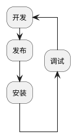

# npm package

npm pacakage 是 js 程序共享的主要途径，npm package 主要有两种使用场景，一种是作为命令行工具安装使用，一种是作为一个功能模块在其它应用中被引用。
一个 package 主要由执行程序和元数据两部构成

## package 元数据

`package.json`内容为 package 的元数据，常用[字段列表](https://docs.npmjs.com/cli/v6/configuring-npm/package-json)：

1. `name`：全部小写，没有空格，可以使用下划线或者横线
2. `version`：版本，格式`主板本.副版本.补丁版本`
3. `description`：描述信息，有助于搜索
4. `keywords`：关键字
5. `author`：作者
6. `license`：开源协议
7. `private`：TODO:
8. `main`：入口文件，一般都是 index.js
9. `bin`：指定内部命令对应的可执行文件
10. `config`：添加命令行环境变量
11. `scripts`：脚本，参考[NPM 脚本](./scripts.md)
12. `dependencies`：生产环境中需要用到的依赖，参考[包版本管理](./package%20version.md)
13. `devDependencies`：开发、测试环境中用到的依赖

## 使用 package

### package 安装

在 MacOS 系统下，NodeJS 默认安装路径为：`/usr/local/bin/node`，NodeJS 在安装的同时会全局安装`npm`。
全局安装目录是`/usr/local/lib/node_modules`，`npm`也安装在这个目录。
本地安装时， npm 会从当前目录开始逐级向上遍历寻找 package 的根目录(即有`package.json`文件或`node_modules`目录的目录)，如果未找到则把当前目录作为根目录，然后在根目录的`./node_modules`下安装。

其它系统原理类似，详细请参考[folders](https://docs.npmjs.com/cli/v6/configuring-npm/folders)

### 作为 CLI 工具使用

npm 在安装 package 完成后会检查`package.json`中是否有声明`bin`字段，`bin`字段用于声明可执行程序位置
全局安装：会在`/usr/local/bin/`目录下创建链接，这时我们就可以直接在命令行执行
本地安装：会在`根目录/node_modules/.bin/`下创建链接，这时我们可以使用`npm run`或者`npx`执行

### 作为项目 dependence 使用

作为项目 dependence 安装的 package 可以在程序中使用`require("packagename")`引用
js 引擎会使用 package 的`package.json`中的`main`字段声明的文件作为入口文件
如果未声明`main`字段则默认使用`index.js`，如果没有`index.js`文件则无法正常使用
当然也可以使用完整路径引入 package，例如：`require("packagename/lib/path/to/sub/module")`，这样显然是不优雅的

## 创建自己的 package

- Step1. 通过`npm init`初始化项目，生成 package.json
- Step2. 创建入口文件，默认为`index.js`
- Step3. 发布 package，在发布之前请确认是否已经有同名项目存在，如果有则发布过程中会提示帐号权限不足；
  - 注册 npm 帐号：`npm adduser`；
  - 在客户端登录帐号`npm login`，登录后会在客户端存储证书；
  - 发布：`npm publish`
- Step4. 更新 package
  - 更新版本：`npm version <update_type>`，该命令会更新 package.json 中的版本号，如果项目使用 git 管理，那么同时会添加一个 git tag
    - `patch`：修丁版本
    - `minor`：次版本
    - `major`：主版本
  - 重新发布：`npm publish`

### TODO:如何组织样式文件

### 使用`npm link`调试本地包

通常我们要调试一个包的功能需要先发布到仓库，然后再安装调试，这个流程非常麻烦并且会产生很多没有必要的发布。

我们可以使用`npm link`命令快捷的进行本地调试，分为两步：

- step1：在需要调试的包内执行`npm link`命令，这时会在全局安装目录下创建一个链接，链接到这个包，如果是作为一个 CLI 工具使用就可以直接在控制台进行测试了
- step2：如果是作为某个项目的依赖包使用，则在项目的根目录执行`npm link packageName`命令，这时会在`node_modules`目录下创建一个链接，连接到 step1 创建包，注意这里的`packageName`是`package.json`中的`name`字段的值，而不是目录名。然后就可以使用`require`引入这个包。
- Step3：在调试完成后清理创建的 link
  - 在项目中使用`npm unlink --no-save package && npm install`命令
  - 在包下执行`npm unlink`命令

## TODO:各种 dependence

## TODO:开发一个命令行工具

framework 及工具
