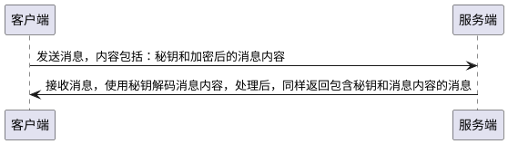

# 加密 && SSH

## 对称加密

加密和解密双方使用同样的秘钥进行加密和解密，但是秘钥的传输过程容易被劫持；
优点：速度快
缺点：不安全，秘钥容易被截取

## 非对称加密

加密和解密使用不同的秘钥，加密和解密使用的秘钥必须匹配公钥(public key)和私钥(private key)。使用公钥加密的信息只能使用匹配的私钥解密，反之亦然。公钥可以对外发布。
过程概述：A 请求 B，B 返回自己的公钥给 A，A 向 B 发送使用公钥加密的信息，B 收到消息后使用私钥解密消息；
优点：安全
缺点：慢，消耗计算资源

## 对称加密+非对称加密

使用非对称加密进行对称加密秘钥传输，保证安全。使用对称加密秘钥进行通信保证速度。
过程概述：A 生成一个秘钥，A 请求 B，首先获取 B 的公钥，然后使用 B 的公钥加密之前生成的秘钥并发送给 B，B 使用自己的私钥解密获取 A 的密钥，A 和 B 之后的通信使用 A 生成的秘钥进行加密，这样就解决了对称加密密钥被截取的问题
优点：快、安全
缺点：可能发生中间人攻击

## SSH

SSH 是一种用于计算机之间通信的网路协议，用于加密登录，登录命令：`ssh [-p xxx] user@host`

### 登录过程

1. 请求：远程主机收到用户的登录请求，把自己的公钥发给用户；
2. 加密：用户使用这个公钥，将登录密码加密后发送回来；
3. 验证：远程主机用自己的私钥解密登录密码，验证登录；

中间人攻击：

攻击过程：如果用户和服务器的登录过程被截获，中介人冒充服务器给用户发送公钥，中间人就可以使用自己的私钥获取用户密码。
应对方案：在首次登录服务的时候，系统会提示确认主机的**公钥指纹**，公钥指纹一般都会发布在服务官方网站，确认一致之后，既可以确认输入密钥登录。在确认之后系统会将指纹写入到`~/.ssh/known_hosts`中，下次登录会检查该文件，如果已经确认就不会继续提示。

### 公钥登录

每次都使用密码登录非常麻烦，SSH 提供了公钥登录，可以省去密码输入：

1. 用户自己生成密钥对，将公钥存储在远程主机；
2. 登录的时候，远程主机会发送一段随机字符串
3. 用户使用自己的私钥加密字符串后再返回给远程主机
4. 远程主机使用事先上传的公钥进行解密，解密成功完成登录

使用 ssh-keygen 生成秘钥对

1. 运行`ssh-keygen`，一路回车，可以设置密码，运行结束后在`~/.ssh/`目录下会生成公钥`id_rsa.pub`和私钥`id_rsa`两个文件
2. 运行`ssh-copy-id [-p xxx] user@host`上传公钥到服务器

### 配置文件

`~/.ssh/id_rsa.pub`：公钥
`~/.ssh/id_rsa`：私钥
`~/.ssh/known_hosts`：客户端存储已经确认的公钥指纹

`/etc/ssh/sshd_config`：ssh 服务配置
`~/.ssh/authorized_keys`：服务端存储客户端公钥
