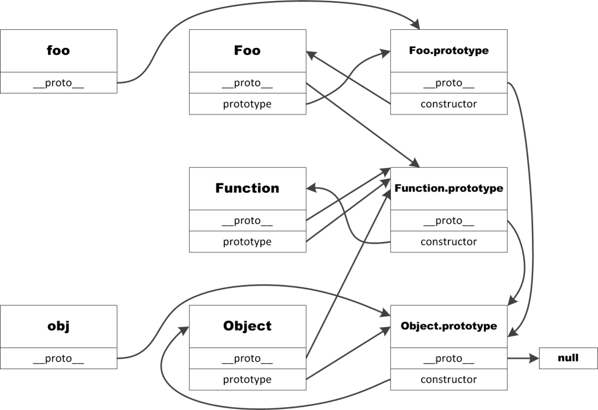

# JavaScript 原型链

在 JavaScript 中每个**函数**都有一个`prototype`属性，被称为**原型对象**；每个原型对象都有一个`constructor`属性指向函数本身。

原型对象上包含了由这个函数构造出来的对象的所有公共属性和方法。

每一个通过构造函数派生出的**实例对象**都有一个`__proto__`的非标准属性，这个属性就指向构造函数的原型对象`prototype`，这样每个对象都可以通过`__proto__`访问到原型对象，同一个函数派生出的实例对象共享同一个`prototype`原型对象。

`__proto__`是非标准属性，建议使用`Object.getPrototypeOf()`方法获取对象原型。

JavaScript 中有两个特殊的对象：`Object` 与 `Function`。

- `Object.prototype` 是所有对象的原型，处于原型链的最底层。
- `Function.prototype` 是所有函数对象的原型，包括构造函数。`Object` 的 `prototype` 属性指向`null`。



```Javascript
lucy.__proto__;// Person {}
lucy.__proto__ === Person.prototype;// true
Object.getPrototypeOf(lucy) === Person.prototype;// true
Object.getPrototypeOf(lucy) === lucy.__proto__;// true
Person.prototype.constructor === Person; // true
```

在 JavaScript 中当调用对象的属性或调用对象的方法时，对象首先会在自身查找，如果没有就向上到原型对象上找。由于原型对象本身也是对象也有自己的原型，在实例对象的原型对象上查找不到属性就会向原型对象的原型对象继续发起查询，直到尽头(null)，这就形成了一个链形的结构即原型链；最终的源头就是 Object，所有的对象都是 Object 构造函数生成的，Object 的也有`prototype`对象，Object 的 prototype 属性指向`null`

我们对[02.封装](./02.封装.md)的代码进行一下改造

```Javascript
function Person(name,sex){
  this.name = name;
  this.sex = sex;
}
Person.prototype.speak = function(word){
  console.log(this.name + " say " + word);
}

var lee = new Person("Lee","man");
lee.speak('Hello');// "Lee say Hello"
```

我们将公用的方法绑定到原型对象`prototype`上，这样派生出来的实例对象都可以访问到这些方法，同时因为是通过引用来实现绑定的，所以我们对`prototype`对象进行就该就能够立刻在所有生成的对象实例生效，这也是 JavaScript 继承机制的强大(不严谨)之处，可以在运行的过程中对预定义的行为进行修改。

通过以下例子更好的感受以下原型链

```Javascript
// 实例对象的原型是构造函数的prototype属性
Object.getPrototypeOf(lee) === Person.prototype;// true
// 实例可以获取原型上的属性
lee.speak('Hello');// "Lee say Hello"
// prototype也有原型对象，默认时Object.prototype
Object.getPrototypeOf(Person.prototype);// Object {}
Object.getPrototypeOf(Person.prototype) == Object.prototype;// true
// 通过原型链查找我们可以获取原型链上的所有属性和方法
lee.toString();// "[object Object]"
lee.toString === Object.prototype.toString;// true
// Object的原型的原型为null，是原型链的尽头
Object.getPrototypeOf(Object.prototype);// null
```

原型链相关方法

- `Object.getPrototypeOf(object)`：返回一个对象的原型。`Object.getPrototypeOf({}) === Object.prototype;// true`
- `Object.create`：用于生成对象，并且制定生成对象的原型。 `var lee2 = Object.create(lee);Object.getPrototypeOf(tt) === lee;// true`
- `isPrototypeOf`：用来判断一个对象是否是另一个对象的原型。`lee.isPrototypeOf(lee2);// true`

## 参考

[JavaScript 对象与原型](https://byvoid.com/zhs/blog/javascript-object-prototype/)
