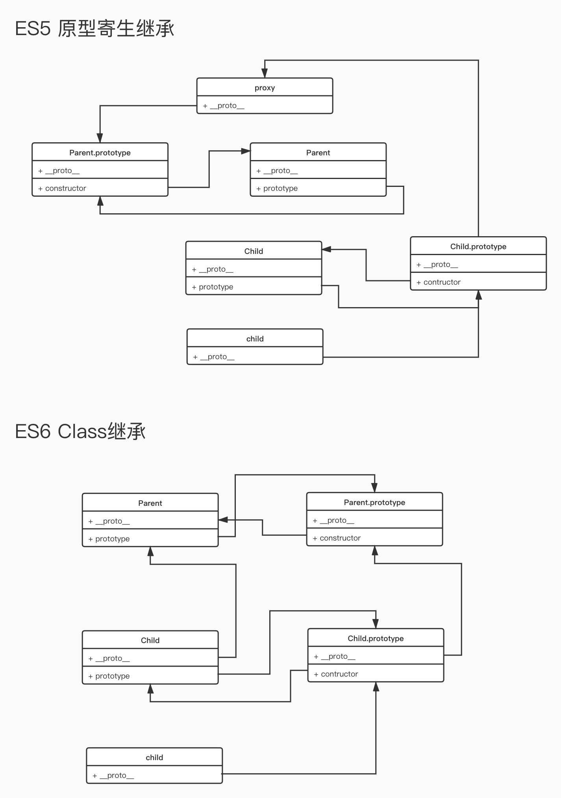

# ES6 Class

ES6 Class 实现了类的定义，继承和静态方法，但是未实现以下几点：

1. 不支持私有属性
2. 不支持多重继承
3. 没有接口概念

```JavaScript
class Person {
  // 实例属性，相对于constructor中定义语法更加清晰简洁
  id = "12345"
  // 构造函数，每个Class必有方法，如果没有声明会自动添加一个空的constructor方法
  constructor(id, name, age, sex) {
    this.id = id
    this.name = name;
    this.age = age;
    this.sex = sex;
  }
  // 实例方法，实际上挂载在类的prototype上
  isAdult() {
    return this.age >= 18;
  }
  // 静态方法
  static isMan(obj) {
    return obj instanceof Man;
  }
  // 取值函数和存值函数，用来拦截实例属性赋值和获取
  get sex() {
    return "my sex is secret"
  }
  set sex(value) {
    console.log(`set sex: ${value}`);
  }
}

let me = new Person("234378", "Lee", 19, "man"); // set sex: man
console.log(me.id); // 234378
console.log(me.isAdult()); // true;
console.log(me.isAdult === Person.prototype.isAdult); // true
console.log(me.sex); // my sex is secret
Person.isMan(me) // true
```

ES6 的 Class 只是一个语法糖，Class 实际还是一个 Function，用于定义原型(prototype)的；`constructor`用于生产对象实例并添加实例属性，class 内声明方法相当于在原型对象上添加方法。与 ES5 不一致的是 ES6 Class 内部的方法是不可枚举的

```JavaScript
typeof Person // "function"
Person === Person.prototype.constructor // true
Object.keys(Person.prototype) // []
```

## 继承

class 使用`extends`关键字实现继承，相对于 ES5 原型链实现更加清晰方便。
子类在`constructor`中必须在**使用`this`关键字**之前调用`super`方法，否则会报错。因为**子类的`this`对象是通过父类构造函数创建的，得到与父类同样的实例属性和方法后再进行加工**，如果不调用`super`方法就无法获得`this`对象。

```js
class Animal {
  yell() {
    console.log("yell");
  }
}

class Person extends Animal {
  constructor(name, age, sex) {
    // 调用父类构造函数，构造this实例对象
    super();
    this.name = name;
    this.age = age;
    this.sex = sex;
  }

  isAdult() {
    return this.age >= 18;
  }
}

class Man extends Person {
  constructor(name, age) {
    super(name, age, "man");
  }
}

let me = new Man("Jade", 5);
console.log(me.isAdult()); // false;
me.yell();
```

和 ES5 继承的区别是，ES5 子类先创建实例对象`this`，然后将父类实例对象的属性和方法添加到`this`上
属性继承实现：`Parent.call(this, args)`
方法继承实现：`Child.prototype = Object.create(Parent.prototype);`

Class 子类的`__proto__`属性表示构造函数的继承，总是指向父类
Class 子类的`prototype`属性的`__proto__`属性表示方法的继承，总是指向父类的`prototype`属性

```JavaScript
class A {}

class B extends A {}

B.__proto__ === A // true
B.prototype.__proto__ === A.prototype // true
```


