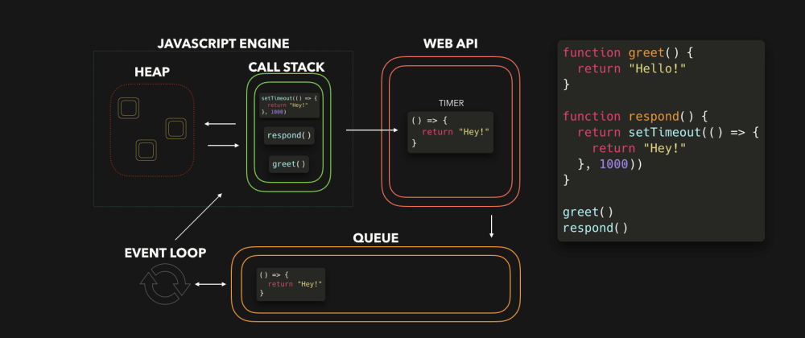

# JavaScript 运行机制

JavaScript 是**解释型语言**，不需要编译，在执行的过程中实时编译，边编译边运行。
**JavaScript 引擎**负责在运行的过程中将 JS 代码转换成可执行的机器码，常用的 JavaScript 引擎有：

1. Chrome V8 引擎 (chrome、Node、Opera）
2. SpiderMonkey （Firefox）
3. Nitro (Safari）
4. Chakra （Edge)

JavaScript 引擎只能完成语言的解析和运行，我们的程序通常需要调用一些 API(如 DOM 操作、文件操作、网络操作)来实现业务需求。这些 API 是由 **JavaScript Runtime** 提供的。常见的运行环境：浏览器、NodeJS

JavaScript 引擎和 JavaScript Runtime 构成了 JavaScript 程序的运行环境。

- JavaScript 引擎负责解析 JS 代码，转为可执行的机器语言
- JavaScript runtime 暴露一些 API，供 JavaScript 调用

## JavaScript 引擎运行机制

JavaScript 是**单线程**，JavaScript 最开始被设计为浏览器脚本语言，主要用来处理用户交互和操作 DOM，场景相对简单，为了避免多线程的复杂同步问题(例：两个函数同时操作同一对象)，所以从诞生就是单线程的。在浏览器环境 JS 和 DOM 渲染共用一个线程，会互相阻塞。

HTML5 提出 [Web Worker](../../html/../03-Html/Worker/Web%20Worker.md) 标准用来利用多 CPU 能力处理 CPU 密集型任务。
//TODO: NodeJS 多线程

概括：JavaScript 是一个单线程语音，主线程执行完执行栈中的任务后，去检查异步任务队列，将任务队列中触发的事件加入到主线程执行栈执行。

### 异步非阻塞

JS 引擎是单线程的，单线程的问题就是任务是串行的，上一个任务未完成下一个任务就需要一直等待，所以在进行一些耗时操作如 ajax 请求等，js 引擎线程就无法继续处理其它任务，页面就会假死，即**线程阻塞**。

JavaScript 使用异步任务（asynchronous callback）来解决这个问题。主线程通过 API 创建异步任务(如 ajax 请求)，API 会在其它线程运行任务，主线程不需要等待结果返回，直接向下继续运行，这就是**非阻塞调用**。异步任务完成操作有两种方式：

1. 主线程不定时查看任务完成状态。
2. **异步 I/O 模式**：异步任务完成当异步任务完成之后会以某种方式(通常为 callback)通知主线程，主线程如果处于空闲状态就会接收返回结果

现代浏览器一个 tab 页面一般包含以下线程：

- GUI 渲染线程
- JS 引擎线程
- 事件触发线程
- 定时器触发线程
- 异步 HTTP 请求线程

JS 中的异步操作是通过 WebAPIs 去支持的，常见的有 `XMLHttpRequest`，`setTimeout`，`事件回调（onclick, onscroll）`等。而这几个 API 浏览器都提供了单独的线程去运行，所以才会有线程去做定时器的计时，request 的回调等。**这些线程和 JavaScript 引擎线程不是同一线程，是浏览器实现了它们之间的通信**

### 主线程、同步任务、异步任务、任务队列和 Event Loop

- 同步任务：发起调用后可立刻获得结果
- 异步任务：发起调用后无法立刻后的结果，需要额外处理进行等待，如网络请求、定时器延时等

JavaScript 是一个单线程语言，这个线程即是**主线程**负责执行代码，可以通过 runtime 暴露的 API 创建管理子线程。

在[变量作用域&执行栈](./02-变量作用域&执行栈.md)中介绍过，JS 引擎遇到可执行函数后会生成执行上下文并压入到执行栈，执行栈是 LIFO 机制，JS 引擎是从栈顶执行，执行完成后将上下文出栈。

这个模型通常没什么问题，如果一个任务耗时很长任务，后面的任务就只能排队等待，通常情况下这些耗时任务一般都不是 CPU 耗时而是 IO 耗时(如 AJAX 网络请求)，CPU 在空闲等待。JavaScript 引擎可以挂起处于等待中的 IO 任务继续向下执行，等 IO 返回结果后再运行这些挂起的任务。

Event Loop 是 JavaScript 的异步执行(优化)机制，JS 引擎会调用 Web API 分配给其它模块处理，其它模块在处理完成后会将数据联调回到函数放入主线程继续处理。执行过程：

1. 遇到同步任务初始化上下文后压入执行栈直接执行，执行完成之后将上下文弹出栈
2. 遇到异步任务同样初始化并入栈，执行时调用 Web API 其它模块执行异步任务，继续执行至完成后同样将异步上下文弹出栈
3. Web API 会创建子线程执行异步任务，执行完成之后会将返回结果作为回调函数的参数，然后把回调函数压入到一个队列中，这个队列即是**任务队列(task queue)**，任务队列是 FIFO 的存储结构
4. Event Loop 会不停的检查主线程执行栈和任务队列，一旦发现主线程空闲后就会将任务队列中的第一个任务压入执行栈让主线程执行，如此不停的循环

### 宏任务(macro task)和微任务(micro task)

异步任务分为宏任务、微任务，通过不同的 WebAPIs 触发，不同类型的任务会将 callback 添加到不同的队列。

- 宏任务：callback 会压入**任务队列**，常见的宏任务包括：XHR 回调、事件回调、`setTimeout/setInterval`
- 微任务：callback 会压入**工作队列**，常见的微任务包括：`Promise.then()`

异步任务执行完成之后会将返回结果作为回调函数的参数，并将回调函数函数压入**任务队列**，等等 Event Loop 处理

在 ES6 标准中又添加了**工作队列**的概念，用来存放 Promise 等异步任务，工作队列和任务队列的区别是，工作队列的优先级更高，Event Loop 会优先处理工作队列中的任务。

## 参考

[JavaScript 运行机制详解：再谈 Event Loop](https://www.ruanyifeng.com/blog/2014/10/event-loop.html)
[我理解的 JS 运行机制及 Event Loop](https://github.com/sunyongjian/blog/issues/38)
