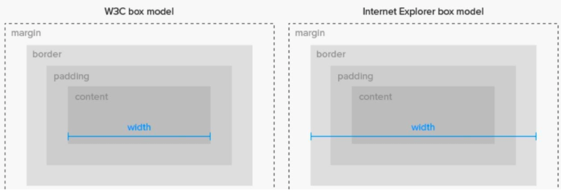
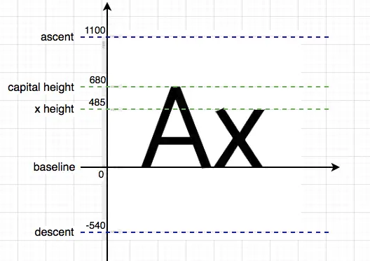
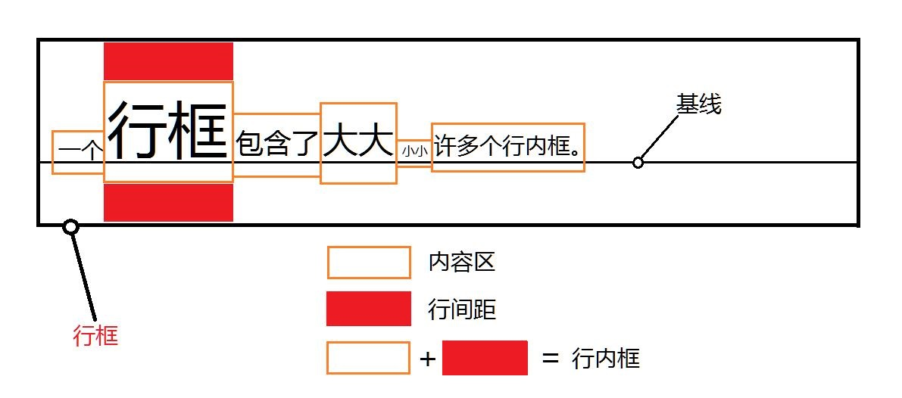
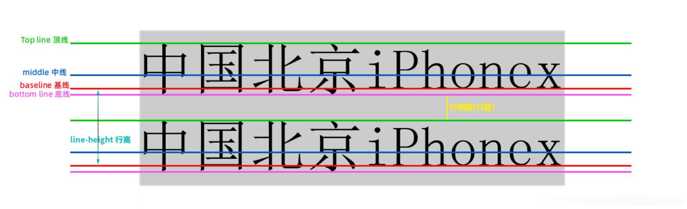

# 文档流和盒模型

## [CSS 盒模型](https://developer.mozilla.org/zh-CN/docs/Learn/CSS/Building_blocks/The_box_model)

在 HTML 文档中，每个*元素*都被表示为一个*矩形盒子*，CSS 盒模型定义 HTML 元素在文档流中所占的矩形区域
在 CSS 中，我们有几种类型的盒子，一般分为区块盒子（block boxes）和行内盒子（inline boxes），可以使用`display`属性设置元素的盒子类型

每个盒子由 4 部分组成：

1. content area：内容区域
2. padding：内边距
3. border：边框
4. margin：外边距

block 盒模型分为标准盒模型和怪异盒模型两种，两种盒模型的`height`和`width`属性的作用范围不同。可以使用`box-sizing`属性进行切换。

- `box-sizing: content-box;`：默认值，W3C 标准盒模型
  - 设置`width/height`作用于`content`
  - 实际渲染宽高等于`width/height+padding+border+margin`
- `box-sizing: border-box;`： IE 传统盒模型(IE6)
  - 设置`width/height`作用于`content + border + padding`
  - 实际渲染宽高等于`width/height+margin`
- `box-sizing: inherit;`

### 区块盒子（block boxes）

### 行内盒子（inline boxes）

### font-size 和 内容区域的高度

`font-size`决定**em 框**高度，但是`font-size`并不决定实际显示的字符尺寸，这和字体设计有关，如下图字体设计是在一个坐标系中进行的，坐标系里有一些标准线

- `base-line`：基线，通常和字母`x`的下边缘重合
- `x-height`：字母`x`的高度
- `capital height`：大写字母的高度。
- `ascent`：字体中的所有字形从基线往上，最高不能超过的值，可以说是理论上的字形上边界
- `descent`：字体中的所有字形从基线往下，最低不能超过的值，可以说是理论上的字形下边界

我们可以简化的理解为`em框`即为坐标系，`font-size`设置了坐标系的高度，字体渲染的时候会适配坐标系的高度进行等比缩放

多个字符的 em 框组合在一起就形成了**内容区**，内容区域的高度由字体中的 ascent 和 descent 相加得到

行内盒子模型由四部分组成

1. 内容区域(content area)，是一个围绕文字看不见的盒子，大小与`font-size`有关，大致相当于**文字选中状态**下背景颜色区域；
2. 内联盒子(inline boxes)，即 display:inline 的块，会在一行内显示不会换行，如果是单纯的文字属于匿名内联盒子；
3. 行框盒子(line box)，每一行是一个行框盒子，行框盒子是由一个一个内联盒子组成；
4. 包含盒子(containing box)，由一个个行框盒子组成；例如一个段落`

`

### 行高 line-height

行内元素的高度是由`line-height`决定的，不是由`font-size`决定的；

从上到下四条线分别是顶线、中线、基线、底线
**中线**为英文小写字母`x`的中间交叉点位置
**基线**为英文小写字母`x`的下边缘，在字体设计的时候所有的字符都基于这条线进行定位
**行高**是指文本行基线间的垂直距离

行高的值可以为以下值：

- `number`：无单位数值，实际高度为数值乘以当前`font-size`
- `length`：`em`、 `rem`、 `px`、 `pt`
- `percent`：百分比，实际高度为百分比乘以当前`font-size`
- `normal`：默认值，与浏览器和字体有关，约为 1.2；
- `inherit`：

`line-height`可以让单行文本垂直居中，单实际上并不是绝对居中；

### 行间距

行间距等于`(行高 - 内容区) / 2`即`(line-height - font-size) / 2`，行间距可能是负数，为负数是会产生内容重叠

### vertical-align

`vertical-align`用来设置行内元素（inline/inline-block/inline-table）或表格单元格（table-cell）元素的垂直对齐方式。
对齐规则是相对于父元素

- 关键字：
  - `base-line`：默认值，`baseline`与字母`x`的下边缘对齐。
  - `top`： 元素及其后代的顶边与整行的顶端(行内最高元素的顶端)对齐。
  - `bottom`：元素及其后代的底边与整行的底边对齐。
  - `middle`：元素上下边的中心点和行**基线向上 1/2`x-height`**的高度位置对齐，约等于字母`x`的交叉中点
  - `sub`：元素基线与父元素的下标基线对齐。
  - `super`：元素基线与父元素的上标基线对齐。
  - `text-top`：元素顶边和父级的内容区域顶边对齐
  - `text-bottom`：元素底部和父级的内容区域底部对齐
- 长度值：`<length>`：相对于基线上下偏移值
- 百分比：`<percentage>`：相对于基线上下偏移值，相对于`line-height`计算

### 基线位置

基线的位置并不固定

- 在文本之类内联元素中，基线是字符`x`的下边缘位置
- `img`元素中基线就是下边缘
- 在`inline-block`元素中，也分两种情况
  - 如果该元素中有内联元素，基线就是最后一行内联元素的基线
  - 如果该元素内没有内联元素或者 overflow 不是 visible，其基线就是 margin 的底边缘

## 文档流

文档流(Document Flow)也可以叫普通流(Normal Flow)，指的是元素在 HTML 中的位置顺序决定排布的过程，在排布的过程中按照元素的特性(Display)按照从上到下从左到右的顺序进行排布；

每个元素都有一个默认的 `display` 值，元素 `display` 值决定了元素在文档流中的表现,我们可以修改元素的 `display` 属性来实现页面布局.

|                                 | `block`              | `inline-block`                                     | `inline`                                                                                                           |
| ------------------------------- | -------------------- | -------------------------------------------------- | ------------------------------------------------------------------------------------------------------------------ |
| 宽度                            | 填充其父容器的宽度。 | 取决于内容。                                       | 取决于内容。                                                                                                       |
| 定位                            | 独占一行             | 与其他内容一起流动，并允许旁边有其他元素。         | 与其他内容一起流动，并允许旁边有其他元素。                                                                         |
| 能否设置`width`和`height`       | 能                   | 能，宽度默认和 inline 元素一致由内部元素城撑起宽度 | 不能。 设置会被忽略，宽由内部原始撑起，高度由 line-height 决定。                                                   |
| 可以使用`vertical-align`对齐    | 不可以               | 可以                                               | 可以                                                                                                               |
| 边距（margin）和填充（padding） | 各个方向都存在       | 各个方向都存在                                     | 只有水平方向存在。垂直方向会被忽略。 尽管`border`和`padding`在`content`周围，但垂直方向上的空间取决于'line-height' |

### [浮动 float](https://developer.mozilla.org/zh-CN/docs/Learn/CSS/CSS_layout/Floats)

浮动是一个很古老的属性，它的设计初衷是为了实现**文字环绕效果**，并不是为了实现页面布局，所以我不喜欢使用浮动进行页面布局，因为我感觉处理浮动的影响很麻烦且影响性能；那么我们为什么不用`display:inline-block`呢，浮动会使元素脱离文档流，向一个方向移动直到遇到文档的边缘或者另外一个浮动元素停止，浮动元素有如下特性：

- 包裹性：浮动元素会**块状化**,元素 `display:inline-block`，可以设置宽高，默认宽高由元素内部元素撑起
- 破坏性：导致父元素高度塌陷；
- 跟随性：其后的 `inline` 模块后紧随其后，文字环绕效果；

浮动元素因为脱离了文档流，会引起父元素高度塌陷，可以采用以下方式清除浮动带来的影响

- `clear`
  - 在元素容器最后添加空元素并设置 `clear` 属性
  - 使用`:after` 添加伪元素，并设置 `clear`
- 让父元素 BFC 化

### [定位 position](https://developer.mozilla.org/zh-CN/docs/Learn/CSS/CSS_layout/%E5%AE%9A%E4%BD%8D)

- `position: static;`: 默认属性，此时`top`、`bottom`、`left`、`right`、`z-index`属性都不生效
- `position: relative;`: 相对定位，预留元素原本所占空间，所以原有文档流不会改变，设置`top`、`bottom`、`left`、`right`时相对于原位置移动
- `position: absolute;`: 绝对定位，元素脱离文档流，相对于向上最近的`position`属性不为`static`的元素定位，如果不设置定位属性，则停留在原位置
- `position: fixed;`: 固定定位，相对于 viewport 定位
- `position: sticky;`: 粘性定位，相当于相对定位和固定地位的结合体，当元素在屏蔽内表现为相对定位，当要滚出屏幕是表现为固定定位

### BFC(Block Formatting Context）

块级格式化上下文，一个创建了新的 BFC 的盒子是独立布局的，**盒子里面的子元素的样式不会影响到外面的元素**。在同一个 BFC 中的两个毗邻的块级盒在垂直方向（和布局方向有关系）的`margin`会发生折叠。满足以下条件的元素都会形成一个 BFC：

1. `float`属性不为`none`
2. `position`属性不为`static`或`relative`
3. `overflow`属性不为`visible`
4. `display`属性值是`table-cell`、`table-caption`、`inline-block`、`flex`、`inline-flex`

## [外边距重叠](https://developer.mozilla.org/zh-CN/docs/Web/CSS/CSS_Box_Model/Mastering_margin_collapsing)

在同一个 BFC 中两个素的`margin-top`和`margin-bottom`相邻时会发生边距折叠，折叠后的值为两个边距较大的一方。

## 参考文献

[CSS 行内布局（一）：字体](https://juejin.cn/post/7138784059592802311)
