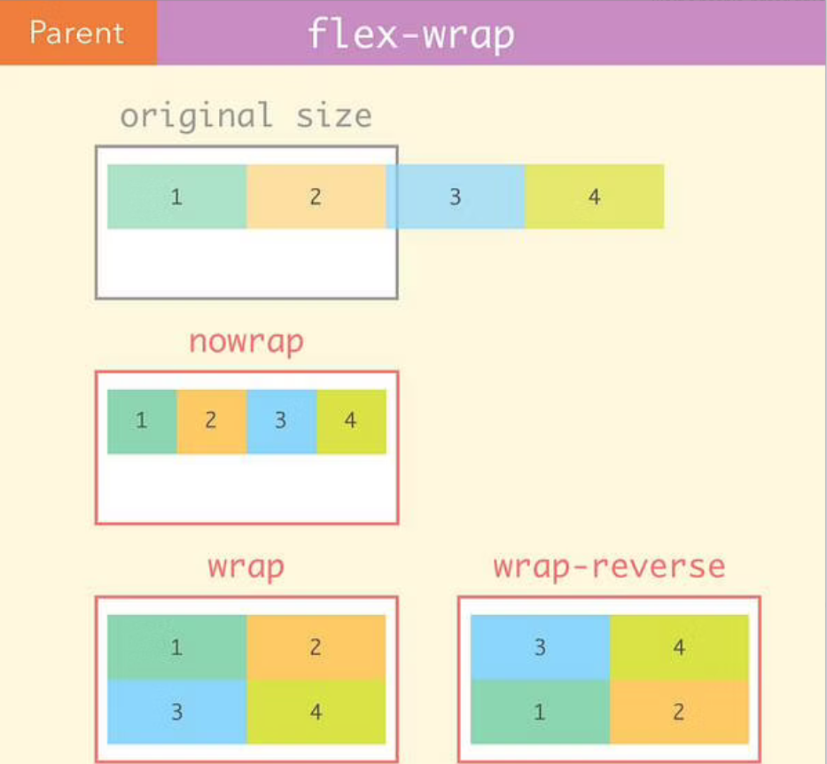

# [弹性盒子布局](https://developer.mozilla.org/zh-CN/docs/Web/CSS/CSS_Flexible_Box_Layout)

在弹性布局模型中，弹性容器的子元素可以在任何方向上排布，也可以“弹性伸缩”其尺寸，既可以增加尺寸以填满未使用的空间，也可以收缩尺寸以避免父元素溢出。子元素的水平对齐和垂直对齐都能很方便的进行操控。

- 实现自适应布局的神器，真正意义上的布局
- 可以实现父容器(Flex box)中各个子元素(Flex item)按序排列，按比例显示，
- 在父容器尺寸变化的时候，子元素可以自适应按比例进行变化

## 弹性盒子

- Flex Container：弹性容器，包含弹性项目的父元素。通过`display`属性设置为`flex`或`inline-flex`来定义；
- Flex Item：弹性项目，弹性容器的每个子元素都是弹性项目。弹性容器直接包含的文本将被包裹成匿名弹性单元；
- Axis：轴，每个弹性布局包含两个轴。弹性项目沿其依次排列的那根轴称为主轴(main axis)。垂直于主轴的那根轴称为侧轴。
  - `flex-direction`：设置主轴
  - `justify-content`：设置弹性项目**沿主轴对齐规则**
  - `align-items`：设置弹性项目**沿侧轴对齐规则**
  - `align-self`：设置弹性项目在侧轴上对其规则，会覆盖`align-items`设置的值
- Direction：方向，设置弹性项目沿主轴和侧轴的布局方向(从左到右或从右到左)，使用`writing-mode`设置
  - `order`：弹性项目元素属性，设置弹性项目的排列顺序
  - `flex-flow`：`flex-direction`和`flex-wrap`属性的简写，设置弹性项目如何排布
- Line：行，根据`flex-wrap`属性，弹性项目可以进行单行或多行排列
- Dimension：尺寸，

## 容器属性：`.container{ display:flex }`

- `display`：定义弹性盒子
  - `display: flex;`：定义 flex 容器为块级元素
  - `display: inline-flex;`：定义 flex 容器为行内级元素
- `flex-direction`：定义弹性盒子的主轴方向，即项目排列方向，受`dir`属性影响
  - `flex-direction: row;`：默认值，与文本方向相同
  - `flex-direction: row-reverse;`：
  - `flex-direction: column;`：
  - `flex-direction: column-reverse;`：
- `justify-content`：定义如何分配沿主轴弹性元素之间及周围的空间
  - `justify-content: center;`：居中
  - `justify-content: flex-start;`：左对齐
  - `justify-content: flex-end;`：右对齐
  - `justify-content: space-between;`：两端对齐，项目之间的间隔相等
  - `justify-content: space-around;`：每个项目两侧等间隔，不会发生间距合并，项目之间间隔是项目与边框间隔的两倍
- `align-items`：定义如何分配沿侧轴弹性元素之间及周围的空间
  - `align-items: stretch`：默认值，如项目未设置高度或设置为`auto`，项目将拉伸占满整个容器的高度。
  - `align-items: center`：沿侧轴中点对齐
  - `align-items: flex-start`：沿侧轴起点对齐
  - `align-items: flex-end`：沿侧轴终点对齐
  - `align-items: baseline`：项目第个项目文字的基线对齐
- `flex-wrap`：定义换行规则及换行后的堆叠规则
  - `flex-wrap: nowrap;`：默认值，不换行
  - `flex-wrap: wrap;`：换行，第一行在下方
  - `flex-wrap: wrap-reverse;`：逆向换行，反向堆叠，第一行在上方
- `flex-flow`：`flex-direction`和`flex-wrap`的简写，格式为`flex-flow: flex-direction flex-wrap;`
- `align-content`：定义多行情况下项目沿侧轴空间分配方案
  - `align-content: flex-start`：沿侧轴起点对齐
  - `align-content: flex-end`：沿侧轴终点对齐
  - `align-content: center`：居中对齐
  - `align-content: space-between`：等间距均匀分布
  - `align-content: space-around`：等边距均匀分布
  - `align-content: stretch`：拉伸对齐
  - `align-content: baseline`：基线对齐

## 项目设置：`box-flex: value;`

- `order`：定义项目的排列顺序。数值越小，排列越靠前，默认为 0。
- `flex`：是`flex-grow`、`flex-shrink`和`flex-basis`的简写，默认值为`0 1 auto`
  - `flex: none;`：`flex: 0 0 auto`
  - `flex: auto;`：`flex: 1 1 auto`
  - `flex: [ <'flex-grow'> <'flex-shrink'> <'flex-basis'> ];`
- `flex-grow`：定义项目的放大比例，弹性容器主轴有剩余空间时生效
  - 值为非负数
  - 默认为 0，即如果存在剩余空间，也不放大。
- `flex-basis`：沿主轴 base size
  - 默认值`auto`即为项目本身尺寸
  - 值可以是具体尺寸或百分比
  - 实际尺寸优先级：`max-width/max-height/min-width/min-height` > `flex-basis` > `width/height` > `内容本身的size`
- `flex-shrink`：定义了项目的缩小比例，主轴项目尺寸和超过容器主轴长度时生效
  - 值为非负数
  - 默认为 1，即如果空间不足，该项目将缩小，防止溢出容器
- `align-self`：单独定义项目沿侧轴排列方式，会覆盖容器的`align-items`属性。默认值为 auto，表示继承父元素的 align-items 属性，如果没有父元素，则等同于 stretch。

### 参考

[使用 CSS 弹性盒](https://developer.mozilla.org/zh-CN/docs/Web/CSS/CSS_Flexible_Box_Layout/Using_CSS_flexible_boxes)
[Flex 布局教程：语法篇](http://www.ruanyifeng.com/blog/2015/07/flex-grammar.html)
