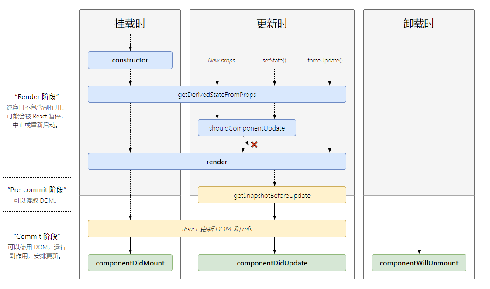

# React 渲染过程和生命周期

## 生命周期



- `constructor`：组件初始化
  - 实际并不属于 React 的生命周期函数，只是负责 Class 的初始化
  - 在`constructor`中并不推荐处理初始化以外的逻辑，所以社区推荐去除`constructor`函数直接使用类属性
- `getDerivedStateProps`：在组件`props`变化时更新`state`
  - `props`被传入时、`state`变化时或`forceUpdate()`调用时会触发，并不只是`props`变化时
  - 使用场景有限，**慎重使用**
- `UNSAFE_componentWillMount`：组件加载前触发，已经被标记为废弃，**慎用**
  - 废弃原因：在 React 的异步渲染机制下可能被多次调用
- `render`：用于描述具体渲染内容，**注意**：`render`并没有真正的渲染组件
  - 应该是存函数，不应该包含任何副作用，例如`setState`或者绑定事件
- `componentDidMount`：组件加载完成时触发，适合发起网络请求或者绑定事件
- `UNSAFE_componentWillReceiveProps`：已被弃用
  - 可以使用`getDerivedStateProps`替代
  - 如果声明了`getDerivedStateProps`则`UNSAFE_componentWillReceiveProps`不会执行
- `shouldComponentUpdate`：通过返回`true`或`false`是否出发重新渲染
  - 用于渲染优化
- `UNSAFE_componentWillUpdate`：已经被标记为废弃，**慎用**
  - `shouldComponentUpdate`可能导致函数不执行
- `getSnapshotBeforeUpdate`：配合 React 新的异步渲染机制，在 DOM 更新前调用，返回值会被作为`componentDidUpdate`的第三个参数传入
- `componentWillUnmount`：卸载前触发，主要用于清理工作，注意：在这里清理定时器，解除事件绑定

## TODO: `setState`是同步还是异步

默认情况下 React `setState`会将更新存入一个队列中，React 根据队列逐个执行,合并 state 数据完成后执行回调，更加结果更新虚拟 DOM 触发渲染。设计原型：

- 保持内部一致性：props 更新也是异步的
- 为后续架构升级启用并发更新：React 会根据`setState`的数据来源来分配优先级，数据来源包括：事件回调等

```JS
class Test extends React.Component  {
   state = { count: 0 };
   componentDidMount() {
      this.setState({ count: this.state.count + 1 },() => {
         console.log(this.state.count) // 1
      });
      console.log(this.state.count) // 0
   }
}
```

异步更新：先输出 0 后输出 1

---

```JS
class Test extends React.Component  {
   state = { count: 0 };
   componentDidMount() {
      this.setState({ count: this.state.count + 1 },() => {
         console.log(this.state.count)
      });
      this.setState({ count: this.state.count + 1 },() => {
         console.log(this.state.count)
      });
   }
}
```

两次输出均为 1，因为异步更新`setState`中`this.state.count + 1`的值均为 1

---

```JS
class Test extends React.Component  {
   state = { count: 0 };
   componentDidMount() {
      this.setState((preState) => {
         return { count: preState.count + 1}
      }, () => {
         console.log(this.state.count)
      })
      this.setState((preState) => {
         return { count: preState.count + 1}
      }, () => {
         console.log(this.state.count)
      })
   }
}
```

输出结果为 1 和 2

---

```JS
class Test extends React.Component  {
   state = { count: 0 };
   componentDidMount() {
      this.setState({ count: this.state.count + 1 },() => {
         console.log(1, this.state.count) // 1
      });
      console.log(2, this.state.count) // 0
      setTimeout(() => {
         this.setState({ count: this.state.count + 1 },() => {
           console.log(3, this.state.count) // 2
        });
        console.log(4, this.state.count) // 1
      }, 0)
   }
}
// 2 0
// 1 1
// 4 1
// 3 2
```

## 渲染过程

- React 会`render()`后会创建一颗由 React 元素生成的 Tree，即 Virtual DOM
- 状态变化后再次触发`render()`会生成一颗新树
- 调度阶段：React 通过 Diff 算法对比两颗树，找出哪些 DOM 需要更新，然后加入到更新队列。这个过程称为**协调(Reconciliation)**。
- 渲染阶段：遍历更新队列，将更新聚合**一次性地更新 UI**

## Virtual DOM

React 是声明式 UI 库，开发者使用组件描述 UI，对数据到 UI 页面的渲染过程进行封装，React 让开发者可以保持相对简单的心智，不需要关心 DOM 操作、事件处理、属性操作等。

React 将组件转化为页面结构(虚拟 DOM)，再转换为真实 DOM 渲染到页面上，并在数据(props、 state、context)改变时自动进行更新，在更新的时候会首先进行协调(Reconciliation)，在协调阶段之后会立刻进入 commit 阶段，提交阶段结束后数据的更新就会在页面生效。

DOM 更新会导致重绘和重流，DOM 更新策略优化也是前端渲染优化的关键点，React Reconciliation 基于数据的变化计算出新的虚拟 DOM，并对比新旧虚拟 DOM，寻找到最优的更新方案。React 通过 Virtual DOM 对 DOM 更新进行优化，在不做手动优化的情况下提供过得去的性能，保证性能下限。

Virtual DOM 是一个 JS 对象，是对真实 DOM 的抽象，在数据变化后 React 会生成新的 Virtual DOM 和旧的 Virtual DOM 进行对比，React 使用深度优先的方式遍历遍历对比 Virtual DOM，缩小真实 DOM 更新范围，也会将更新聚合(将多个更新合并，所以 React 状态更新不是同步的)，减少更新次数。

Virtual DOM 最初的设计目的是为了跨平台，基于 Virtual DOM 本质是 JavaScript 对象，基于 Virtual DOM 可以区别的定制下游输出，实现不同平台的渲染，如 SSR、跨终端等场景。

在提交阶段 React 会做两件事：

1. 将调和阶段计算的结果作用到真实 DOM
2. 调用开发中在组件中定义的 HOOK 方法


## React Diffing

每次`render`都会创建一个 React Elements Tree，React 对其进行对比然后更新页面 UI。树的对比的复杂度非常高，React 基于以下两个假设对进行了算法优化：

- 不同类型的组件会产生不同的树
- 开发者可以通过设置`key`来暗示 React 哪些子元素在不同的渲染下可能是稳定的

具体过程

1. 首先进行根节点对比
   1. 如果根节点元素类型不同，React 会卸载根父点及其子节点并建立新的树。
   2. 如果根节点为同类型的 DOM 元素，React 会保留 DOM 节点，仅比对及更新有改变的属性。处理完当前节点后，React 会继续递归对子节点进行处理。
   3. 如果根节点为同类型的组件元素，组件的实例不会变，实例的`props`会更新
2. 兄弟节点对比，兄弟节点有插入、删除和修改三种操作，可以通过设置`key`进行优化
   - 默认情况下 React 会对比两个列表，如果有差异会进行全量更新，在某些情况(头部插入新元素)下开销会比较大。
   - 为了解决这问题 React 引入了`key`属性，当子元素拥有`key`时，React 使用`key`来匹配原有树上的子元素以及最新树上的子元素。

## Fiber

React Fiber 是 React 16 中新的协调引擎，优化 Reconciliation，防止因为 Reconciliation 耗时过长导致的页面卡顿，使 Virtual DOM 可以进行增量式渲染

React 16 之前架构可以分为两层：

- Reconciler（协调器）：负责找出变化的组件；
- Renderer（渲染器）：负责将变化的组件渲染到页面上；

从 React 16 开始架构分为三层：

- Scheduler（调度器）: 调度任务的优先级，高优任务优先进入 Reconciler；
- Reconciler（协调器）: 负责找出变化的组件：Reconciler 内部采用了 Fiber 的架构，更新工作从递归变成了可以中断的循环过程。
- Renderer（渲染器）: 负责将变化的组件渲染到页面上。

JS 是单线程的，默认情况下，JS 运算、页面布局和页面绘制都是运行在浏览器的主线程当中，当 React 状态更新后 React Reconciliation 会遍历所有节点，计算差异，然后再更新 UI。这个过程如果超过 16ms 就容易出现掉帧现象。

React Fibers 的解决思路是对计算过程进行切割，分批完成，处理一部分之后将控制器交回给浏览器，让浏览器进行页面绘制。另外实现了自己的组件调用栈，不占用 JS 的执行栈，这样可以灵活的暂停、继续和跳过，底层依赖`requestIdleCallback`。

## TODO:异步渲染机制

## 参考文章

[React Fiber 是什么](https://zhuanlan.zhihu.com/p/26027085)
[React Fiber 很难？六个问题助你理解 React Fiber](https://juejin.cn/post/6984949525928476703)
