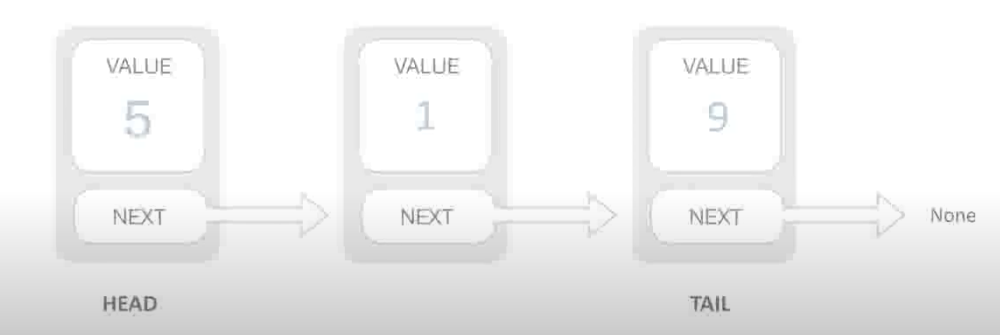
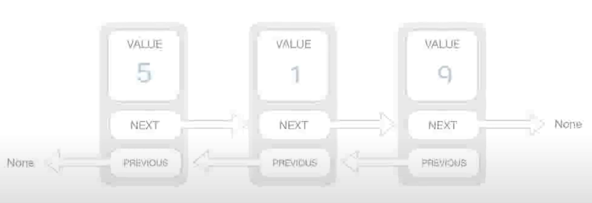

# 链表 LinkedList

数组是一个物理上连续存储的数据结构，在进行数组的插入和删除操作时时间复杂度为`O(n)`，所以在需要频繁进行增删操作的场景下，数组的效率较低。

链表并不是物理连续的，是通过`next`指针链接分散的节点。

链表包含以下操作接口：

1. 尾部添加：append
2. 插入：insert
3. 获取元素位置：indexOf
4. 删除元素：remove
5. 删除指定位置元素：removeAt

链表的增删操作只需要修改节点的指针指向，时间复杂度是常数，即为`O(1)`

相对于数组有以下优点

- 更高的增删效率
- 在长度不确定的场景下(区块链)更适合

但是链表的元素查找只能从头指针逐个向下查找，时间复杂度为`O(n)`

