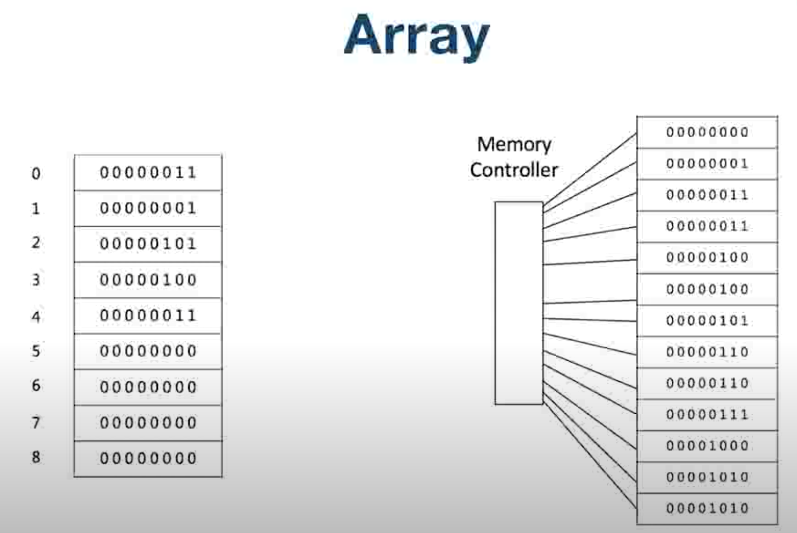
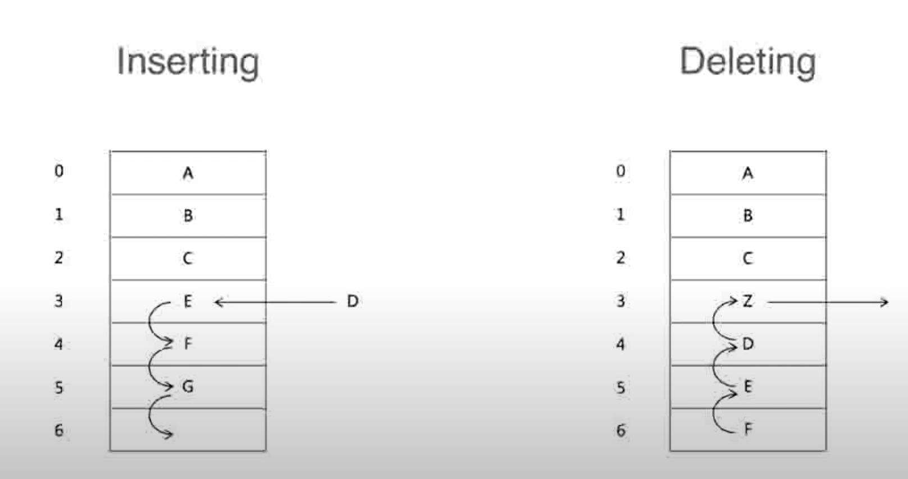
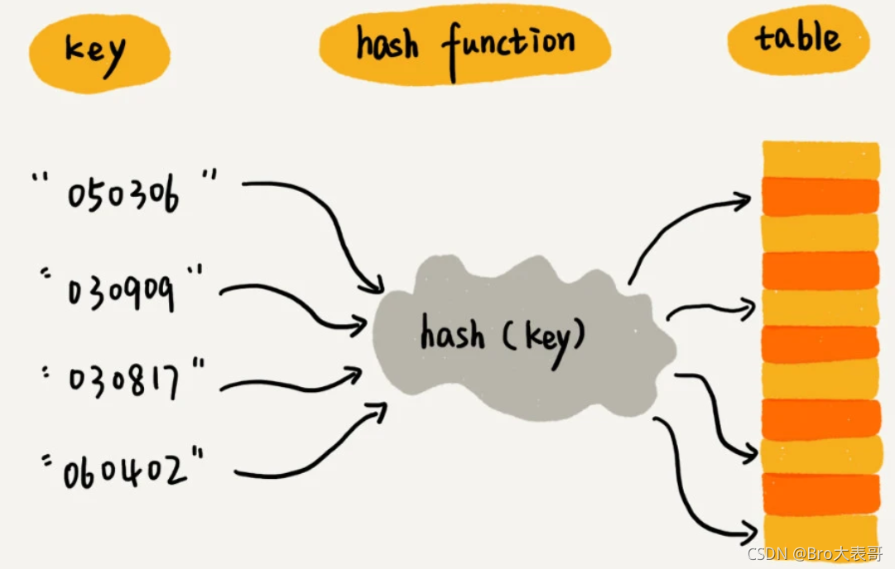
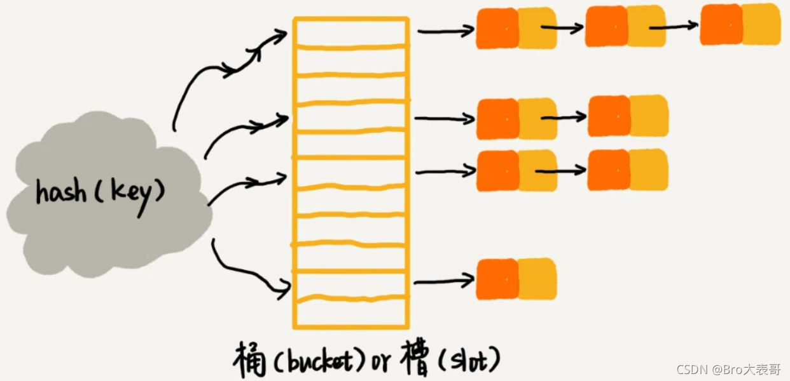

# 数组

数组是在内存中连续的存储区域，使用下标可以访问内容，访问数组元素的时间复杂度为`O(1)`。

因为数组的存储在内存中是连续的，所以数组元素的插入和删除都需要对操作位置后续的元素进行处理，所以数组的插入和删除时间复杂度为`O(n)`

JavaScript 的数组并不是真正意义上的数组，参考[JavaScript Iterator](../../../02-JavaScript/00.Basic/01.Iterator.md)

## 散列表 哈希表

常规列表结构按顺序存储数据，**存储简单**，但是查找数据需要**逐条遍历**性能较差。

散列表也是列表，在存储数据的时候首先会**对`key`进行散列算法获得一个数字签名**，然后将`value`出入到列表相应的位置，这样在查找某个`key`值得数据时首先通过散列算法求出响应的坐标就可以实现快速查找。

### 散列冲突

散列冲突是指两个不同的`key`通过散列算法获得的散列值是相同的，这样在进行散列表插入的时候就会发生覆盖

分离链接法：

1. 哈希表中的每一项都是一个链表(LinkedList)
2. 添加的时候是向链表中插入元素，和常规哈希表元素不同的是链表中的元素是包含`key`和`value`的对象
3. 查找的时候首先根据数字签名找到链表，然后循环链表，根据`key`找到最终的值

线性探查法：

插入的时如果发现数字签名指向位置已经有元素存在，在向下一个位置递归插入，查找反向。
