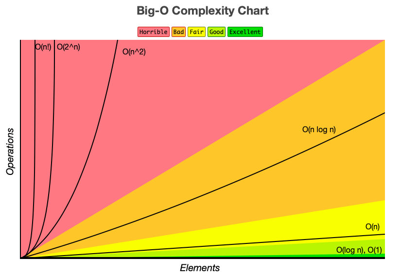

# 算法

## 递归(Recursion)

递归的实质是能够把一个大问题分解成比它小点的问题，然后我们拿到了小问题的解，就可以用小问题的解去构造大问题的解，递归解题模板：

- Base Case：递归终点即最小问题
- 拆解：每一层调用都要比当前层小，不断缩小问题
- 组合：使用小问题的解组合得到最终解

TODO:尾递归：

## 双指针(Two Pointers)

双指针通常用于处理数组，以下假设指针一为`i`、指针二为`j`、数组长度为`n`。双指针通常有两种模式，同向和反向：

- 同向：`0~i`为已处理需要保留的部分，`i~j`为已处理不需要保留的部分，`j~n`为未处理部分
  - 同向模式可以保持**相对顺序一致**
  - 通用步骤：
    - 第一步：初始化两个指针`i`和`j`，位置均为`0`
    - 第二步：`while(j < n)`
      - 如果`j`指向的值是被需要的则将`j`的值移动到`i`，然后`i++`
      - 否则跳过继续下一次循环
- 反向：`0~i`为已处理需要保留的部分，`i~j`为未处理部分，`j~n`为已处理不需要保留部分
  - 第一步：初始化指针`i = 0`、`j = n -1`
  - 第二步：`while(i <= j)`
    - 基于指针指向的值处理，根据具体要求可能是交换值或者是取较大值
    - 至少移动一个指针

## TODO:循环不变量

## TODO:二分查找(Binary Search)

针对有序区间内的 O(logN)搜索方式，常见用于已排好序的 Array

两大原则：

- 每次都要缩减搜素区域
- 每次缩减不能排除潜在答案

三大模板

- 找一个准确地值，例：寻找数组中某个值的位置
  - 循环添加：`left <= right`
  - 缩减搜素区间：`left = mid + 1`或者`right = mid - 1`
- 找一个模糊值，例：寻找数组中最接近某个数的位置
  - 循环添加：`left < right`
  - 缩减搜素区间：
    - 方式一：`left = mid`或`right = mid - 1`
    - 方式二：`left = mid + 1`或`right = mid`
- 万用形
  - 循环添加：`left < right - 1`
  - 缩减搜素区间：`left = mid`或者`right = mid`

## 广度优先(Breadth First Search)

- 初始化队列，添加全部节点
- 处理队列
  - 生成新的队列
  - 取出元素的 value 做处理
  - 判断字符有子节点，将子节点加入到新队列
  - 判断新的队列是否为空，决定是否进行下一次递归

## 深度优先(Depth First Search)

是一种**递归**形式的搜索方式

- Bottom Up DFS
  - 定义 BaseCase(出口条件)
  - 向子元素要答案
  - 利用子问题答案构建当前问题答案
  - 返回答案给父问题
- Top Down DFS
  - 定义 BaseCase(出口条件)
  - 利用父问题传下来的值做计算
  - 把求解的值继续传递给子问题递归

## 贪心算法 Greedy

## 回溯 Recursion 递归 Backtrace

## 分治算法(Divide And Conquer)

将一个复杂的大问题分割成**规模较小的相同问题**，分而治之。
如果一个问题可以被拆分成与原问题相同的规模较小的问题，那么就可以采用分治算法，反复使用分治手段可以使问题规模不断变小，在代码的实现上就用到了**递归**。

## 动态规划(Dynamic Programing)

解决小规模问题并记录结果，不断的扩大规模并利用之前记录的结果，直至满足条件。

DP = Recursion + Cache

Recursion 是从大到小，层层分解，直到 base case 分解不了了再组合返回上去；
DP 是从小到大，记好笔记，不断进步。

## 时间复杂度&空间复杂度

多块代码组合只取复杂度最高值

- `O(1)`：常数复杂度
- `O(log n)`：对数复杂度
- `O(n)`：线性时间复杂度
- `O(n^2)`：
- `O(n^3)`：
- `O(2^n)`：指数
- `O(n!)`：阶乘

[数据结构复杂度](https://www.bigocheatsheet.com/)
