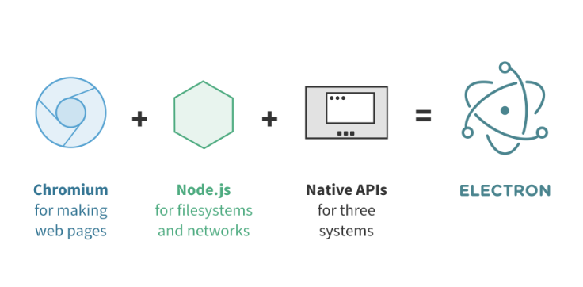

# Electron

- 主进程：Electron 运行 package.json 的`main`脚步的进程称为主进程
  - 每个应用只有一个主进程
  - 管理原生 GUI、典型窗口（BrowserWindow Tray Dock Menu）
  - 创建渲染进程
  - 控制应用生命周期
- 渲染进程：展示 Web 页面的进程称为渲染进程
  - 可以通过 Node.js 和 Electron 提供的 API **跟系统底层打交道**
  - 一个 Electron 应用可以有多个渲染进程
- IPC：进程间通信
  - 主进程和渲染进程间通信
  - 渲染进程间通信
