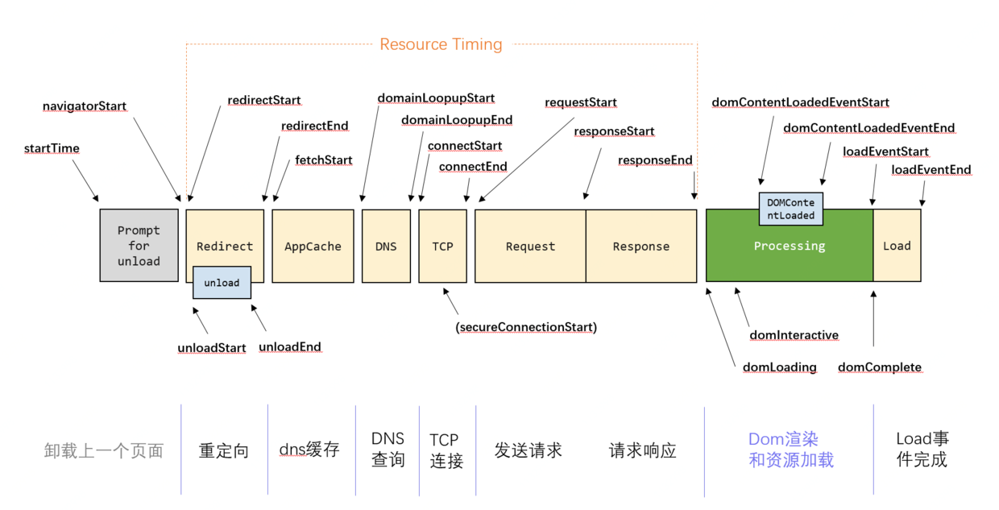

# 网站性能统计

## 页面性能统计方式

1. 合成监控
   1. [pagespeed](https://developers.google.com/speed/pagespeed/insights/?hl=zh-cn)
   2. [lighthouse](https://developers.google.com/web/tools/lighthouse)
2. 真实用户监控

## 页面性能指标

+ 白屏时间：从输入地址到也开始展示内容
  + 影响因素：首字节时间(受DNS、TCP、服务器处理、网络延迟影响)和头部资源加载时间
+ 首屏时间：从输入地址到第一屏内容渲染完成
  + 统计方法：首屏内图片加载完成时间
  + 影响因素：图片加载，异步内容渲染
+ 可操作时间：domready触发节点

## Perfromance API

Web Performance API接口可以获取当前页面的性能相关信息



+ `window.performance`
  + `timeOrigin`：返回
  + `now()`：执行后返回从`timeOrigin`到`now`执行的时间
  + `memory`：内存占用
    + `jsHeapSizeLimit`：内存大小限制
    + `totalJSHeapSize`：可使用内存
    + `usedJSHeapSize`：JS对象(包括V8引擎内部对象)占用内存
  + `navigation`：进入页面方式
    + `redirectCount`：如果有重定向的话，页面重定向次数
    + `type`：进入页面方式
      + `0`：正常进入
      + `1`：通过 window.location.reload() 刷新的页面
      + `2`：通过浏览器的前进后退按钮进入的页面（历史记录）
      + `255`：非以上方式进入的页面
  + `timing`：记录浏览器性能相关的时间数据，网页各阶段的耗时
    + `navigationStart`: 浏览器在开始unload前一个页面的时间节点
    + `redirectStart`: 代表redirect的开始时间节点
    + `redirectEnd`: 代表redirect的结束时间节点
    + `unloadEventStart`: 如果前一个文档和请求的文档是同一个域的，则unloadEventStart和unloadEventEnd分别代表浏览器unload前一个文档的开始和结束时间节点。否则两者都等于0；
    + `unloadEventEnd`:
    + `fetchStart`: 浏览器发起任何请求之前的时间值
    + `domainLookupStart`: DNS查询的开始时间节点
    + `domainLookupEnd`: DNS查询结束的时间节点
    + `connectStart`: 建立TCP连接时间节点
    + `connectEnd`: TCP连接成功时间节点
    + `secureConnectStart`: 可选。如果页面使用HTTPS，它的值是安全连接握手之前的时刻。如果该属性不可用，则返回undefined。如果该属性可用，但没有使用HTTPS，则返回0
    + `requestStart`: 发送请求的时间节点
    + `responseStart`: 开始响应请求的时间节点
    + `responseEnd`: 完成响应的时间节点
    + `domLoading`: 代表浏览器开始解析html文档的时间节点
    + `domInteractive`: 浏览器已经完成HTML文档解析**生成DOM树构**，未开始加载外部资源
    + `domContentLoadEventStart`: 开始执行同步JS
    + `domContentLoadEventEnd`: 同步JS执行完成，并且CSSDOM树也构建完成的时间点，可以构建渲染树了
    + `domCompelect`: 所有处理已完成，网页上的资源也加载完成
    + `loadEventStart`: loadEventStart和loadEventEnd分别代表onload事件触发和结束的时间节点
    + `loadEventEnd`:
  + `getEntries();`：可以获取页面所有请求详细信息的数组
  + `getEntriesByType('navigation')`：获取特定类型的性能指标数据
    + `navigation`
    + `resource`

性能计算

``` js
const {
    navigationStart, // 页面加载开始时间
    redirectStart,
    redirectEnd,
    fetchStart,
    domainLookupEnd,
    domainLookupStart,
    connectEnd,
    connectStart,
    requestStart,
    responseEnd,
    responseStart,
    domLoading, //代表浏览器开始解析html文档的时间节点
    domInteractive, //代表浏览器解析html文档的状态为interactive时的时间节点,dom解析完成，但是内嵌资源还未加载
    domContentLoadedEventStart, //代表DOMContentLoaded事件触发的时间节点
    domContentLoadedEventEnd, //代表DOMContentLoaded事件完成的时间节点
    domCompelect, //html文档完全解析完毕的时间节点；
    //loadEventStart和loadEventEnd分别代表onload事件触发和结束的时间节点
    loadEventStart,
    loadEventEnd,
    domComplete,
  } = window.performance.timing

  const total = loadEventEnd - navigationStart // 整页耗时
  const server = responseEnd - navigationStart //服务端耗时
  const linkup = domLoading - responseEnd //衔接耗时
  const client = loadEventEnd - domLoading //客户端耗时

  const empty = domLoading - navigationStart //白屏时间

  const dns = domainLookupEnd - domainLookupStart // DNS查询耗时
  const tcp = connectEnd - connectStart // TCP链接耗时
  const ttfb = responseStart - requestStart // 请求耗时
  const download = responseEnd - responseStart // 下载时间

  const domParse = domComplete - domInteractive // 解析dom树耗时
```

## User Timing API
