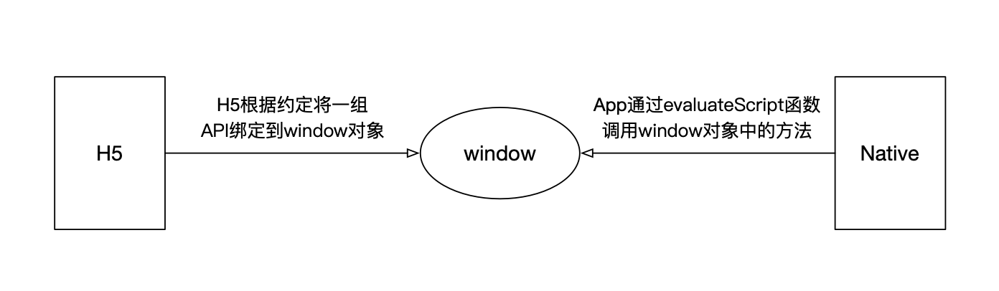
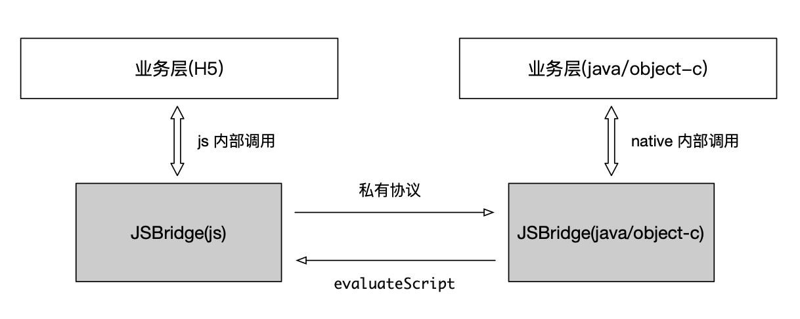

# JS Bridge

Hybrid App（混合模式移动应用）业务开发中总是调用客户端能力原生能力，如拍照、定位等

JS Bridge 是原生 JS 和客户端(native)通讯的桥梁


## Native 调用 Webview 能力

Native 向 Web 发送消息基本原理上是在 WebView 容器中动态地执行一段 JS 脚本，通常情况下是调用一个挂载在 window 上全局上下文的方法。

JavaScript 作为解释型语言，可以随时随地地通过解释器执行一段 JS 代码，所以可以将拼接的 JavaScript 代码字符串传入 webView 就可以调用 webview 能力。



## Webview 调用 Native 能力

webview 可以拦截 H5 发送的请求，无论是标准协议（如 http://、https:// 等）还是私有协议（如 weixin:// ），基于这个原理，H5 采用私有协议模拟发起 URL 请求，Native 解析这类 URL 并定制相应的处理函数，这就实现了 H5 调用 Native。

### 方案一：APP 拦截 Webview 请求的 URL Schema

常规的请求触发方案都可以触发 URL Schema

- a 标签
- location.href
- 使用 iframe.src
- 发送 ajax 请求

这些方法，a 标签需要用户操作，location.href 可能会引起页面的跳转丢失调用，发送 ajax 请求 Android 没有相应的拦截方法，所以使用 iframe.src 是经常会使用的方案

```js
function iosBridge(action, param) {
  param["methodName"] = action;
  // 创建一个iframe
  const frame = document.createElement("iframe");
  const paramStr = JSON.stringify(param);
  // 携带参数, 约定好的URL Schema格式, native端拦截, 拿到携带的方法
  frame.src = `xxx://xxx.hybrid.ios/?message=${encodeURIComponent(paramStr)}`;
  document.body.appendChild(frame);
  setTimeout(() => iframe.remove(), 300);
}
```

### 方案二：通过 API 全局注入

App 将 Native 的相关接口注入到 JS 的 Context（window）的对象中，Web 端就可以直接在全局 window 下使用这个全局 JS 对象，进而调用原生端的方法

## 双向通信



H5 和 Native 之间的调用不都是单向的，由于同时存在 H5 调用 Native 然后 Native 再回调 H5，和 Native 调用 H5 然后 H5 再返回值给 Native 的情况，所以这里将发起请求的一方叫调用方，另一方叫被调方。为了区分多次不同的调用，在调用方发起请求时会带上一个特殊的标记 sn，这样保证回调的顺序不乱。


## 参考文档

[JSBridge 通信原理](https://sevody.github.io/2019/11/10/jsbridge-mechanisms/)
[前端认知下的 WebView](https://rapidsu.cn/articles/4092)
