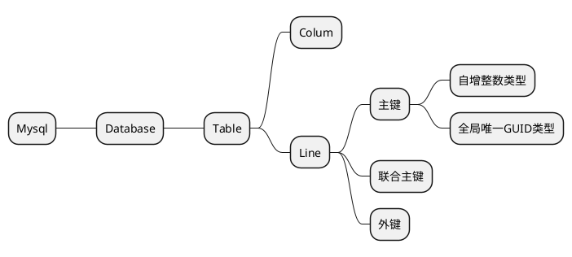

# Mysql



数据库操作

```sql
SHOW DATABASES;
USE database_name;
CREATE DATABASE database_name;
DROP DATABASE database_name;
SHOW TABLES;
DESC table_name;
-- 查看创建表的SQL语句
SHOW CREATE TABLE table_name;
DROP TABLE table_name;
```

## 表关系

一对一：

一对多：通过创建外键，关联另外一个表。外键并不是通过列名实现的，而是通过定义外键约束实现的。外键约束会降低数据库的性能。

```sql
-- 创建外键
ALTER TABLE students
ADD CONSTRAINT fk_class_id/* 外键约束的名称，可以是任意名 */
FOREIGN KEY (class_id)/* 设置外键 */
REFERENCES classes (id);/* 设置关联表 */

-- 删除外键
ALTER TABLE students
DROP FOREIGN KEY fk_class_id;
```

多对多：通过一个表的外键关联到另一个表

| id  | teacher_id | class_id |
| --- | ---------- | -------- |
| 1   | 001        | 001      |
| 2   | 002        | 001      |

## 索引

索引是为了解决查询速度问题，索引是关系数据库中对某一列或多个列的值进行预排序的数据结构。通过使用索引，可以让数据库系统不必扫描整个表，而是直接定位到符合条件的记录，这样就大大加快了查询速度。

可以对一张表创建多个索引。索引的优点是提高了查询效率，缺点是在插入、更新和删除记录时，需要同时修改索引，因此，索引越多，插入、更新和删除记录的速度就越慢。

对于主键，关系数据库会自动对其创建主键索引。使用主键索引的效率是最高的，因为主键会保证绝对唯一。

```sql
ALTER TABLE students
ADD INDEX idx_score (score);
```
