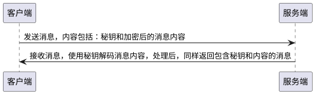
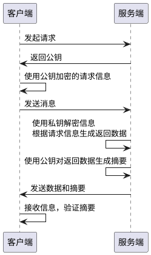

# 数据加密

数据加密是为了保护数据安全，防止数据被窃取和篡改。数据加密技术是使用秘钥实现信息转和无意义密文相互转换的方法。

## 加密算法

加密算法主要有三大类：

- 摘要算法：
  - HASH 算法
    - MD5
    - SHA-1
    - SHA-256
  - HMac 算法
- 加解密算法：
  - 对称加密：使用相同的秘钥加密和解密
    - DES：
    - 3DES
    - AES
  - 非对称加密：使用秘钥对进行加密和解密
    - RSA
    - DSA
- 签名算法

## Base64

Base64 会将内容转换为无意义的字符串，所以很多人认为 Base64 有加密的作用。
其实 Base64 并不是加密算法，而是一种编码方式，可以很容易的进行编解码。经常配合加密算法一起使用。

```JavaScript
// 浏览器环境
window.btoa('hello') // aGVsbG8=
window.atob('aGVsbG8=') // hello

// NodeJS
import { Buffer } from 'buffer';
const buf = Buffer.from('hello world', 'utf8');
console.log(buf.toString('base64')); // aGVsbG8gd29ybGQ=
```

## 信息摘要&摘要算法

**HASH 算法**又称散列算法，无论多长的信息经过加密都会生成固定长度的信息摘要，有以下特点：

- HASH 算法是**不可逆**的单向函数(计算很容易，但是逆向计算却非常困难的函数)
- 输出长度固定，且不同的输入有不同的输出，可以用来对输入的数据生成”指纹“即“数据摘要”
- 好的 HASH 算法冲突率更低。冲突是因为 HASH 算法的输出长度固定，但是算法的输入长度是无限制的，所以理论上会存在输入不同但是输出相同的情况，即为 HASH 碰撞。

**信息摘要**：使用 HASH 算法对消息进行加密得到固定长度的密文称为摘要。通常用于验证消息是否被篡改，应用场景：

1. 保证消息完整性：因为不同的数据使用摘要算法生成的信息摘要是不同的，所以可以将信息和摘要一起发送，然后使用摘要算法重新计算信息摘要进行对比，来验证信息是否被修改。
2. 安全访问认证：将用户名和密码生成摘要信息保存到数据，而不是直接明文保存，这样即使数据库被盗也不会泄露用户信息。
3. 数字签名：参考[HTTPS](../../01-基础/02-Network/HTTP/5.%20HTTPS.md)

### 常用 HASH 算法

- MD5(Message Digest Algorithm 5)：可以将任意长度的输入转换为 128bit 长度的消息摘要。
- SHA-1(Secure Hash Algorithm)：生成长度为 160bit 的摘要，相对于 MD5 更安全，但是计算速度更慢
- SHA-256：生成长度为 256bit 的摘要

```JavaScript
const crypto = require("crypto");
// getHashes 方法用于查看支持的加密算法
console.log(crypto.getHashes());

const hash = crypto.createHash('md5');
hash.update('hello');
console.log(hash.digest("hex")); // 5d41402abc4b2a76b9719d911017c592
```

### HMac 算法

由于 HASH 算法相同的输入总是会产生相同的输出，所以 HASH 算法可以采用“撞库”的办法进行暴力破解。所以即使数据库存储的摘要信息没有直接的意义，但是仍然可能被暴力破解，为了增加破解的难度通常会进行*加盐*操作。
盐就是一个字符串，和被加密的信息拼接后再进行加密存储，这样即使丢失的信息被暴力破解因为不知道信息中是如何加的盐那么得到的也是无意义的信息。

**HMac**(Hash-based Message Authentication Code)即加盐的 HASH 算法。HMac 总是会结合某种 HASH 算法结合使用，例如和 MD5 结合使用的即为 HmacMD5。

```JavaScript
const crypto = require("crypto");

const hash = crypto.createHmac('md5', 'world');
hash.update('hello');
console.log(hash.digest("hex")); // 1a75d01d561d51776bf36c996b826d6b
```

## 对称加密

加密和解密双方使用同样的秘钥进行加密和解密，但是秘钥的传输过程容易被劫持；

- 优点：速度快
- 缺点：不安全，秘钥发生的过程容易被截取，中间人也可以伪造秘钥



常用实现算法：

- DES
- 3DES
- AES

```JavaScript
const crypto = require("crypto");
// 获取支持的算法
console.log(crypto.getCiphers());

// 密钥
const secret = crypto.randomBytes(32);
const cipher = crypto.createCipheriv(
  "aes-256-cbc",
  secret,
  Buffer.alloc(16, 0)
);
cipher.update("hello", "utf8");

// 密文
const ciphertext = cipher.final("hex");

const decipher = crypto.createDecipheriv(
  "aes-256-cbc",
  secret,
  Buffer.alloc(16, 0)
);
decipher.update(ciphertext, "hex");
console.log(decipher.final("utf8")); // hello
```

## 非对称加密

加密和解密使用不同的秘钥，加密和解密使用的秘钥必须匹配公钥(public key)和私钥(private key)。使用公钥加密的信息只能使用匹配的私钥解密，反之亦然。公钥可以对外发布。

注意：**私钥不能用于加密数据，因为公钥是公开的，私钥加密的数据是无意义的**

- 优点：安全
- 缺点：相对对称加密较慢，消耗计算资源

秘钥对生成

```sh
# 生成私钥
openssl genrsa -out privatekey.pem 1024
# 生成公钥
openssl rsa -in privatekey.pem -pubout -out publickey.pem
```



```JavaScript
const crypto = require("crypto");
const fs = require("fs");

const privateKey = fs.readFileSync("./privatekey.pem");
const publicKey = fs.readFileSync("./publickey.pem");

// 公钥加密
const encodeData = crypto.publicEncrypt(publicKey, Buffer.from('hello'));
console.log(encodeData.toString("base64"));
// 私钥解密
const decodeData = crypto.privateDecrypt(privateKey, encodeData);
console.log(decodeData.toString("utf8"));
```

## 签名验证

首先生成摘要，然后使用私钥对摘要加密生成签名，将内容和签名一起发送到客户端，客户端使用私钥解密签名获得摘要进行对比，保证信息未被修改。

```JavaScript
const crypto = require("crypto");
const fs = require("fs");

const privateKey = fs.readFileSync("./privatekey.pem");
const publicKey = fs.readFileSync("./publickey.pem");

// 生成签名
let sign = crypto.createSign("RSA-SHA256");
sign.update("hello");
let signed = sign.sign(privateKey, "hex");

// 验证签名
let verify = crypto.createVerify("RSA-SHA256");
verify.update("hello");
let verifyResult = verify.verify(publicKey, signed, "hex");

console.log(verifyResult); // true
```

## 对称加密+非对称加密

使用非对称加密进行对称加密秘钥传输，保证安全。使用对称加密秘钥进行通信保证速度。
过程概述：A 生成一个秘钥，A 请求 B，首先获取 B 的公钥，然后使用 B 的公钥加密之前生成的秘钥并发送给 B，B 使用自己的私钥解密获取 A 的密钥，A 和 B 之后的通信使用 A 生成的秘钥进行加密，这样就解决了对称加密密钥被截取的问题

- 优点：快、安全
- 缺点：可能发生中间人攻击
