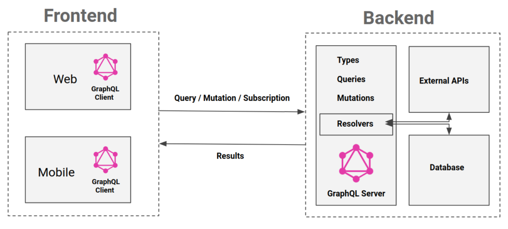
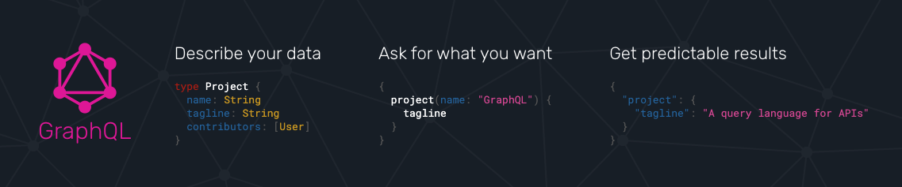

# GraphQL

> GraphQL is an open spec for a flexible API layer. Put GraphQL over your existing backends to build products faster than ever before.

GraphQL 解决的问题和 BFF 基本一致，在已有服务上增加一层，用于满足更加贴近业务的数据需求。GraphQL 相对于 BFF 是规范化的，前后端按照规定的标准进行数据交换。

GraphQL 解决 Restful API 以下痛点：

- 单个页面需要发送多个请求获取数据后进行二次加工使用，大多数时候请求是小于串行的
- 数据冗余：
- 字段类型不稳定：服务端返回数据不可控，前端需要进行数据校验。如空数组后端经常会返回 null
- 前后端沟通效率低下：依赖后端接口文档质量



> GraphQL is a query language for APIs and a runtime for fulfilling those queries with your existing data.

GraphQL 是一种 API 查询语言，也是使用现有数据完成查询的 runtime。



GraphQL 由 Client Server Tools 三部分构成。Client 和 Server 通常是基于 HTTP 通信，和 Restful API 不同的是 GraphQL Server 只有一个接口，Client 在查询参数中描述想要获取资源的 Graph。Tools 可以帮助生成请求的 Graph，进行请求的调试。

Server 需要定义暴露给前端的接口和数据的 Schema，接口和类型定义完成后接通过定义`Resolve`策略函数实现接口功能。

## 客户端 Query 语法

GraphQL 语法主要由操作类型、操作名称和字段三部分构成，同时还支持 Arguments、Fragments、Aliases、Variables 等特性

```graphql
operationType [operationName] {
  ...fields
}
```

```graphql
query HeroNameAndFriends {
  hero {
    name
    friends {
      name
    }
  }
}
```

GraphQL 操作类型用来描述请求执行的类型，支持以下三种操作：

- `query`：数据查找
- `mutation`：数据曾删改
- `subscription`：数据变更订阅

## 服务端 Schema 和 接口定义

```graphql
## Schema定义
interface Character {
  id: ID!
  name: String!
  friends: [Character]
  appearsIn: [Episode]!
}

type Human implements Character {
  id: ID!
  name: String!
  friends: [Character]
  appearsIn: [Episode]!
  starships: [Starship]
  totalCredits: Int
}

type Droid implements Character {
  id: ID!
  name: String!
  friends: [Character]
  appearsIn: [Episode]!
  primaryFunction: String
}

## 接口定义
query HeroForEpisode($ep: Episode!) {
  hero(episode: $ep) {
    name
    primaryFunction
  }
}
```
