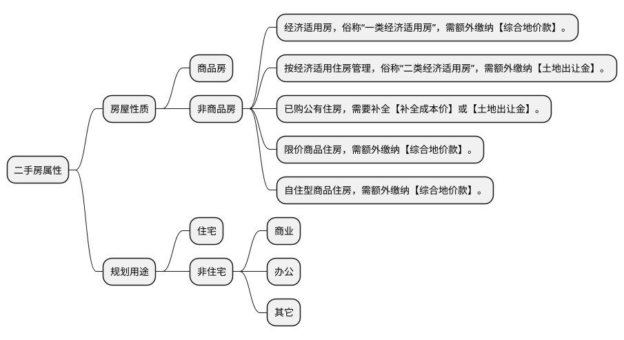
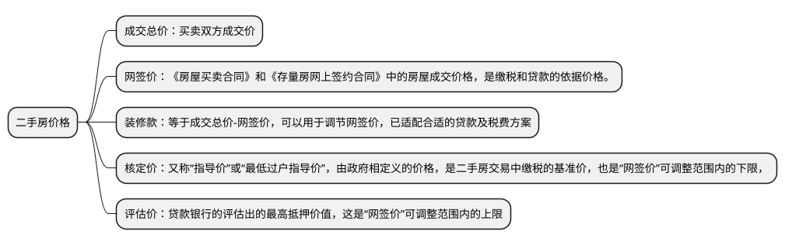
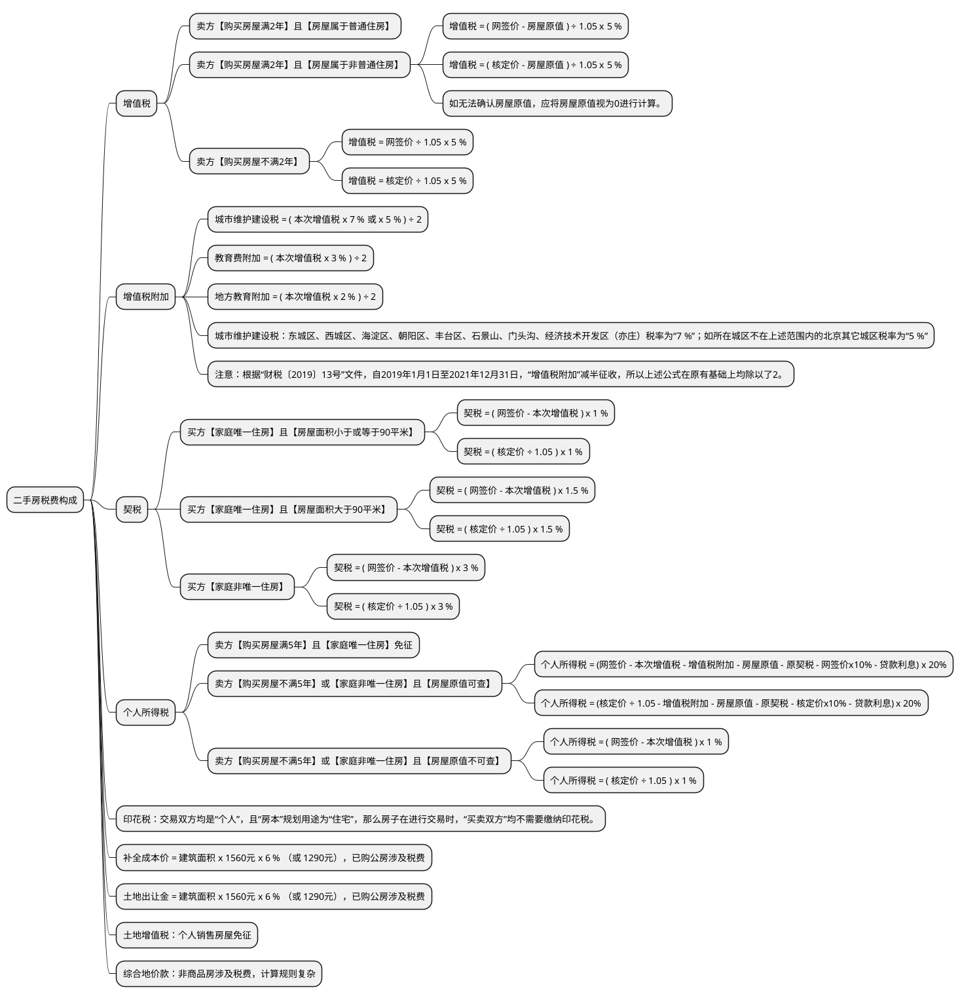

# 北京二手房

- 核定价(政府定价) <= 网签价格 <= 评估价(银行定价)
- 税费和贷款都是**以网签价为基数**
- 计税金额：税务局会按照“核定价”与“网签价”孰高的原则确定“计税金额”

普通住房认定标准，需要同时满足以下标准（已购公房除外，全部认定为普通住房）：

- 住宅小区建筑容积率在 1.0（含）以上，北京住宅基本全都在 1.0 以上
- 单套建筑面积在 140 平米（含）以下
- 实际成交价格(网签价格)的套单价或者总价应低于以下标准：
  - 五环内 [单价 ：39600 元/平米] [总价：468 万元/套]
  - 五至六环 [单价 ：31680 元/平米] [总价：374.4 万元/套]
  - 六环外 [单价 ：23760 元/平米] [总价：280.8 万元/套]

