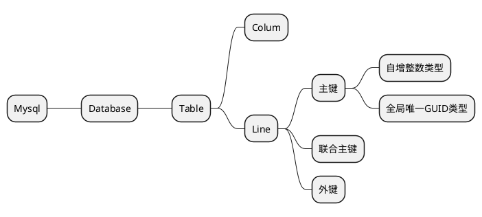

# Mysql

## 数据类型

- VARCHAR(n)：可变长度字符串，最大长度为 n
- BINARY(n)：固定长度为 n 的二进制串
- BOOLEAN：TRUE 或 FALSE
- INTEGER：整数，精度为 10
- INTEGER(n)：整数，精度为 n
- DECIMAL(p,s)：精确数值，精度为 p，小数点位数为 s
- FLOAT：近似数值，尾数精度为 16
- FLOAT(p)：近似数值，尾数精度为 p
- DATE：日期类型
- TIMESTAMP：时间戳
