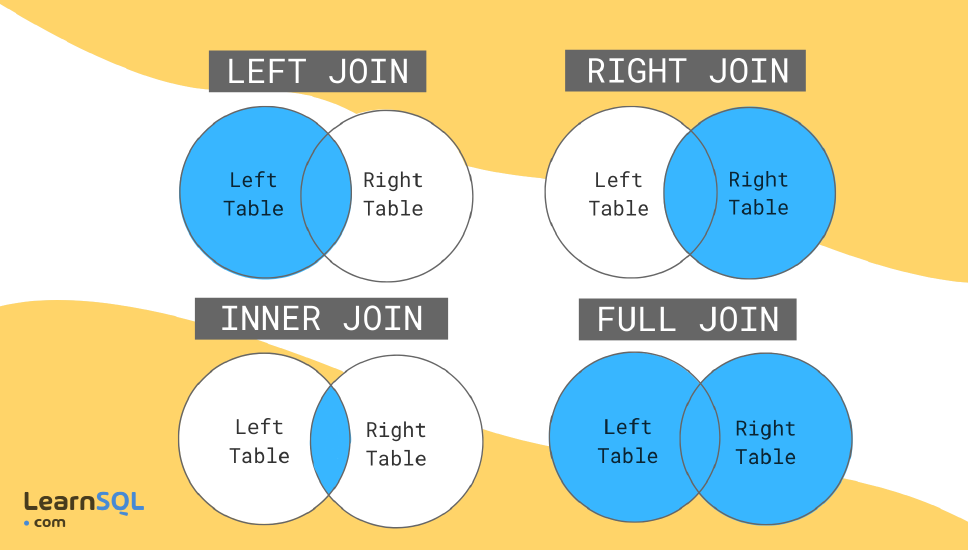

# SQL(Structured Query Language)

## DDL：Data Definition Language

数据库操作

```sql
-- 查看全部数据库
SHOW DATABASES;
-- 查看数据库信息
  <数据库名>;
-- 删除数据库
DROP DATABASE <数据库名>;
-- 查看当前正在使用数据库
SELECT DATABASE();
-- 切换/使用数据库
USE <数据库名>;
```

数据表操作

- list 表：`SHOW TABLES;`
- 创建表：`CREATE TABLE <表名> (字段1 字段类型, 字段2 字段类型, ....)`
- 查看表信息：`DESC <表名>;`
- 查看创建表 SQL 语句：`SHOW CREATE TABLE <表名>;`
- 删除表：`DROP TABLE <表名>;`
- 添加列：`ALTER TABLE <表名> ADD COLUMN birth VARCHAR(10) NOT NULL;`
- 删除列：`ALTER TABLE <表名> DROP COLUMN birthday;`
- 修改列：`ALTER TABLE <表名> CHANGE COLUMN birth birthday VARCHAR(20) NOT NULL;`

## DML：Data Manipulation Language

- 插入数据：`INSERT INTO <表名> (字段1, 字段2, ...) VALUES (值1, 值2, ...), ...;`
- 更新数据：`UPDATE <表名> SET 字段1=值1, 字段2=值2, ... WHERE ...;`
- 删除数据：`DELETE FROM <表名> WHERE ...;`

## DQL：Data Query Language

```sql
SELECT [DISTINCT] 列名...
  FROM <表名>
  WHERE <条件表达式>
  ORDER BY 列名...
  LIMIT <size> OFFSET <start>;
```

- 别名：`SELECT 列名1, 列名2 别名, 列名3, ... FROM <表名>`
  - 别名可选，设置后会使用别名展示最终结果
  - DISTINCT：去除重复值
- 条件查询：`SELECT * FROM <表名> WHERE <条件表达式>`
  - 条件表达式：
    - `=、>、>=、<、<=,<>`：等于、大于、大于等于、小于、小于等于、不等于
    - `LIKE`：类似，例：`name LIKE 'ab%'`，%代表任意字符
  - 条件表达式组合：
    - `AND`
    - `OR`
    - `NOT`
    - `()`：多于两个的组合需要使用括号进行分组
- 排序：`SELECT * FROM <表名> ORDER BY <列名> [ASC|DESC], <列名2>, ...`
  - `ASC`：默认，正序排序
  - `DESC`：可选，倒序排序
  - **如果有条件查询，`ORDER`语句要在条件查询语句之后**
- 分页：`SELECT * FROM <表名> LIMIT <size> OFFSET <start>;`
  - `LIMIT`：条数
  - `OFFSET`：起始位置
- 聚合查询：`SELECT 聚合函数(*) FROM <表名>;`
  - `SUM`
  - `AVG`
  - `MAX`
  - `MIN`
- 分组查询：`SELECT 聚合函数(*) FROM <表名> GROUP BY <列名>, ...;`
  - 使用分组查询时，只有作为分组条件的字段和聚合字段才能作为 SELECT 字段
- 连接查询：`SELECT <表别名.列名> [AS 列别名], ... FROM <主表名> [AS 表别名] INNER JOIN <连接表名> [AS 表别名] ON <条件表达式>`
  - 内连接：`INNER JOIN`，只返回同时存在于两张表的行数据
  - 外连接：`OUTER JOIN`
    - `RIGHT OUTER JOIN`：返回右表都存在的行
    - `LEFT OUTER JOIN`：返回左表都存在的行
    - `FULL OUTER JOIN`：把两张表的所有记录全部选择出来


