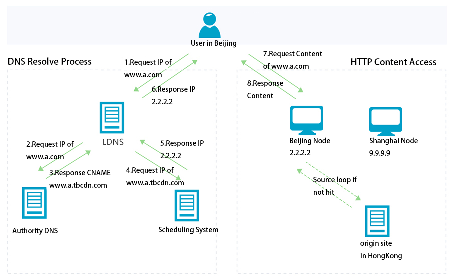

# CDN

Content Delivery Network 内容分发网络，提供内容分发服务，通常都是分布式的，解决因分布、带宽、服务器性能带来的访问延迟问题，提供稳定快速的内容传输。CDN 可以根据请求的用户信息(物理地址、运营商等)分配最优的服务器。

CDN 由三部分构成：

- 分发服务系统：
  - 响应用户的最终请求
  - 同步源站内容
- 负载均衡系统：负责请求调度，确定用户的最终请求地址，分为两级：
  - 全局负载均衡（GSLB）：主要根据用户的位置分配最优的 cache 物理位置
  - 本地负载均衡（SLB）：管理分配具体 cache 节点
- 运营管理系统：

## DNS & CDN

CDN 和 DNS 有着密布可分的关系。

未接入 CDN 请求过程

- DNS 解析
- 获得 IP 发起请求
- 处理服务器响应

对接入 CDN 服务的请求，会将 DNS 交给 GSLB 处理

- 用户发起请求，向本地 DNS 请求 IP
- 本地 DNS 请求权威 DNS 服务器，
- 权威 DNS 服务器返回 CNAME(指向全局负载均衡)
- 本地 DNS 服务器向全局负载均衡发起请求
- 全局负载均衡返回缓存服务器 IP
  - 首先根据请求 IP 向最优的本地负载均衡服务器发起请求
  - 被动负载均衡会根据缓存服务器的负载请求、是否有请求内容等情况选择最优缓存服务器 IP 返回
- 用户向缓存服务器发起请求
- 缓存服务器响应请求，如果没有请求内容会先去源服务器请求内容再响应



## CDN 挂掉后如何保证网站可以正常运行

```HTML
<script
    src="https://code.jquery.com/jquery-3.3.1.min.js"
    integrity="sha256-FgpCb/KJQlLNfOu91ta32o/NMZxltwRo8QtmkMRdAu8="
    crossorigin="anonymous">
</script>
<script>window.jQuery || document.write('<script src="js/vendor/jquery-3.3.1.min.js"><\/script>')</script>
```

[Subresource Integrity 介绍](https://imququ.com/post/subresource-integrity.html)
[大公司里怎样开发和部署前端代码？](https://github.com/fouber/blog/issues/6)
[高并发架构的 CDN 知识介绍](https://segmentfault.com/a/1190000019036398)

## TODO:使用 CDN 优化网站性能

1. 来自同一域名的资源(css img js...)浏览器一般同时下载 6 个，如果来自不同域名则没有限制；
