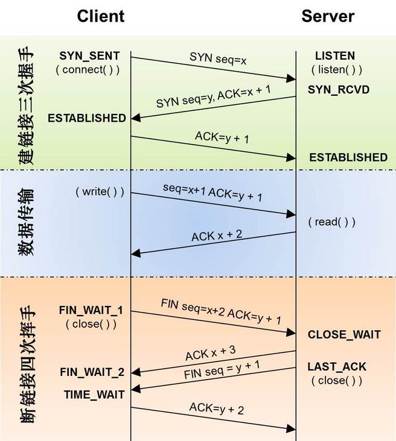

# TCP 协议

TCP 是传输层协议，是一个**端到端的连接协议**。
一个 TCP 连接是由客户端 IP、客户端端口、服务端 IP、服务端端口四部分组成。
TCP 协议保证数据传输的可靠性，需要一个确认机制保证数据的传输。

## TCP 链接创建和断开

### 三次握手

1. 第一次握手：**客户端告诉服务器我要发起请求了**。浏览器首先向服务器发送一个带`SYN`标志的数据包，并进入`SYN_SEND`状态，等待服务器确认；
2. 第二次握手：**服务器告诉客户端我准备接受请求了**。服务器接收到数据包后返回一个带有`SYN/ACK`的数据包，此时服务器进入`SYN_RECV`状态；
3. 第三次握手：**客户端告诉服务器我马上就要发送请求了**。最后浏览器再发送一个带有`ACK`的数据包给服务器，客户端和服务器进入`ESTABLISHED`状态，代表握手结束，连接成功；

三次握手的意义在于验证发送端和接收端是都准守`TCP/IP`协议，第一次握手确认**客户端的发送能力**，第二次握手确认**服务的的接收和发送能力**，第三次握手确认**客户端的接收能力**。

### 四次挥手

在请求和响应结束后，需要断开 TCP 连接，因为连接是双向的，所以浏览器和客户端需要分别断开

1. 第一次挥手：**客户端告诉服务器请求报文发送完毕，准备关闭链接**。客户端发送一个 FIN，用来关闭客户 A 到服务器 B 的数据传送
2. 第二次挥手：**服务器告诉客户端请求报文接收完成，准备关闭链接**。服务器收到这个 FIN，它发回一个 ACK，确认序号为收到的序号加 1。和 SYN 一样，一个 FIN 将占用一个序号。
3. 第三次挥手：**服务器告诉客户端响应报文发送完毕，准备关闭链接**。服务器 B 关闭与客户端 A 的连接，发送一个 FIN 给客户端 A。
4. 第四次挥手：**客户端告诉服务器响应报文接收完成，关闭链接吧**。客户端 A 发回 ACK 报文确认，并将确认序号设置为收到序号加 1。

## TODO:TCP Socket
