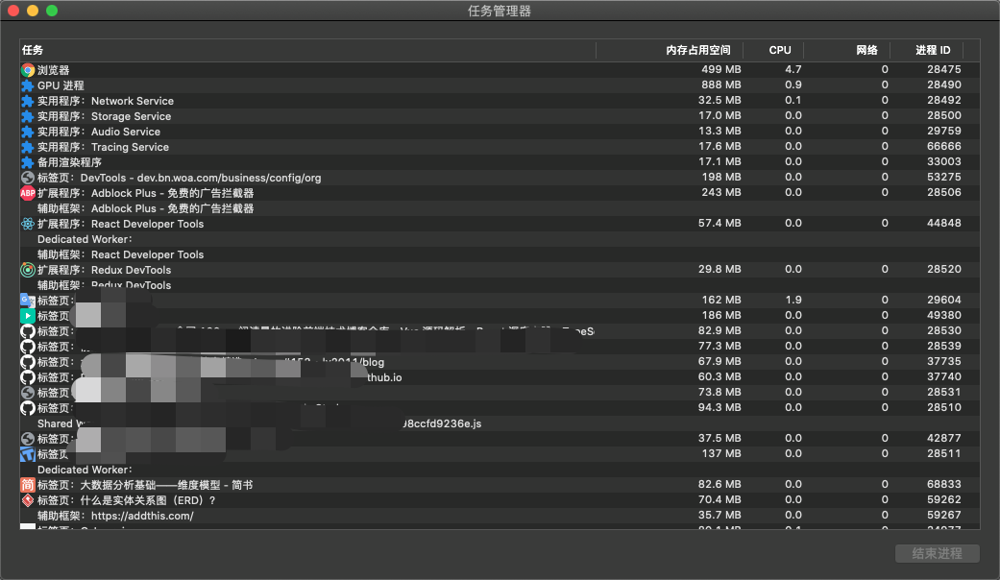

# TODO:浏览器架构

浏览器是**多进程架构**（不要和 JS 单线程混淆），每个页面都是单独的进程

- 主进程：每个页面只有一个
  - 负责浏览器面显示与用户交互(前进、后退等)
  - 控制页面创建、销毁等
  - Renderer 进程得到的内存中的 Bitmap，绘制到用户界面上
  - 网络资源管理
- 第三方进程：插件进程，每个插件一个
- GPU 进程：最多一个，用于 3D 绘制等
- 渲染进程(浏览器内核)：每个页面一个，各进程互不影响，主要负责页面渲染、脚本执行和事件处理等

## 渲染进程

浏览器的渲染进程是**多线程的**

- GUI 渲染线程：负责页面渲染，DOMTree、CSSOM Tree、Render Tree 构建，Layout 和 Render
  - 重绘和重流触发
  - GUI 线程和 JS 引擎线程是互斥的，详见[关键渲染路径&渲染优化-页面阻塞](./2.关键渲染路径&渲染优化.md)
- JS 引擎线程：也称 JS 内核，负责 解析和执行 JS 脚本
  - 一个页面只有一个 JS 线程
  - JS 引擎一直在等待任务队列中的任务然后执行，详见[JS 运行机制](../../02-JavaScript/02.Core/05-运行机制.md)
- 事件触发线程：由浏览器控制，负责控制 Event Loop
  - JS 引擎调执行`setTimeout`、异步请求或事件监听等代码块时会将代码会添加到事件线程
  - 当事件触发后事件触发线程会将对于的代码块和触发数据一起添加到任务队列
- 定时器触发线程：`setInterval`与`setTimeout`所在线程
- 异步 HTTP 请求线程：`XMLHttpRequest`连接后通过浏览器开启的请求线程

TODO:在浏览器输入一个 URL 到页面加载完成大概分为以下几大步骤：

1. 浏览器输入 url，浏览器主进程接管，开一个下载线程
   1. DNS 寻址及 IP 解析
   2. TCP 链接
   3. 请求、响应、文档下载
2. 将下载内容通过`RendererHost`接口转交给渲染进程
   1. 建立 DOMTree、CSSOMTree 和 RenderTree 并渲染页面
