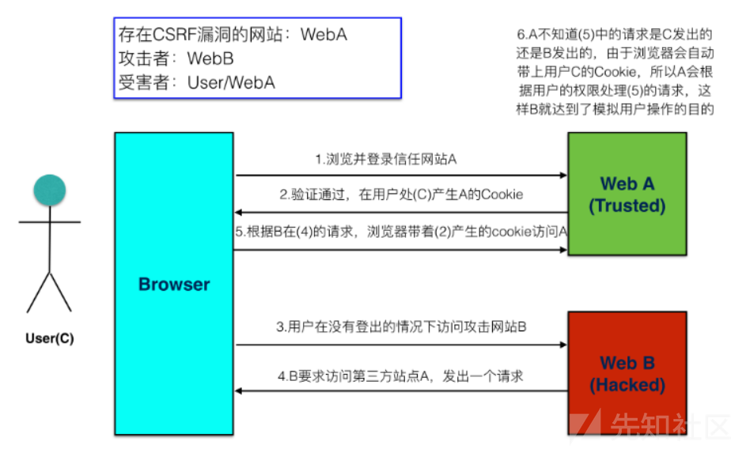

# CSRF(Cross-Sit-Request-Forgery)

跨站请求伪造(CSRF)主要攻击方式为诱导或伪造用户操作，向服务器发起恶意请求，利用用户的身份认证信息绕过服务端验证，

攻击场景

- A 网站的`http://demo.com/list/delete?id=10`链接为用户网站删除列表数据请求，只做用户登录验证，
- B 网站中包含``如下代码
- 当用户登录 A 网站湖又打开 B 网站，删除的请求就会发出，因为用户已经登录 A 网站，那么请求就会生效。

常见攻击类型：

- GET 型：利用图片地址等方式触发 GET 请求
- POST 型：页面内包含自动提交表单，打开页面后自动发送 POST 请求
- 链接型：使用`<a>`标签，用户点击后触发请求

## 预防 CSRF

CSRF 攻击一般发起在第三方网站，而不是被攻击的网站。被攻击的网站无法防止攻击发生

1. 使用 POST 请求代替 GET 请求，增加攻击难度
2. 同源检测：通过检测请求头中的来源信息验证
   1. Origin Header：
   2. Referer Header：但 XHR 请求可调用`setRequestHeader`方法来修改`Referer`
3. 验证码
4. 对于任何重要的请求（如转账、付款等）都需要重新验证用户的身份；
5. Token
   1. 用户打开页面的时候，服务器需要给这个用户生成一个 Token，这个 Token **不能存储在 Cookie 中**，在表单中可以使用隐藏域存储。
   2. 发送请求的时候带上 Token
   3. 服务端验证 Token
