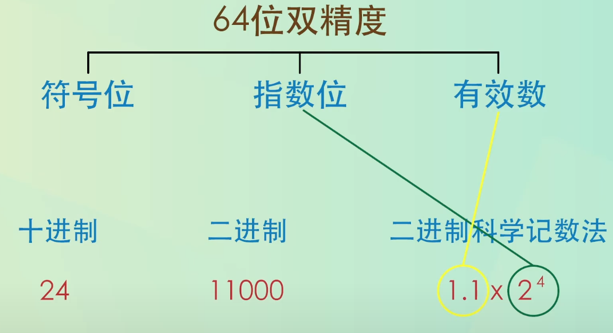

# JavaScript Number 和数学运算

JavaScript 不区分整数和浮点数，`123`、`12.3`、`1.23*e3`、`-123`、`NaN`、`Infinity` 都是合法的数字类型

JavaScript 的 Number 类型为**双精度 IEEE 754 64 位浮点**类型


- 1 位符号位： `0`代表正数，`1`代表负数
- 11 位指数为：用来表示次方数
- 52 位尾数位：超出部分自动进一舍零



## NaN

`Number.NaN`：是一个特殊的数字，表示非数字；

- `NaN`与所有值都不相等，包括它自己：`NaN == NaN //false`；
- `NaN`参与的计算结果均为`NaN`;
- 唯一判断`NaN`的方法是通过`isNaN()`函数
  - `isNaN(value): boolean`：会首先尝试将传入的值转换为数字类型，不能转换为数字的一律返回`true`
  - `Number.isNaN(value): boolean`：会首先判断是否为数字，如是数值再判断是否为`NaN`

```JS
isNaN('a') // true
Number.isNaN('a')  //false
```

## 转换方法

- `Number.parseInt(value: string, radix?: number): number`：将字符串或小数转化为整数
  - `parseInt`可以理解`+`和`-`两个符号
  - `radix`的值为`2~36`，表示字符串的基数，如果不指定`parseInt`会忽略第一个字符及其以后的所有字符，返回到此为止的整数
  - `parseInt`会自动忽略字符串头部空格；
  - 转换从前到后进行转换，遇到无法转换的字符停止转换，返回已转换部分；
  - 如果第一个字符就无法转换返回`NaN`
- `Number.parseFloat(value: string): number`：字符串转浮点数
  - 同`parseInt()`支持正负号，会忽略首尾空格，遇到非法字符会停止解析并返回已解析结果
  - `parseFloat()`会转换第一个`.`后为小数部分；
- `Number.prototype.toFixed(digits: number): string`：数字小数点处理，保留`digits`位数的小数位数

## 数字运算

- 加法：数字和字符串相加，执行字符串拼接
- 取余：获取相除余数部分，**结果正负由第一个运算子的符号决定**
- 其他：其他算数运算符一律专为数字运算；
- 浮点数在运算的过程无法精确表示无限循环小数，所以会产生误差`1 / 3 === (1 - 2 / 3) //false`

## BigInt

用来表示答应`2^53 - 1`的整数，在整数字面量后面加`n`的方式定义，也可以使用`BigInt(value: number | string): BigInt`方法。
