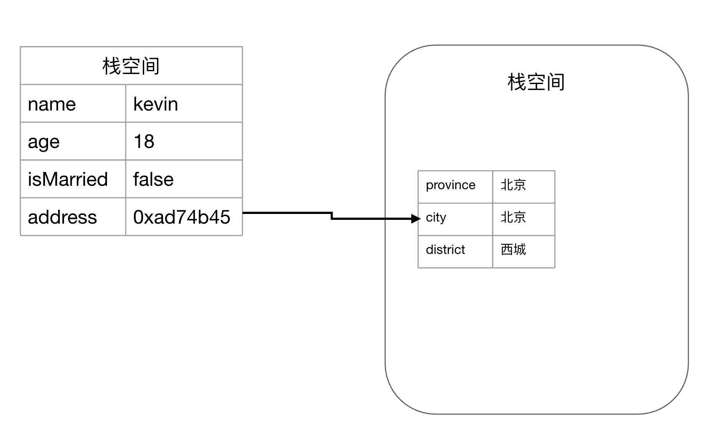

# JavaScript 基础-变量&常量

在应用程序中，使用变量来为值命名，变量名称为标识符(Identifier)；
常量是一个只读(read-only)的值的标识符；
JavaScript 标识符规则同 Java 一致：包含数字、字母、`$`、`_`，不以数字开头，区分大小写；

## 变量声明

- 变量声明：在 JavaScript 中有三种变量声明方式
  - 关键字`var`：声明全局变量和局部变量；
  - 关键字`let`：在语句块内声明局部变量；
  - 直接赋值：声明全局变量，**实际是直接在`window`上添加属性，可以使用`delete`删除**。这种方式是不推荐的，在严格模式下会报错；
- 常量声明：在 ES6 之前 JavaScript 不支持常量，ES6 支持使用关键字`const`来声明常。
- 重复声明：
  - 使用`var`重复声明变量相当于什么都没做
  - `let`和`const`关键字不允许变量重复声明，重复声明会报错

```JavaScript
let a = 1;
let a; // 报错 SyntaxError: Identifier 'a' has already been declared
```

ES6 规定全局变量将逐步与顶层对象的属性脱钩，`var`和`function`声明的全局变量为了兼容性仍保持全局对象的属性。

## 变量赋值

变量赋值：声明后未赋值的变量默认值为`undefined`

```JavaScript
var a;
coNsole.log(a);// 输出 undefined
```

常量赋值：常量在声明的时候必须被初始化，常量在声明后不能在重新被赋值

```JavaScript
const a; // 报错 Uncaught SyntaxError: Missing initializer in const declaration
const a = 1;
a = 2; // 报错 Uncaught TypeError: Assignment to constant variable.(…)
```

## 解构赋值 Destructuring

ES6 允许按照一定模式，从数组和对象中提取值，对变量进行赋值，这被称为解构(Destructuring)
只要某种数据结构具有[Iterator](../00.Basic/01.Iterator.md)接口，都可以采用数组形式的解构赋值

```JavaScript
// 数组解构
let [a, b, [c, d], e = 5, f = 6] = [1, 2, [3, 4], undefined, null]
console.log(a, b, c, d, e, f) // 1 2 3 4 5 null
// 字符串解构赋值
let [firstLetter, secondLetter] = 'ab'
// 对象解构赋值
let lee = {name: 'lee', age: 18}
let { name : enName, age, sex = 'man' } = lee
// 函数参数解构赋值
function sayHi({name, age}) {
  console.log(`I am ${name} ${age} years old`)
}
sayHi(lee)
```

## 变量类型&内存空间

JavaScript 引擎需要为每一个变量分配内存空间，根据**变量所占内存空间是否固定**，变量类型分为基本类型和引用类型两种：

| 类型     | 内存空间 | 存储位置                            | 读写         | 变量类型                                                |
| -------- | -------- | ----------------------------------- | ------------ | ------------------------------------------------------- |
| 基本类型 | 固定     | 栈，直接存入数据值                  | 直接读写     | `undefined` `string` `boolean` `number` `symbol` `null` |
| 引用类型 | 不固定   | 堆+栈，堆中存放数据值，栈中存放指针 | 指针引用读写 | `array` `object` `function`                             |

- String：ECMAScript 中的字符串是不可变的，要改变某个变量保存的字符串，首先要销毁原来的字符串，然后用另一个包含新值的字符串填充该变量
- Number：双精度 64 位二进制
- Null：`null`本身不是对象，`typeof null === 'object'`，是语言本身的一个 bug。[参考](https://github.com/YvetteLau/Step-By-Step/issues/5#issuecomment-494202827)
- Function：特殊引用类型，不用来存储数据



## JavaScript 变量提升

JavaScript 引擎运行方式是先解析代码，获取所有被声明的变量和函数，然后再一行一行的运行。
在执行前**所有的变量声明语句和函数声明语句都会被提升到代码的头部**，这个过程就是**变量提升**。

**注意**：ES6 规定，使用`let`和`const`声明的变量不会进行变量提升。

```JavaScript
console.log(a); // undefined
var a = 1;
```

在解析过程变量`a`的声明被提升到 `console`之前，但是赋值不会被提升，相当于：

```JavaScript
var a;
console.log(a);
a = 1;
```

所以结果为`undefined`，变量提升只对`var`和`function`语句有效

```JavaScript
console.log(b); // Uncaught ReferenceError: b is not defined(…)
b = 2;
```

JavaScript 不会对`b = 2`进行变量提升，只认为这是一个赋值语句；

**变量提升的好处**有两点：

1. 提升性能，让函数在执行前预先为变量分配栈空间
2. 提升代码容错性，让一些不规范的代码可以正常执行，双刃剑。

## var 和 let 异同

- [作用域](./02-变量作用域&执行栈.md)
- 变量提升：`let`声明不会进行变量提升
- 重复声明：`var`可以重复声明同名变量，`let`重复声明会报错
- [暂时性死区](./02-变量作用域&执行栈.md#暂时性死区-tdztemporal-dead-zone)
- **顶层对象(window)和全局变量脱钩**：使用`let`声明的变量不能通过`window.xxx`访问

## 变量提升深入 - 执行上下文 EC(Execution Context)

JS 引擎运行过程分为预编译期和执行期，JS 引擎是一边运行一边解析，在运行的过程中遇到**可执行代码**时就会首先创建一个**执行上下文**(Execution Context)，即编译。在生成执行上下文的过程会发生变量提升。

JavaScript 解释器执行的伪逻辑：

1. 解析要被执行的可执行代码
2. 创建执行上下文
   1. `this`绑定
   2. 初始化作用域链
   3. 创建[变量对象](#变量对象vo)
3. 激活代码并执行

### 执行上下文

EC 主要有三部分构成：

- 变量对象：存放上下文中可以被访问的变量声明、形参和函数标识符等
- 作用域链：包含当前 VO 和所有父级 VO，详见[变量作用域&执行栈](./02-变量作用域&执行栈.md)
- `this`：运行过程中`this`的指向，详见[this](04-this.md)

JS 可执行代码有三类：

- 全局代码：也可以将全局代码看成是一个 IIFE
- 函数代码：
- Eval 代码：

三种可执行代码对应有三种执行上下文:

- 全局上下文：创建全局对象，并设置`this`指向这个全局对象。一个程序只有一个全局上下文
- 函数执行上下文
- Eval 执行上下文

### 变量对象(VO)

VO(Variable Object)是一个抽象概念中的对象，用于存储执行上下文中的变量、函数声明和函数参数，创建顺序如下：

1. 参数处理
   1. 创建`arguments`对象
   2. 将函数参数添加到 VO 对象，并使用实参初始化(若未传入实参则初始化为`undefined`)
2. 函数声明处理：扫描函数内的函数声明并添加到 VO 对象，发现**重复声明会覆盖**变量对象添加的同名属性
3. 变量声明处理：扫描函数内的`var`关键字声明的变量并添加到 VO 对象，初始化变量值为`undefined`，发现重**复声明会忽略**
4. 求出上下文内部`this`的值

```JavaScript
var a = 10;         // VO(globalContext) = {
function test(x){   //   a: 10,
  var b = 20;       //   test: <ref to function>
}                   // };
test(30);           // VO(test functionContext){
                    //   arguments: { 0: 30, length: 1 },
                    //   x: 30
                    //   b: undefined
                    // }

// ExecutionContentObject(test)
ECObj = {
  Scope： {...}, // 作用域链
  VariableObject: { // 变量对象
    arguments: {
      0: 30,
      length: 1
    },
    x: 30,
    b: undefined
  },
  this: { ... } // this指针
}
```

JS 在执行阶段使用的变量都是来自 VO 对象，Review VO 的创建过程应该对变量提升会有更深入的理解。

```JavaScript
alert(x); // function x(){} 函数重复声明，覆盖var x
var x = 10;
alert(x); // 10 运行时变量赋值
x = 20;
function x(){}
alert(x); // 20
if(true){
  var a = 1;
}else{
  var b = true;
}
alert(a); // 1
alert(b); // undefined 变量初始化后为执行赋值
```

## TODO:ES6 变量环境&词法环境

## 参考

[深入理解 JavaScript 执行上下文、函数堆栈、提升的概念](https://segmentfault.com/a/1190000009041008)
TODO:[[译] 理解 JavaScript 中的执行上下文和执行栈](https://juejin.cn/post/6844903682283143181)
