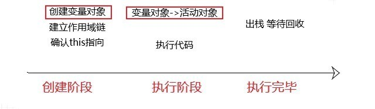
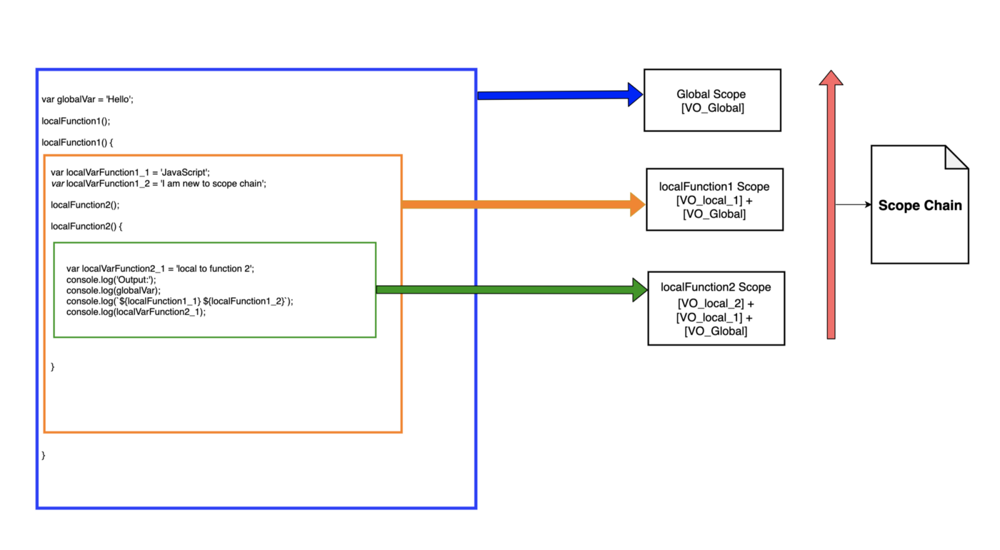

# 变量作用域&执行栈

在 ES6 之前 JavaScript 只支持全局作用域和函数作用域：

- `局部变量`：在函数内部声明的变量为局部变量，只能在函数内部使用；
- `全局变量`：在其它位置声明的变量均为全局变量，可以在任意位置访问；

```JavaScript
if(true) {
  var a = 1;
}
function tt(){
  var b = 2;
  console.log(b);
}
tt(); // 输出 2
console.log(a); // 输出 1
console.log(b); // 报错：Uncaught ReferenceError: b is not defined(…)
```

ES6 添加了块级作用域的支持，使用`let`关键字可以声明块作用域的局部变量。

```JavaScript
if (true) {
  let a = 1;
  console.log(a); // 输出 1
}
console.log(a); // 报错：Uncaught ReferenceError: a is not defined(…)
```

使用`const`声明的常量的作用域与使用`let`声明变量规则一致；

## 暂时性死区 TDZ(Temporal Dead Zone)

ES6 规定如果区块中存在`let`和`const`命令，这个区块对这些命令声明的变量，从开始就形成了封闭作用域。**在声明之前引用这些变量就会报错**；这在语法上成为暂时性死区。

这一特性也与`let`和`const`声明的变量不会进行变量提升的特性吻合。

```JavaScript
var temp = 123;

if(true){
  temp = 'abc'; // ReferenceError，let命令讲temp锁死在if作用域内，let命令不会发生变量提升所以报错
  let temp;
}
```

## 作用域深入

### 解释器执行过程&执行上下文栈

在[变量声明、赋值](./01-变量声明、赋值.md)中介绍了执行上下文，每一个可执行函数都会创建一个可执行上下文，可执行上下文有 VO、作用域链和`this`三部分构成。VO 中存储了当前执行函数可访问的变量。

**执行上下文栈**：其它语言称为“调用栈”，是 LIFO 数据结构，用来存储代码运行时创建的所有执行上下文。一个执行上下文可能触发另一个上下文，比如一个函数调用另一个函数，JavaScript 是单线程的，也就是说在同一时间只能执行一个任务，所以 JS 引擎会为每一个可执行函数创建一个**执行上下文**用来存储执行的环境，创建后压入**执行上下文栈**的顶部。压栈完成后 JS 引擎会从栈顶开始逐个执行每一个上下文，一个上下文执行完成之后会立刻从执行环境栈弹出，并执行下一个上下文。

1. JS 引擎开始执行的时候会创建一个全局 EC 并压入栈底，JS 引擎逐行执行代码，每触发一个可执行代码都会创建一个新的 EC。
2. EC 在创建后会被压入**执行上下文栈(Execution Context Stack)**
3. JS 引擎总会执行位于栈顶的 EC，每个 EC 中都有一个对象用来存储可访问的变量，即**变量对象(Variable Object)**，JS 引擎每进入一个执行上下文之后，该 EC 的变量对象就被激活了变量对象转化为**激活对象(Activation Object)**
4. 函数运行完成之后 JS 引擎会将该函数创建的 EC 弹出执行栈，并销毁这个 EC，进入下一个 EC 并激活执行，之后会完成内存回收。
5. 如此反复，直到清空执行栈。



```JavaScript
let a = 'Hello World!';
function first() {
  console.log('Inside first function');
  second();
  console.log('Again inside first function');
}
function second() {
  console.log('Inside second function');
}
first();
console.log('Inside Global Execution Context');
```


### FIXME:垃圾回收

垃圾回收（Garbage Collection，缩写为 GC）即内存回收，是一种自动的存储器管理机制。当某个程序占用一部分内存不再被程序访问时程序会释放这部分内存。垃圾回收实现方式有两种：

1. 引用计数：最早的也是最简单的垃圾回收实现方法，这种方法为占用物理空间的对象附加一个计数器，当有其他对象引用这个对象时计数器加一，反之引用解除时减一。垃圾回收器会定期检查，技术为零的对象会被释放。缺点是：**无法回收循环引用的存储对象**
2. 标记清除法：标记清除法主要将 GC 的垃圾回收过程分为标记阶段和清除两个阶段：
   1. 标记阶段：把所有活动对象做上标记；
   2. 清除阶段：把没有标记（也就是非活动对象）销毁。

以下情况会发生内存泄漏

- 全局变量：在非严格模式下当引用未声明的变量时，会在全局对象中创建一个新变量
- 未被清理的定时器`setInterval`，
- DOM 引用，引用 DOM 的变量在使用后可以赋值为`null`
- 闭包

### 作用域链

在执行上下文中查找变量的过程称为**标识符解析(Identifier Resolution)**，当查找变量的时候首先会从当前上下文的变量对象中获取，如果没有找到，就会父级的上下文的变量对象中查找，直到全局执行上下文。这样由执行上下文变量对象构成的链表就叫做**作用域链(Scope)**。



作用域链是一个有序链表，每个函数都有一个内部属性`[[scope]]`，这个属性保存所有父级变量对象。当函数执行开始后会将当前函数的 VO 转换为 AO，AO 和`[[scope]]`属性组成了`Scope`，即`Scope = [AO].concat([[scope]])`，过程示例如下：

第一步：创建阶段

```JS
function foo() {
  var a = 0;
  function bar() {
    var b = 1;
    console.log(a + b);
  }
}
foo();

// 执行栈
ECStack = [
  barContext,
  fooContext,
  globalContext
];

// 执行上下文
fooContext = {
  arguments: {
    length: 0;
  },
  a: undefined;
  scope: foo.[[scope]]
}
foo.[[scope]] = [globalContext.VO]

barContext = {
  arguments: {
    length: 0;
  },
  a: undefined;
  scope: bar.[[scope]]
}
bar.[[scope]] = [foo.VO, globalContext.VO]
```

第二步：执行阶段

```JS
// 执行栈顶bar函数，将barContext
barContext = {
  AO: {
    arguments: {
      length: 0
    }
    b: undefined;
  },
  Scope:[AO, [[scope]]]
}
```

变量的查找发生在作用域链，变量`b`在当前 AO 中获得，变量`a`在当前 AO 中为找到会递归向上查找在`foo.AO`中获得。

作用域链和原型链都是链式向上查找，区别是原型链查找到顶层仍未找到会返回`undefined`，作用域链无法查找到会抛出`ReferenceError`异常。
