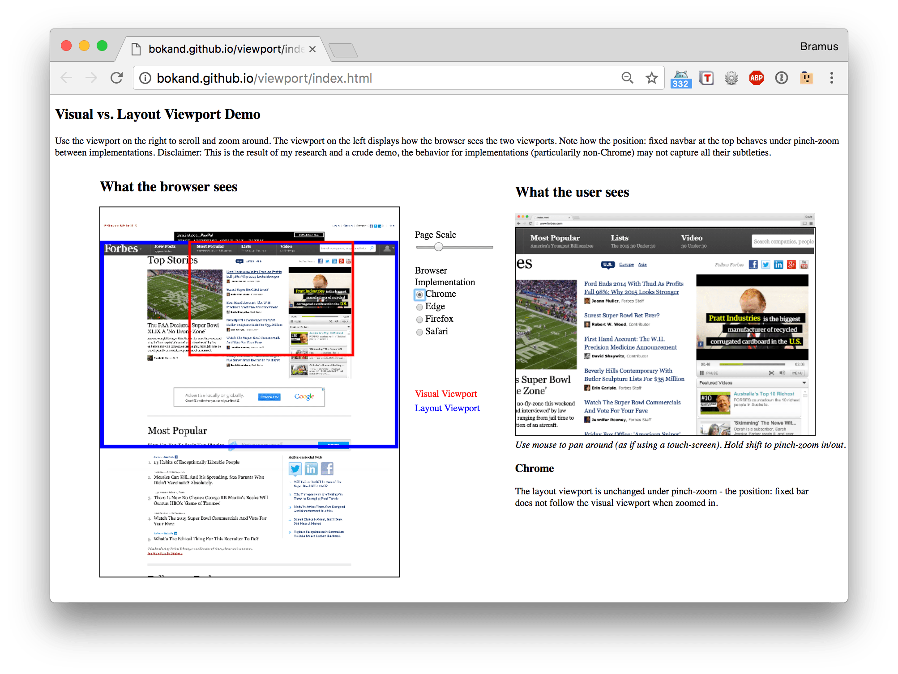

# 响应式布局

## 媒体查询方案

通过媒体查询为不同分辨率的设备写不同的样式实现响应式布局，缺点是需要写多套代码，实现和管理成本高。

## 百分比 方案

百分比布局比较常用，缺点是：

- 需要将设计稿进行百分比换算，开发成本高
- 规则复杂
  - 子元素`height`和`width`：相对于父元素的`height`和`width`
  - `top bottom`：相对于非`static`父元素高度
  - `left right`：相对于非`static`父元素宽度
  - `padding`和`margin`：不论是垂直方向或者是水平方向，都相对于直接父亲元素的`width`
  - `border-radius`：相对于自身的宽度

## vw/vh 方案

`vw/vh`是 CSS3 中引入了一个新的单位，还有`vmin`和`vmax`

- `vw`：相对于视窗的宽度，视窗宽度是`100vw`
- `vh`：相对于视窗的高度，视窗高度是`100vh`
- `vmin`：`vw`和`vh`中的较小值
- `vmax`：`vw`和`vh`中的较大值

## Rem 方案

`rem`单位都是相对于根元素`html`的`font-size`来决定大小的,根元素的`font-size`相当于提供了一个基准，当页面的尺寸发生变化时，只需要改变`font-size`的值，那么以`rem`为固定单位的元素的大小也会发生响应的变化。

```JavaScript
(function (doc, win) {
  var docEl = doc.documentElement,
    resizeEvt = 'onorientationchange' in window ? 'orientationchange' : 'resize',
    reCalc = function () {
      var clientWidth = docEl.clientWidth;
        if (!clientWidth) return;
          clientWidth = Math.min(clientWidth, 1024)
          clientWidth = Math.max(clientWidth, 300)
          docEl.style.fontSize = 100 * (clientWidth / 375) + 'px';
        }
    if (!doc.addEventListener) return;
    win.addEventListener(resizeEvt, function() {
      setTimeout(function(){
        reCalc()
      }, 50)
    });
    reCalc()
})(document, window);
```

通过媒体查询预设 html `font-size` 解决进入页面时闪烁问题

```CSS
@media (min-width: 360px){ html{ font-size: 96px; } }
@media (min-width: 375px){ html{ font-size: 100px; } }
@media (min-width: 414px){ html{ font-size: 110.6px; } }
```

TODO:Rem 在 CSS 预处理器中使用及原理

## viewport 方案

以固定尺寸方式布局，动态设置`initial-scale`的值适配移动浏览器方案。
例：设计稿`750px`宽，所以 iphone6 设置`initial-scale=375/750`。
适合场景：活动页，可以保证等比环境设计稿。
但是对于大多数用户来说更大的屏幕是为了能够看到更多的内容，而不是为了看到更大的字体，所以在业务场景并不适合。

### 视口(Viewport)

Viewport 的由来，因为移动设备的屏幕较小，传统 web 页面在移动设备会出现横向滚动条，在使用流动布局的页面上布局会被压乱；
苹果为解决这个问题设计了 viewport，viewport 就是一个虚拟窗口，宽度大概为`980px`(不同的厂商的设备略有区别)；
页面在这个布局窗口(layout viewport)上进行 CSS 渲染，然后在视觉窗口(visual viewport)通过拖拽和缩放就可以满足大部分网页的显示需求；



Layout Viewport：布局窗口
Visual Viewport：视觉窗口

现在绝大部分公司都针对移动设备进行单独设计。那么在默认的 viewport 宽度上显示这些网页就会出现新的问题，开发出来的页面只占了 viewport 的一小部分。所以我们需要对 viewport 进行设置

```html
<meta
  name="viewport"
  content="width=device-width, initial-scale=1.0, user-scalable=no"
/>
```

属性列表

- `width`: viewport 宽度
  - Number，单位为像素
  - `device-width`
- `height`: viewport 高度
  - Number， 单位为像素
  - `device-height`
- `initial-scale`: 初始缩放比例
- `maximum-scale`: 最大缩放比例
- `minimum-scale`: 最小缩放比例
- `user-scalable`: 是否允许用户缩放
  - `yes`
  - `no`
