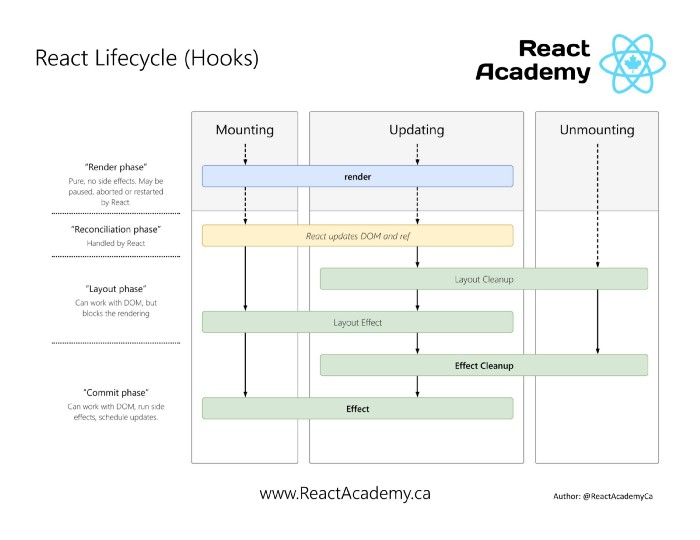

# React 函数组件&Hooks

```JSX
import React, { useState, useEffect } from "react";
function Example() {
  const [count, setCount] = useState(0);

  useEffect(() => {
    document.title = `You clicked ${count} times`;
  });

  return (
    <div>
      <p>You clicked {count} times</p>
      <button onClick={() => setCount(count + 1)}>Click me</button>
    </div>
  );
}
```

## 函数组件和 Class 组件的区别

类组件是 OOP(面向对象编程)，函数组件是 FP(函数式编程)，相比较函数组件更简单、纯粹、易测试，从使用和语法上有以下差异：

| 组件类型 | 编写方式                  | 生命周期            | 机制                                                    |
| -------- | ------------------------- | ------------------- | ------------------------------------------------------- |
| 类组件   | `extends React.Component` | 有生命周期函数      | 每个组件`mount`后都是一个组件实例，在实例内保存运行状态 |
| 函数组件 | `function`                | 使用`useEffect`实现 | 无实例，通过 HOOK 保持状态                              |

- `ref`对象
  - Class 组件：使用`React.createRef()`创建
  - 函数组件：使用`useRef()`创建，函数组件每次渲染都会重新执行`React.createRef()`创新的`ref`对象
- 状态管理
  - Class 组件：`setState()`
  - 函数组件：`useState()`

**核心区别：**

> 心智模型，函数式组件捕获了渲染所使用的值

参考：[函数式组件与类组件有何不同？](https://overreacted.io/zh-hans/how-are-function-components-different-from-classes/)

## FC&Hooks 解决问题

- 组件状态逻辑复用，可以通过自定义 Hook 封装状态逻辑，相对于`HOC`和`render props`方案不需要重构组件，不会产生 “wrapper hell”。
- 解决逻辑分散和聚合问题
  - 逻辑分散问题：例如在 Class Component 中我们会在`componentDidMount`中添加一些订阅函数并在`componentWillUnmount`中注销这些订阅，逻辑上关联的功能被拆分到不同的函数中处理。使用`Effect Hook`我们可以在一个`useEffect`中处理订阅和注销订阅操作，对不同业务逻辑进行隔离。
  - 逻辑聚合问题：例如在 Class Component 中我们往往在`constructor`中一次性声明所有的`state`，在其它生命周期函数中以此处理不相关的业务逻辑，使用`State Hook`和`Effect Hook`我们可以将非相关的逻辑和状态分组处理。
- 函数组件相对于类组件有更好的可测性

## 最佳实践-如何设计 React 组件

为了更好的复用应该尽量做到**有状态的组件没有渲染，有渲染的组件没有状态**，将组建拆分成两部分，一部分单纯管理组件状态，一部分实现渲染逻辑

- 展示组件：只做展示、独立运行、不额外添加功能，复用性更强
- 灵巧组件：负责业务处理、数据状态管理，灵巧组件内至少包含一个灵巧组件或展示组件，专注于业务本身

## TODO:运行逻辑&约束

在一个函数组件内部可以多次使用 state hook 和 effect hook 声明多个 state，函数组件首次渲染后所有 state 初始化完成，会按照执行顺序将 state 存储在一个数组(实际是链表)中，组件更新时使用数组中的数据返回 state 的值，这就要求**hook 的执行顺序是不变的**，所以**只能在函数最外层调用** Hook。不要在循环、条件判断或者子函数中调用。

## State Hook

纯函数不能有状态，使用 Hooks 保持组件状态，提供在函数组件内**保存本地状态**的能力。

声明状态：React 会记住通过`state hook`声明的`state`值，并在函数组件每次运行的时候返回最新的值。`const [state, setState] = useState(initialState)`。
初始状态：`initialState`用来初始化 state，**`initialState`只在组件初始化的时候起作用**。`initialState`也可以是一个函数，在组件初始化的时候 React 会执行这个函数，并将这个函数的返回值作为初始状态
更新状态：`setState`用来更新 state，`setState`方法接收一个新的 state 来更新当前的 state，并将组件的一次重新渲染加入队列，注意：和 class 组件`setState`不同，**不会进行 state 合并而是直接替换**。
函数式更新：如果更新 state 需要依赖之前的 state，在调用`setState`方法的时候可以传入一个函数，函数执行时候的参数即为之前的 state

```JSX
// 使用函数初始state
const [state, setState] = useState(() => {
  const initialState = someExpensiveComputation(props);
  return initialState;
});

// 函数式更新
function Counter({ initialCount }) {
  const [count, setCount] = useState(initialCount);
  return (
    <>
      Count: {count}
      <button onClick={() => setCount(initialCount)}>Reset</button>
      <button onClick={() => setCount((prevCount) => prevCount - 1)}>-</button>
      <button onClick={() => setCount((prevCount) => prevCount + 1)}>+</button>
    </>
  );
}
```

## Effect Hook

`useEffect(effectCallback, [deps]);`
React 统称数据获取、设置订阅及、设置定时器、手动更新 React 组件中的 DOM、记录日志等操作为**副作用**(没有发生在数据向视图转换过程中的逻辑)，这些操作可能产生莫名其妙的 bug，所以在函数组件主体内不允许进行这些操作。

React 使用 Effect Hook 来完成副作用操作，`useEffect(effectCallback)`接收一个可能有副作用代码的函数并保存该函数，并在 DOM 更改后**依次**执行传入的函数。React 保证每次运行`effect`的时候 DOM 都已经更新完毕。

函数的返回值如果是也是一个函数，React 会在组件**下一次渲染之后**执行这个函数，可以在这个返回函数中执行一些卸载订阅取消之类的操作。

默认情况下 React 在每次渲染完成后执行执行 effect hook 注册的副作用函数，一些场景并不需要每次渲染之后重新执行，例如：初始数据加载、订阅等场景。`useEffect`方法的第二个参数可以设置 effect 函数的依赖值的数组，依赖数组中的任意一个值发生了变化 effect 都会重新执行。
如果你要使用此优化方式，**请确保数组中包含了所有外部作用域中会发生变化且在 effect 中使用的变量**，否则你的代码会引用到先前渲染中的旧变量。如果只想执行一次则可以传入一个空数组。

```JSX
// 清除 effect
useEffect(
  () => {
    const subscription = props.source.subscribe(); // 订阅
    return () => {
      subscription.unsubscribe(); // 清除订阅
    };
  },
  [props.source] // 依赖
);
```

`useLayoutEffect(effectCallback, [deps])`和`useEffect`语法一致，都是用来处理副作用，区别是：

- `useEffect`是异步执行的，而`useLayoutEffect`是同步执行的。
- `useEffect`的执行时机是浏览器完成渲染之后，而`useLayoutEffect`的执行时机是浏览器把内容真正渲染到界面之前，即在 layout 和 painting 之间。



## Context Hook

`const value = useContext(MyContext);`接收一个 context 对象，并返回该 context 的当前值，同时会订接收的 context 的变化。
当`<MyContext.Provider>`的`value`props 更新时，使用该 context 的 hook 会重新执行并获取最新的 value。
React Context 使用参考：[React 数据管理](./React数据管理.md)

## FIXME:自定义 Hook

React 自定义 hook 就是一个以`use`开头的函数，在这个函数中的顶层可以使用其它 hook。

```JSX
import { useState, useEffect } from "react";

function useFriendStatus(friendID) {
  const [isOnline, setIsOnline] = useState(null);

  useEffect(() => {
    function handleStatusChange(status) {
      setIsOnline(status.isOnline);
    }

    ChatAPI.subscribeToFriendStatus(friendID, handleStatusChange);
    return () => {
      ChatAPI.unsubscribeFromFriendStatus(friendID, handleStatusChange);
    };
  });

  return isOnline;
}
```

## Reducer Hook

State Hook 的替代方案，类 Redux。`const [state, dispatch] = useReducer(reducer, initialArg, init);`

- `reducer`参数：以下格式的函数`(state, action) => newState`，接收当前 state 和 action，返回新 state。
- `initialArg`参数：初始 state
- `init`参数：state 初始化方法，初始 state 为`init(initialArg)`

```JSX
const initialState = { count: 0 };

function reducer(state, action) {
  switch (action.type) {
    case "increment":
      return { count: state.count + 1 };
    case "decrement":
      return { count: state.count - 1 };
    default:
      throw new Error();
  }
}

function Counter() {
  const [state, dispatch] = useReducer(reducer, initialState);
  return (
    <>
      Count: {state.count}
      <button onClick={() => dispatch({ type: "decrement" })}>-</button>
      <button onClick={() => dispatch({ type: "increment" })}>+</button>
    </>
  );
}
```

## 参考文章

[React Hooks 原理](https://github.com/brickspert/blog/issues/26)
