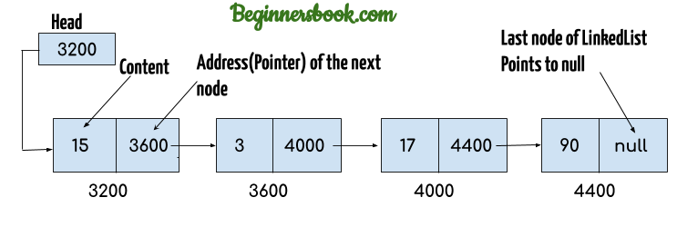

# 链表 LinkedList

数组是一个物理上连续存储的数据结构，在进行数组的插入和删除操作时时间复杂度为`O(n)`，所以在需要频繁进行增删操作的场景下，数组的效率较低。

链表并不是物理连续的，是通过`next`指针链接分散的节点。链表包含`head`和`tail`两个属性，分别执行链表的头尾。

链表的增删操作只需要修改节点的指针指向，时间复杂度是常数，即为`O(1)`
但是链表的元素查找只能从头指针逐个向下查找，时间复杂度为`O(n)`

链表包含以下操作接口：

1. 尾部添加：`append(element)`，复杂度`O(1)`
2. 插入：`insert(position, element)`，复杂度`O(n + 1)`
3. 获取元素位置：`indexOf(element)`，复杂度`O(n + 1)`
4. 删除元素：`remove(element)`，复杂度`O(n + 1)`
5. 删除指定位置元素：`removeAt(position)`，复杂度`O(n + 1)`

链表相对于数组有以下优点

- 更高的增删效率
- 在长度不确定的场景下(区块链)更适合

## 双向链表

链表的传入和删除的复杂度为`O(1)`，但是链表的遍历时间复杂度为`O(n)`，可以使用双向链表优化，双向链表包含两个指针分别执行前一个和后一个元素，使用双向链表可以将删除的时间复杂度优化为`O(1)`
