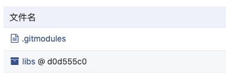

# TODO:git-submodule

## 在主仓库中管理子仓库

### 添加子仓库

使用`git submodule add <submoduleRemotePath>`添加子仓库，添加完成之后主仓库会产生两处修改

**配置文件**：`.gitmodules`，包含子模块的名字、本地路径和仓库地址等信息

```conf
; .gitmodules
[submodule "libs"]
  path = libs
  url = https://github.com/example/libs.git
[submodule "components"]
  path = components
  url = https://github.com/example/components.git
```

**子仓库**：在主仓库会增宽子仓库，可以直接使用和修改子仓库中的文件。
但是使用`git status`查看显示子仓库是一个文件，因为 git 把子仓库当做一个文件管理，是一个链接文件指向子仓库的某个 commit 的链接，如下图。



### 更新子仓库

`git submodule update --remote <submoduleName>`。**注意：只能更新子仓库的主分支**

## `clone`包含子仓库的主仓库

**自动同步子仓库**：使用`--recursive`参数，执行`clone`同时递归的拉取子仓库`git clone --recursive <path>`

**手动同步子仓库**：

- `clone`主仓库：`git clone <path>`
- 初始化子仓库：`git submodule init`
- 同步子仓库：`git submodule update`

## 修改子仓库

### 场景一：子仓库独立更新并提交

在子仓库中进行代码的修改和提交和普通的仓库没有任何区别，子仓库提交更新后在主仓库中执行更新既可。
不足的是在主仓库中没有显示子仓库有更新，缺少通信机制。

### 场景二：在主仓库中更新子仓库

在主仓库中也可以直接修改子仓库中文件，修改后在主仓库使用`git status`可以看到有文件修改，但执行`add`和`commit`操作对子仓库并不生效，需要`cd`到子仓库进行操作。
在子仓库中执行`commit`后主仓库的`.gitmodules`文件会自动修改，需要执行`add`和`commit`。

## TODO:monorepo VS submodules

- 避免重复的工程配置，如 eslint DevOps 等，TODO:X AS Code 是否是更好的解决方案？

## [subtree](https://github.com/git/git/blob/master/contrib/subtree/git-subtree.txt)

subtree 是社区贡献的功能，使用 subtree 可以实现一个仓库作为其他仓库的子仓库

subtree 不增加任何元数据文件，对于其他成员完全透明，使用`git clone`和`git pull`的时候可以直接拉取包括子仓库在内的所有文件，其他开发成员可以不知道 subtree 的存在

- 在父仓库中新增子仓库：`git subtree add --prefix=<prefix> <repository | commit> --squash`
  - `--prefix`：🔝 子仓库安装目录
  - `--squash`：🔝 忽略子仓库 commit 历史，只生成一条 commit 信息
- 拉取子仓库更新：`git subtree pull --prefix=<prefix> <repository> --squash`
- 推送在主仓库中发生的对子仓库的修改到子仓库：`git subtree push --prefix=<prefix> <repository> --squash`

以`https://github.com/test/project.git`作为主仓库，`https://github.com/test/libs.git`作为子仓库，实操过程如下：TODO:实操验证，主仓库更新后 push 子仓库 commit 如何同步等问题

```shell
# 字主仓库中添加子仓库
git subtree add --prefix=sub/libs https://github.com/test/libs.git master --squash
# 这时libs仓库的文件会被clone到project项目的sub/libs目录下，并产生了两个commit

# 推送代码到远程仓库
git push

# 其它开发同学和常规代码同步一样使用clone或pull获取更新代码
# 可以和常规开发一样对主项目下的sub/libs下的代码进行update、commit、push

# 如果子仓库发生了更新，使用git subtree pull 同步更新

git subtree pull --prefix=sub/libs https://github.com/test/libs.git master --squash

# 如果在主仓库中修改了子仓库的代码，需要push子仓库更新，以便其他主仓库更新修改

git subtree push --prefix=sub/libs https://github.com/test/libs.git master

# 简化subtree，添加remote来替代子仓库全路径

git remote add -f libs https://github.com/test/libs.git
git subtree add --prefix=sub/libpng libs master --squash
git subtree pull --prefix=sub/libpng libs master --squash
git subtree push --prefix=sub/libpng libs master
```
