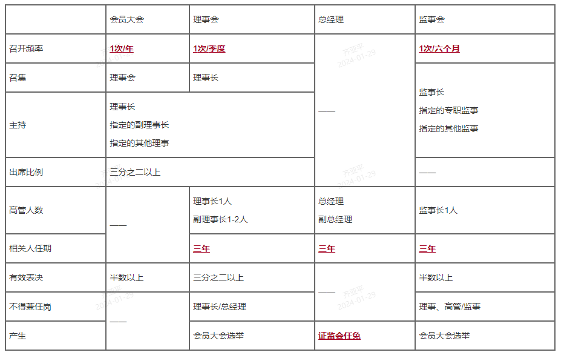

# 自律性组织

按照《证券法》的规定，我国的证券自律管理机构是**证券交易所**、**国务院批准的其他全国性证券交易场所**、**证券业协会**
根据《证券登记结算管理办法》，**我国的证券登记结算机构实行行业自律管理**。

## 证券交易所

- 证券交易所是证券买卖双方**公开交易**的场所，是一个高度组织化、**集中**进行证券交易的市场，是整个证券市场的**核心**。
- 证券交易所本身并**不进行证券买卖，也不决定证券价格**
- 证券交易所是为证券集中交易提供场所和设施，组织和监督证券交易，实行**自律管理**的法人

## 证券交易所组织形式

- 公司制：公司制证券交易所是以**股份有限公司**形式组织并以盈利为目的的法人团体，一般由金融机构及各类民营公司组建（我国仍然不以盈利为目的）。
  - 股东大会
  - 董事会
  - 监事会
  - 经理层
- 会员制：会员制证券交易所是一个由会员自愿组成的，**不以盈利为目的**的社会法人团体
  - 会员大会
  - 理事会
  - 监事会
  - 总经理

## 我国证券交易所

- 我国证券交易所的设立和解散由**国务院**决定
- 设立证券交易所必须制定**章程**，章程的制定和修改必须经过**国务院证券监督管理机构-证监会**批准

会员制交易所组织架构和职能

- 会员大会（1 次/年、要求三分之二会员出席、结束 10 个工作日内向证监会报告）
  - **制定和修改证券交易所章程**
  - 其它重大事项
- 理事会（1 次/季度、表决需要三分之二以上同意）
  - **召集会员大会**，并向会员大会报告工作
  - 审定各类事项
- 总经理（证监会任免）
- 监事会（1 次/半年）

## 我国证券交易所发展历程

- 上海证券交易 1990 年 11 月 26 日被批准成立，**1990 年 12 月 19** 日正式开业。
- 深圳证券交易所于 1989 年 11 月 15 日开始筹建，1990 年 12 月 1 日开始集中交易，1991 年 4 月 11 日经中国人民银行批准成立并于 **1991 年 7 月 3** 日正式开业。
- **北京证券交易所于 2021 年 9 月 3 日正式注册成立，是我国第一家公司制证券交易所**

## 中国证券业协会

- 中国证券业协会是证券业的**自律性组织**，是非营利性**社会团体法人**
- 中国证券业协会成立于**1991 年 8 月 28 日**
- 中国证券业协会接受业务主管单位**中国证监会**和社会团体登记管理机关中华人民共和国**民政部**的业务指导和监督管理
- 中国证券业协会采用**会员制**的组织形式，证券公司**应当加入**中国证券业协会
- 中国证券业协会章程由**会员大会制定**，并报**中国证监会备案**

中国证券业协会着力加强行业自律、行业服务和行业基础建设，履行**自律、服务、传导**三大职能，是要任务是**自律**。
**2012 年 6 月 6 日，中国证券投资基金业协会从证券业协会独立出来**

组织机构：

- 会员大会
- 理事会
- 会长（中国证券业协会实行**会长负责制**）
- 会员
  - **法定会员（证券公司）**
    - 经中国证监会批准设立的证券公司
  - **普通会员（证券公司子公司）**
    - 证券投资咨询机构
    - 证券资信评级机构
    - 证券公司私募投资基金子公司
    - 证券公司另类投资子公司等机构
  - **特别会员（非盈利机构）**
  - **观察员**
    - 信用增进机构
    - 债券受托管理人
    - 网下机构投资者
    - 境外证券驻华代表处

## 证券登记结算公司

2001.3.30，中国证券登记结算有限责任公司成立，包含上海证券交易所和深圳证券交易所两家分公司

设立条件

- 自有资金不少于 **2 亿元**
- 具有证券登记、存管和结算服务所必须得场所和设施
- 国务院证券监督管理机构规定的其他条件
- 公司名称中**应当**标明“证券登记结算”字样
- 公司章程应当经**国务院证券监督管理机构**批准

主要职能：

1. **证券账户、结算账户的设立；**
   1. 证券公司等**开户代理机构**代理证券登记结算公司为投资者开立**证券账户**
   2. 证券公司**直接**为投资者开立**证券资金结算账户**
   3. 证券登记结算公司仅为证券公司开立结算账户
2. 证券的存管和过户；
3. 证券持有人名册登记；为发行人提供证券持有人名册登记服务
4. 证券交易的**清算和交收**；
   1. 证券登记结算公司作为中央对手方，与**证券公司**直接完成证券和资金的**净额结算**
5. 受**发行人**的委托派发证券权益；**如派发红股、股息和利息**等
6. 办理与上述业务有关的查询、信息服务；
7. 国务院证券监督管理机构批准的其他业务。

登记结算制度：

1. **证券实名制**
2. **货银对付的交收制度**，俗称一手交钱一手交货
3. **分级结算制度和结算参与人制度**，我国采用的是分级结算制度，即：投资者 - 证券公司 - 登记结算中心
4. **净额结算制度**
   1. 交易结算可以分为全额结算和净额结算
   2. 目前，我国对证券交易所达成的多数证券交易均采取**多变净额结算**方式
5. **结算证券和资金的专用性制度**
   1. 证券登记结算公司按照业务规则收取的各类结算资金和证券，必须存放于**专门**的清算加收账户，只能按业务规则用于已成交的证券
